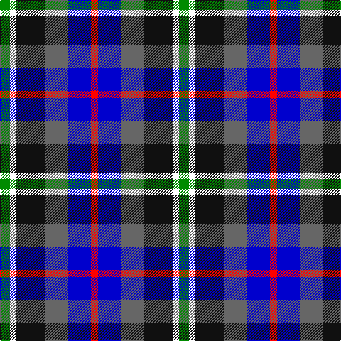

This page is one **sett** — a single exact thread-count. It belongs to the [tartan](/tartans/g7w4k21n16db16r5/)
(the same proportion at any scale), whose colour order is pattern [GWKBBR](/stripes/gwkbbr/).

Sourced from register-of-tartans.  It is a [6 stripe tartan](/stripes/stripes6/).

Original link https://www.tartanregister.gov.uk/tartanDetails.aspx?ref=10470

2 attestations — the source records this cloth was collapsed from (oldest owns this page)

<ul>
<li>06/08/2011 — Hawkes, Norman (Personal) (register-of-tartans, <a href="https://www.tartanregister.gov.uk/tartanDetails.aspx?ref=10470">record</a>)</li>
<li>6th August 2011 — Hawkes, Norman (Personal) (tartans-authority, <a href="http://www.tartansauthority.com/tartan-ferret/display/10470/">record</a>)</li>
</ul>

## Register references

External register numbers recorded for this tartan.

- Scottish Register of Tartans: [10470](https://www.tartanregister.gov.uk/tartanDetails.aspx?ref=10470)

## Thread count
G/14 W8 K42 N32 B32 R/10

## Palette

Palette: <strong>Tartan Register</strong> <small style="color:#888">(5 of 6 colours)</small>
<table><thead><tr><th>Colour</th><th>Threads</th><th>Shade</th><th>Base</th><th>OKLCh</th></tr></thead><tbody><tr><td>G/</td><td style="text-align:right;font-variant-numeric:tabular-nums">14</td><td><code style="background-color:#008B00;">#008B00</code> <small style="color:#888">#008B00</small></td><td>G <code style="background-color:#006100;">#006100</code></td><td><small style="color:#888">oklch(55.2% 0.188 142.5)</small></td></tr><tr><td>W</td><td style="text-align:right;font-variant-numeric:tabular-nums">8</td><td><code style="background-color:#FFFFFF;">#FFFFFF</code> <small style="color:#888">#FFFFFF</small></td><td>W <code style="background-color:#F7F7F7;">#F7F7F7</code></td><td><small style="color:#888">oklch(100.0% 0.000 89.9)</small></td></tr><tr><td>K</td><td style="text-align:right;font-variant-numeric:tabular-nums">42</td><td><code style="background-color:#101010;">#101010</code> <small style="color:#888">#101010</small></td><td>K <code style="background-color:#000000;">#000000</code></td><td><small style="color:#888">oklch(17.3% 0.000 89.9)</small></td></tr><tr><td>N</td><td style="text-align:right;font-variant-numeric:tabular-nums">32</td><td><code style="background-color:#666666;">#666666</code> <small style="color:#888">#666666</small></td><td>B <code style="background-color:#2A418A;">#2A418A</code></td><td><small style="color:#888">oklch(51.0% 0.000 89.9)</small></td></tr><tr><td>B</td><td style="text-align:right;font-variant-numeric:tabular-nums">32</td><td><code style="background-color:#0000CD;">#0000CD</code> <small style="color:#888">#0000CD</small></td><td>B <code style="background-color:#2A418A;">#2A418A</code></td><td><small style="color:#888">oklch(38.3% 0.266 264.1)</small></td></tr><tr><td>R/</td><td style="text-align:right;font-variant-numeric:tabular-nums">10</td><td><code style="background-color:#FF0000;">#FF0000</code> <small style="color:#888">#FF0000</small></td><td>R <code style="background-color:#CC0000;">#CC0000</code></td><td><small style="color:#888">oklch(62.8% 0.258 29.2)</small></td></tr></tbody></table>

# Sample pattern

## Nearest tartans

The nearest existing variants by ΔTartan distance, with this tartan at the top so the swatches line up against it.

ΔTartan

Tartan

Sett

—

<a href="/ttd/edit/#slug=g7w4k21n16db16r5~x2">Hawkes, Norman (Personal)</a> <a class="nn-out" href="/setts/s6/g7w4k21n16db16r5~x2/" title="open its dictionary page">↗</a>

0.62

<a href="/ttd/edit/#slug=db5dp3w2dg3k1ly1~x10">MacBlain (2016)</a> <a class="nn-out" href="/setts/s6/db5dp3w2dg3k1ly1~x10/" title="open its dictionary page">↗</a>

1.02

<a href="/ttd/edit/#slug=o5db4ly1db4k4dy4w1~x4">Devon Companion</a> <a class="nn-out" href="/setts/s7/o5db4ly1db4k4dy4w1~x4/" title="open its dictionary page">↗</a>

1.05

<a href="/ttd/edit/#slug=r3ly2g12k12db14w3~x2">Jamestown Parish Church (Corporate)</a> <a class="nn-out" href="/setts/s6/r3ly2g12k12db14w3~x2/" title="open its dictionary page">↗</a>

1.07

<a href="/ttd/edit/#slug=y5db4ly1db4k4o4w1~x4">Devon, Companion</a> <a class="nn-out" href="/setts/s7/y5db4ly1db4k4o4w1~x4/" title="open its dictionary page">↗</a>

1.12

<a href="/ttd/edit/#slug=k8r12w8g15db30ly5~x2">Reekie (Name)</a> <a class="nn-out" href="/setts/s6/k8r12w8g15db30ly5~x2/" title="open its dictionary page">↗</a>

1.12

<a href="/ttd/edit/#slug=ly3lp9k3lp4k9g15k9db11w2~x4">Hoban (Name)</a> <a class="nn-out" href="/setts/s9/ly3lp9k3lp4k9g15k9db11w2~x4/" title="open its dictionary page">↗</a>

1.14

<a href="/ttd/edit/#slug=o5db4ly1db4k4dr4w1~x4">Devon Companion District Tartan Tartan Number: 1283. Earliest known date: 1984 The Devon Original and Devon Companion owe their origin to the success of the Cornish St Piran sett, which was woven by Coldharbour Mill in the early 1980's. The accreditation certificate was presented to the Mayor of Barnstaple in 1991. In a poem describing the tartan, Miss M. Miles says, &quot;So, in the mind, Devon's beauty is retrieved By contemplating Devon's tartan's weave.&quot; See products available Copyright © Blair Urquhart, Comrie, 2015</a> <a class="nn-out" href="/setts/s7/o5db4ly1db4k4dr4w1~x4/" title="open its dictionary page">↗</a>

1.14

<a href="/ttd/edit/#slug=g4t2g9k4g2r6db12w2~x2">Cherokee</a> <a class="nn-out" href="/setts/s8/g4t2g9k4g2r6db12w2~x2/" title="open its dictionary page">↗</a>

1.28

<a href="/ttd/edit/#slug=k1g6k6g1m2o2db6w1~x4">Hebridean Celebration</a> <a class="nn-out" href="/setts/s8/k1g6k6g1m2o2db6w1~x4/" title="open its dictionary page">↗</a>

1.30

<a href="/ttd/edit/#slug=r1dy6db2lb4k4lb1~x6">Thompson's Fancy (Fashion)</a> <a class="nn-out" href="/setts/s6/r1dy6db2lb4k4lb1~x6/" title="open its dictionary page">↗</a>

## Neighbour map

Every grey dot is one of 14299 variants placed by the first two principal components of the ΔTartan feature space (44% of its variance). Red is this tartan; blue dots are its nearest — click one to open its page.

<svg viewBox="0 0 640 380" role="img" style="max-width:100%;height:auto;border:1px solid #e0e0e0;border-radius:4px;display:block" xmlns="http://www.w3.org/2000/svg"><image href="/nn/cloud.v1.png" width="640" height="380"/><a href="/setts/s6/db5dp3w2dg3k1ly1~x10/"><circle cx="35.4" cy="210.6" r="4" fill="#3465a4"><title>MacBlain (2016)</title></circle></a><a href="/setts/s7/o5db4ly1db4k4dy4w1~x4/"><circle cx="53.1" cy="230.2" r="4" fill="#3465a4"><title>Devon Companion</title></circle></a><a href="/setts/s6/r3ly2g12k12db14w3~x2/"><circle cx="75.0" cy="202.7" r="4" fill="#3465a4"><title>Jamestown Parish Church (Corporate)</title></circle></a><a href="/setts/s7/y5db4ly1db4k4o4w1~x4/"><circle cx="37.9" cy="226.7" r="4" fill="#3465a4"><title>Devon, Companion</title></circle></a><a href="/setts/s6/k8r12w8g15db30ly5~x2/"><circle cx="84.4" cy="199.6" r="4" fill="#3465a4"><title>Reekie (Name)</title></circle></a><a href="/setts/s9/ly3lp9k3lp4k9g15k9db11w2~x4/"><circle cx="51.0" cy="181.4" r="4" fill="#3465a4"><title>Hoban (Name)</title></circle></a><a href="/setts/s7/o5db4ly1db4k4dr4w1~x4/"><circle cx="55.3" cy="231.8" r="4" fill="#3465a4"><title>Devon Companion District Tartan Tartan Number: 1283. Earliest known date: 1984 The Devon Original and Devon Companion owe their origin to the success of the Cornish St Piran sett, which was woven by Coldharbour Mill in the early 1980's. The accreditation certificate was presented to the Mayor of Barnstaple in 1991. In a poem describing the tartan, Miss M. Miles says, &quot;So, in the mind, Devon's beauty is retrieved By contemplating Devon's tartan's weave.&quot; See products available Copyright © Blair Urquhart, Comrie, 2015</title></circle></a><a href="/setts/s8/g4t2g9k4g2r6db12w2~x2/"><circle cx="90.5" cy="190.9" r="4" fill="#3465a4"><title>Cherokee</title></circle></a><a href="/setts/s8/k1g6k6g1m2o2db6w1~x4/"><circle cx="40.9" cy="186.8" r="4" fill="#3465a4"><title>Hebridean Celebration</title></circle></a><a href="/setts/s6/r1dy6db2lb4k4lb1~x6/"><circle cx="87.7" cy="218.9" r="4" fill="#3465a4"><title>Thompson's Fancy (Fashion)</title></circle></a><circle cx="35.5" cy="216.2" r="5" fill="#c00000"/></svg>

ID: /setts/s6/g7w4k21n16db16r5~x2/
