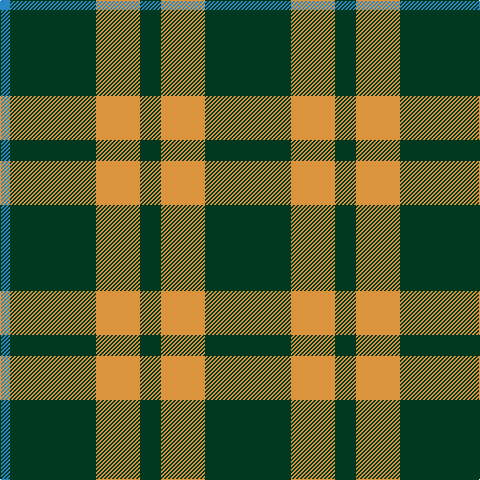

In pattern [BGYGYG](/patterns/bgygyg/).

This was sourced from register-of-tartans.  It is a [6 stripes tartan](/stripes/stripes6/).

Original link https://www.tartanregister.gov.uk/tartanDetails.aspx?ref=3856

## Thread count
B/10 DG86 O44 DG21 O44 DG/86

## Palette
Each colour and its ΔE from the base-6 reference it is a variant of.

| Colour | Shade | Base | ΔE (OKLab) |
|---|---|---|---|
| B | <code style="background-color:#2888C4;">#2888C4</code> `#2888C4` | B <code style="background-color:#2A418A;">#2A418A</code> | 0.21 |
| DG | <code style="background-color:#003820;">#003820</code> `#003820` | G <code style="background-color:#006100;">#006100</code> | 0.15 |
| O | <code style="background-color:#DC943C;">#DC943C</code> `#DC943C` | Y <code style="background-color:#F2BF00;">#F2BF00</code> | 0.12 |

# Sample pattern

## Nearest tartans

The nearest existing variants by ΔTartan distance.

1. [Special Saffron (Fashion)](/setts/s4/g21y44g86b10~b2888c4-g003820-ydc943c/) — ΔT 0.99
1. [Special, Saffron](/setts/s4/g21y43g86b10~b8080d0-g003000-yd08010/) — ΔT 1.09
1. [Special Saffron Tartan Tartan Number: 201. Earliest known date: pre 2003 Y = Saffron See products available Copyright © Blair Urquhart, Comrie, 2015](/setts/s4/g21y43g86b10~b2888c4-g003820-ye8c000/) — ΔT 1.18
1. [Heritage #2](/setts/s7/g20w2g9w2y5w7g10~g005020-we0e0e0-ye8c000~x2/) — ΔT 1.35
1. [Granger](/setts/s6/g40k4g12k21g17w4~g006030-k000000-we0e0e0~x2/) — ΔT 1.48
1. [Leeds University Corporate Tartan Tartan Number: 980. Earliest known date: pre 2003 Leeds University Scottish Country Dance Club. See products available Copyright © Blair Urquhart, Comrie, 2015](/setts/s8/g9r2g2r2g2r8g11w2~g006818-ra00048-we0e0e0~x4/) — ΔT 1.49
1. [Arkansas](/setts/s7/g3w1g12r6g3k3g2~g006818-k101010-rc8002c-wfcfcfc~x4/) — ΔT 1.52
1. [Confederate Infantry](/setts/s6/b2g12r3g8r14g2~b00008c-g003014-ra0783c~x2/) — ΔT 1.53
1. [Wilson's, No 211](/setts/s4/g8b4g1b2~b800080-g008000~x4/) — ΔT 1.59
1. [Hasegawa (Akasaka) (Personal)](/setts/s8/g3w5g3b6g5b1g12r1~b5f749c-g003c14-rdc0000-wf8f4d0~x2/) — ΔT 1.60

## Neighbour map

Every grey dot is one of 15726 variants placed by the first two principal components of the ΔTartan feature space (44% of its variance). Red is this tartan; blue dots are its nearest — click one to open its page.

<svg viewBox="0 0 640 380" role="img" style="max-width:100%;height:auto;border:1px solid #e0e0e0;border-radius:4px;display:block" xmlns="http://www.w3.org/2000/svg"><image href="/nn/cloud.v1.png" width="640" height="380"/><a href="/setts/s4/g21y44g86b10~b2888c4-g003820-ydc943c/"><circle cx="370.8" cy="266.9" r="4" fill="#3465a4"><title>Special Saffron (Fashion)</title></circle></a><a href="/setts/s4/g21y43g86b10~b8080d0-g003000-yd08010/"><circle cx="377.3" cy="268.5" r="4" fill="#3465a4"><title>Special, Saffron</title></circle></a><a href="/setts/s4/g21y43g86b10~b2888c4-g003820-ye8c000/"><circle cx="355.4" cy="261.1" r="4" fill="#3465a4"><title>Special Saffron Tartan Tartan Number: 201. Earliest known date: pre 2003 Y = Saffron See products available Copyright © Blair Urquhart, Comrie, 2015</title></circle></a><a href="/setts/s7/g20w2g9w2y5w7g10~g005020-we0e0e0-ye8c000~x2/"><circle cx="370.5" cy="231.4" r="4" fill="#3465a4"><title>Heritage #2</title></circle></a><a href="/setts/s6/g40k4g12k21g17w4~g006030-k000000-we0e0e0~x2/"><circle cx="388.6" cy="250.0" r="4" fill="#3465a4"><title>Granger</title></circle></a><a href="/setts/s8/g9r2g2r2g2r8g11w2~g006818-ra00048-we0e0e0~x4/"><circle cx="349.0" cy="251.9" r="4" fill="#3465a4"><title>Leeds University Corporate Tartan Tartan Number: 980. Earliest known date: pre 2003 Leeds University Scottish Country Dance Club. See products available Copyright © Blair Urquhart, Comrie, 2015</title></circle></a><a href="/setts/s7/g3w1g12r6g3k3g2~g006818-k101010-rc8002c-wfcfcfc~x4/"><circle cx="365.6" cy="210.6" r="4" fill="#3465a4"><title>Arkansas</title></circle></a><a href="/setts/s6/b2g12r3g8r14g2~b00008c-g003014-ra0783c~x2/"><circle cx="311.7" cy="263.0" r="4" fill="#3465a4"><title>Confederate Infantry</title></circle></a><a href="/setts/s4/g8b4g1b2~b800080-g008000~x4/"><circle cx="373.6" cy="286.0" r="4" fill="#3465a4"><title>Wilson's, No 211</title></circle></a><a href="/setts/s8/g3w5g3b6g5b1g12r1~b5f749c-g003c14-rdc0000-wf8f4d0~x2/"><circle cx="309.5" cy="202.1" r="4" fill="#3465a4"><title>Hasegawa (Akasaka) (Personal)</title></circle></a><circle cx="353.3" cy="261.2" r="5" fill="#c00000"/></svg>

ID: /setts/s6/g86y44g21y44g86b10~b2888c4-g003820-ydc943c/
