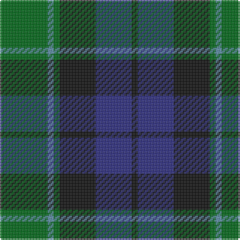

In pattern [GBGKBK](/patterns/gbgkbk/).

This was sourced from tartans-authority.  It is a [6 stripes tartan](/stripes/stripes6/).

Original link http://www.tartansauthority.com/tartan-ferret/display/698/

## Thread count
G/32 B4 G4 K24 DB24 K/4

## Palette
Each colour and its ΔE from the base-6 reference it is a variant of.

| Colour | Shade | Base | ΔE (OKLab) |
|---|---|---|---|
| B | <code style="background-color:#5C8CA8;">#5C8CA8</code> `#5C8CA8` | B <code style="background-color:#2A418A;">#2A418A</code> | 0.23 |
| DB | <code style="background-color:#2C2C80;">#2C2C80</code> `#2C2C80` | B <code style="background-color:#2A418A;">#2A418A</code> | 0.06 |
| G | <code style="background-color:#006818;">#006818</code> `#006818` | G <code style="background-color:#006100;">#006100</code> | 0.02 |
| K | <code style="background-color:#101010;">#101010</code> `#101010` | K <code style="background-color:#000000;">#000000</code> | 0.17 |

# Sample pattern

## Nearest tartans

The nearest existing variants by ΔTartan distance.

1. [Blaylock Annandale (Name)](/setts/s7/g24b6ba3k6b12k15g4x2~b2c2c80-ba5c8ca8-g006818-k101010/) — ΔT 0.40
1. [Graham of Menteith](/setts/s6/g8b1g1k6ba6k1x4~b2474e8-ba28287c-g006c3c-k101010/) — ΔT 0.41
1. [Graham of Menteith Clan Tartan Tartan Number: 698. Earliest known date: 1831 Logan describes the broad blue stripe as 'smalt', in his book, 'The Scottish Gael' published in 1831. Smibert also records this sett in 1850. However, in the text for McIan's Costume of the Clans (1845-47), Logan admits that this sett's antiquity is questionable. Menteith is the name given to the western branch of the Graham family. The Menteith District tartan is similar but the azure stripe is white. (See also Montrose, Menteith.) See products available Copyright © Blair Urquhart, Comrie, 2015](/setts/s6/g18b2g4k14ba12k3x2~b5c8ca8-ba2c2c80-g006818-k101010/) — ΔT 0.41
1. [Ferguson of Balquhidder #2](/setts/s6/g4b24r3k24g25k4x2~b2c2c80-g006818-k101010-rc80000/) — ΔT 0.50
1. [Callum Beg (Fashion)](/setts/s6/g1b6k6g6r1g1x6~b2c2c80-g006818-k101010-rc80000/) — ΔT 0.55
1. [Graham of Montrose](/setts/s6/g4b15w2k16g19k4x2~b2c4084-g005020-k101010-we0e0e0/) — ΔT 0.56
1. [MacKay (Bonner)](/setts/s6/g1b5g1k5g6y1x2~b2c4084-g005020-k101010-ye8c000/) — ΔT 0.62
1. [Redland](/setts/s6/g52w7g9k35b35k7~b2c2c80-g006818-k101010-w98c8e8/) — ΔT 0.62
1. [Glenturret Corporate Tartan Tartan Number: 1097. Earliest known date: 1988 Glenturret Distillery is open to the public. Visitors can view the whisky making process and taste the final product. Glenturret tartan goods are for sale in the distillery shop. See products available Copyright © Blair Urquhart, Comrie, 2015](/setts/s6/k3g14k14g2b15y2x2~b202060-g006818-k101010-ye8c000/) — ΔT 0.64
1. [Blair Clan Tartan Tartan Number: 416. Earliest known date: pre 1963 Described by MacKinlay as a "Modern family sett". See products available Copyright © Blair Urquhart, Comrie, 2015](/setts/s7/b3r1b10k8g10r1g3x4~b2c2c80-g006818-k101010-rc80000/) — ΔT 0.67

## Neighbour map

Every grey dot is one of 15726 variants placed by the first two principal components of the ΔTartan feature space (44% of its variance). Red is this tartan; blue dots are its nearest — click one to open its page.

<svg viewBox="0 0 640 380" role="img" style="max-width:100%;height:auto;border:1px solid #e0e0e0;border-radius:4px;display:block" xmlns="http://www.w3.org/2000/svg"><image href="/nn/cloud.v1.png" width="640" height="380"/><a href="/setts/s7/g24b6ba3k6b12k15g4x2~b2c2c80-ba5c8ca8-g006818-k101010/"><circle cx="209.5" cy="242.8" r="4" fill="#3465a4"><title>Blaylock Annandale (Name)</title></circle></a><a href="/setts/s6/g8b1g1k6ba6k1x4~b2474e8-ba28287c-g006c3c-k101010/"><circle cx="217.0" cy="244.6" r="4" fill="#3465a4"><title>Graham of Menteith</title></circle></a><a href="/setts/s6/g18b2g4k14ba12k3x2~b5c8ca8-ba2c2c80-g006818-k101010/"><circle cx="224.8" cy="246.5" r="4" fill="#3465a4"><title>Graham of Menteith Clan Tartan Tartan Number: 698. Earliest known date: 1831 Logan describes the broad blue stripe as 'smalt', in his book, 'The Scottish Gael' published in 1831. Smibert also records this sett in 1850. However, in the text for McIan's Costume of the Clans (1845-47), Logan admits that this sett's antiquity is questionable. Menteith is the name given to the western branch of the Graham family. The Menteith District tartan is similar but the azure stripe is white. (See also Montrose, Menteith.) See products available Copyright © Blair Urquhart, Comrie, 2015</title></circle></a><a href="/setts/s6/g4b24r3k24g25k4x2~b2c2c80-g006818-k101010-rc80000/"><circle cx="201.1" cy="243.1" r="4" fill="#3465a4"><title>Ferguson of Balquhidder #2</title></circle></a><a href="/setts/s6/g1b6k6g6r1g1x6~b2c2c80-g006818-k101010-rc80000/"><circle cx="194.5" cy="255.4" r="4" fill="#3465a4"><title>Callum Beg (Fashion)</title></circle></a><a href="/setts/s6/g4b15w2k16g19k4x2~b2c4084-g005020-k101010-we0e0e0/"><circle cx="219.8" cy="248.1" r="4" fill="#3465a4"><title>Graham of Montrose</title></circle></a><a href="/setts/s6/g1b5g1k5g6y1x2~b2c4084-g005020-k101010-ye8c000/"><circle cx="209.8" cy="260.4" r="4" fill="#3465a4"><title>MacKay (Bonner)</title></circle></a><a href="/setts/s6/g52w7g9k35b35k7~b2c2c80-g006818-k101010-w98c8e8/"><circle cx="204.1" cy="243.3" r="4" fill="#3465a4"><title>Redland</title></circle></a><a href="/setts/s6/k3g14k14g2b15y2x2~b202060-g006818-k101010-ye8c000/"><circle cx="183.1" cy="245.6" r="4" fill="#3465a4"><title>Glenturret Corporate Tartan Tartan Number: 1097. Earliest known date: 1988 Glenturret Distillery is open to the public. Visitors can view the whisky making process and taste the final product. Glenturret tartan goods are for sale in the distillery shop. See products available Copyright © Blair Urquhart, Comrie, 2015</title></circle></a><a href="/setts/s7/b3r1b10k8g10r1g3x4~b2c2c80-g006818-k101010-rc80000/"><circle cx="207.5" cy="229.0" r="4" fill="#3465a4"><title>Blair Clan Tartan Tartan Number: 416. Earliest known date: pre 1963 Described by MacKinlay as a &quot;Modern family sett&quot;. See products available Copyright © Blair Urquhart, Comrie, 2015</title></circle></a><circle cx="214.6" cy="243.5" r="5" fill="#c00000"/></svg>

ID: /setts/s6/g8b1g1k6ba6k1x4~b5c8ca8-ba2c2c80-g006818-k101010/
