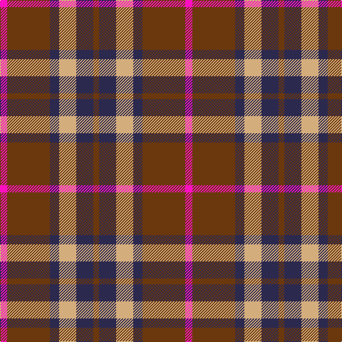

In pattern [GBYBGR](/patterns/gbybgr/).

This was sourced from register-of-tartans.  It is a [6 stripes tartan](/stripes/stripes6/).

Original link https://www.tartanregister.gov.uk/tartanDetails.aspx?ref=10815

## Thread count
LR/10 T60 DB13 LG24 DB24 T/8

## Palette
Each colour and its ΔE from the base-6 reference it is a variant of.

| Colour | Shade | Base | ΔE (OKLab) |
|---|---|---|---|
| DB | <code style="background-color:#2C294F;">#2C294F</code> `#2C294F` | B <code style="background-color:#2C4084;">#2C4084</code> | 0.11 |
| LG | <code style="background-color:#D4AD7D;">#D4AD7D</code> `#D4AD7D` | Y <code style="background-color:#E8C000;">#E8C000</code> | 0.11 |
| LR | <code style="background-color:#FC0FC0;">#FC0FC0</code> `#FC0FC0` | R <code style="background-color:#C80000;">#C80000</code> | 0.25 |
| T | <code style="background-color:#6B380D;">#6B380D</code> `#6B380D` | G <code style="background-color:#006400;">#006400</code> | 0.17 |

# Sample pattern

ID: /setts/s6/g8b24y24b13g60r10-b2c294f-g6b380d-rfc0fc0-yd4ad7d/
