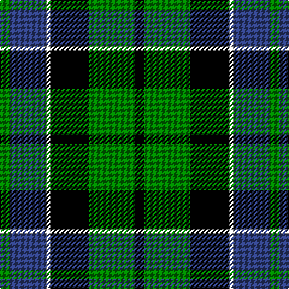

In pattern [GBWKGK](/patterns/gbwkgk/).

This was sourced from weddslist.  It is a [6 stripes tartan](/stripes/stripes6/).

Original link http://www.weddslist.com/cgi-bin/tartans/pg.pl?source=sts

## Thread count
G/8 B30 LN4 K32 G38 K/8

## Palette
Each colour and its ΔE from the base-6 reference it is a variant of.

| Colour | Shade | Base | ΔE (OKLab) |
|---|---|---|---|
| B | <code style="background-color:#304080;">#304080</code> `#304080` | B <code style="background-color:#2A418A;">#2A418A</code> | 0.02 |
| G | <code style="background-color:#008000;">#008000</code> `#008000` | G <code style="background-color:#006100;">#006100</code> | 0.10 |
| K | <code style="background-color:#000000;">#000000</code> `#000000` | K <code style="background-color:#000000;">#000000</code> | 0.00 |
| LN | <code style="background-color:#E0E0E0;">#E0E0E0</code> `#E0E0E0` | W <code style="background-color:#F7F7F7;">#F7F7F7</code> | 0.07 |

# Sample pattern

## Nearest tartans

The nearest existing variants by ΔTartan distance.

1. [Melville](/setts/s6/k8w4g36k26b24k4-b304080-g008000-k000000-we0e0e0/) — ΔT 0.28
1. [Graham of Menteith](/setts/s6/g36b4g8k28ba24k6-b5480b0-ba304080-g008000-k000000/) — ΔT 0.34
1. [Ferguson](/setts/s6/g8b48r6k48g50k8-b304080-g008000-k000000-rc00000/) — ΔT 0.56
1. [MacNeil 1](/setts/s6/w4b36k36g36k8w4-b304080-g008000-k000000-we0e0e0/) — ΔT 0.59
1. [Wilson's, Folio 131](/setts/s5/b24k34g38w4k10-b304080-g008000-k000000-we0e0e0/) — ΔT 0.60
1. [MacCallum](/setts/s7/g16k4b2g8k12ba12k2-b5480b0-ba304080-g008000-k000000/) — ΔT 0.63
1. [Ferguson of Balquhidder](/setts/s6/g4b24r2k24g24k4-b304080-g008000-k000000-rc00000/) — ΔT 0.68
1. [Blair](/setts/s7/b12r4b40k32g40r4g12-b304080-g008000-k000000-rc00000/) — ΔT 0.72
1. [MacKirdy](/setts/s5/k4g24k22b24w2-b304080-g008000-k000000-we0e0e0/) — ΔT 0.73
1. [Wilson's, No 150 "Coburg"](/setts/s6/g36b4g8k28ba24k6-b5480b0-ba800080-g008000-k000000/) — ΔT 0.74

## Neighbour map

Every grey dot is one of 15726 variants placed by the first two principal components of the ΔTartan feature space (44% of its variance). Red is this tartan; blue dots are its nearest — click one to open its page.

<svg viewBox="0 0 640 380" role="img" style="max-width:100%;height:auto;border:1px solid #e0e0e0;border-radius:4px;display:block" xmlns="http://www.w3.org/2000/svg"><image href="/nn/cloud.v1.png" width="640" height="380"/><a href="/setts/s6/k8w4g36k26b24k4-b304080-g008000-k000000-we0e0e0/"><circle cx="156.2" cy="220.8" r="4" fill="#3465a4"><title>Melville</title></circle></a><a href="/setts/s6/g36b4g8k28ba24k6-b5480b0-ba304080-g008000-k000000/"><circle cx="174.5" cy="226.9" r="4" fill="#3465a4"><title>Graham of Menteith</title></circle></a><a href="/setts/s6/g8b48r6k48g50k8-b304080-g008000-k000000-rc00000/"><circle cx="151.5" cy="224.2" r="4" fill="#3465a4"><title>Ferguson</title></circle></a><a href="/setts/s6/w4b36k36g36k8w4-b304080-g008000-k000000-we0e0e0/"><circle cx="142.8" cy="216.1" r="4" fill="#3465a4"><title>MacNeil 1</title></circle></a><a href="/setts/s5/b24k34g38w4k10-b304080-g008000-k000000-we0e0e0/"><circle cx="162.3" cy="240.1" r="4" fill="#3465a4"><title>Wilson's, Folio 131</title></circle></a><a href="/setts/s7/g16k4b2g8k12ba12k2-b5480b0-ba304080-g008000-k000000/"><circle cx="168.2" cy="230.0" r="4" fill="#3465a4"><title>MacCallum</title></circle></a><a href="/setts/s6/g4b24r2k24g24k4-b304080-g008000-k000000-rc00000/"><circle cx="167.6" cy="210.4" r="4" fill="#3465a4"><title>Ferguson of Balquhidder</title></circle></a><a href="/setts/s7/b12r4b40k32g40r4g12-b304080-g008000-k000000-rc00000/"><circle cx="163.7" cy="212.0" r="4" fill="#3465a4"><title>Blair</title></circle></a><a href="/setts/s5/k4g24k22b24w2-b304080-g008000-k000000-we0e0e0/"><circle cx="157.7" cy="226.2" r="4" fill="#3465a4"><title>MacKirdy</title></circle></a><a href="/setts/s6/g36b4g8k28ba24k6-b5480b0-ba800080-g008000-k000000/"><circle cx="174.4" cy="220.1" r="4" fill="#3465a4"><title>Wilson's, No 150 &quot;Coburg&quot;</title></circle></a><circle cx="158.8" cy="223.4" r="5" fill="#c00000"/></svg>

ID: /setts/s6/g8b30w4k32g38k8-b304080-g008000-k000000-we0e0e0/
