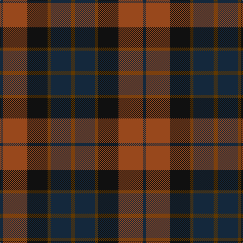

In pattern [BRKGBG](/patterns/brkgbg/).

This was sourced from tartans-authority.  It is a [6 stripes tartan](/stripes/stripes6/).

Original link http://www.tartansauthority.com/tartan-ferret/display/2213/

## Thread count
DN/6 Ta48 K40 T6 DN40 T/8

## Palette
Each colour and its ΔE from the base-6 reference it is a variant of.

| Colour | Shade | Base | ΔE (OKLab) |
|---|---|---|---|
| DN | <code style="background-color:#14283C;">#14283C</code> `#14283C` | B <code style="background-color:#2C4084;">#2C4084</code> | 0.14 |
| K | <code style="background-color:#101010;">#101010</code> `#101010` | K <code style="background-color:#000000;">#000000</code> | 0.17 |
| T | <code style="background-color:#603800;">#603800</code> `#603800` | G <code style="background-color:#006400;">#006400</code> | 0.16 |
| Ta | <code style="background-color:#98481C;">#98481C</code> `#98481C` | R <code style="background-color:#C80000;">#C80000</code> | 0.11 |

# Sample pattern

ID: /setts/s6/g8b40g6k40r48b6-b14283c-g603800-k101010-r98481c/
