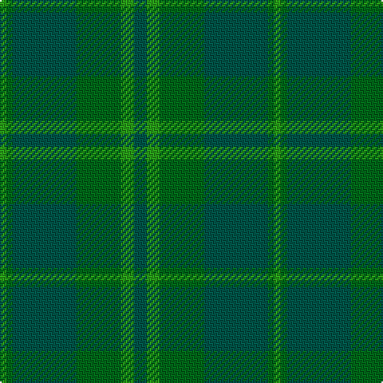

In pattern [GGGGGG](/patterns/gggggg/).

This was sourced from tartans-authority.  It is a [6 stripes tartan](/stripes/stripes6/).

Original link http://www.tartansauthority.com/tartan-ferret/display/4813/

## Thread count
G/4 Gb4 Ga40 Gb28 G8 Ga/8

## Palette
Each colour and its ΔE from the base-6 reference it is a variant of.

| Colour | Shade | Base | ΔE (OKLab) |
|---|---|---|---|
| G | <code style="background-color:#289C18;">#289C18</code> `#289C18` | G <code style="background-color:#006400;">#006400</code> | 0.18 |
| Ga | <code style="background-color:#005448;">#005448</code> `#005448` | G <code style="background-color:#006400;">#006400</code> | 0.11 |
| Gb | <code style="background-color:#006818;">#006818</code> `#006818` | G <code style="background-color:#006400;">#006400</code> | 0.02 |

# Sample pattern

ID: /setts/s6/g8ga8gb28g40gb4ga4-g005448-ga289c18-gb006818/
