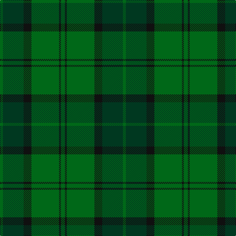

In pattern [GGKGKG](/patterns/ggkgkg/).

This was sourced from register-of-tartans.  It is a [6 stripes tartan](/stripes/stripes6/).

Original link https://www.tartanregister.gov.uk/tartanDetails.aspx?ref=1017

## Attestations

This cloth appears in 2 source records; the oldest owns this page.

- 01/01/1986 — Dunbar Hunting (register-of-tartans, [record](https://www.tartanregister.gov.uk/tartanDetails.aspx?ref=1017))
- 1986 — Dunbar Htg (Clan) (tartans-authority, [record](http://www.tartansauthority.com/tartan-ferret/display/4744/))

## Thread count
G/6 DG42 K16 G56 K4 G/8

## Palette
Each colour and its ΔE from the base-6 reference it is a variant of.

| Colour | Shade | Base | ΔE (OKLab) |
|---|---|---|---|
| DG | <code style="background-color:#003820;">#003820</code> `#003820` | G <code style="background-color:#006100;">#006100</code> | 0.15 |
| G | <code style="background-color:#006818;">#006818</code> `#006818` | G <code style="background-color:#006100;">#006100</code> | 0.02 |
| K | <code style="background-color:#101010;">#101010</code> `#101010` | K <code style="background-color:#000000;">#000000</code> | 0.17 |

# Sample pattern

## Nearest tartans

The nearest existing variants by ΔTartan distance.

1. [MacSporran Rejected design](/setts/s6/g60ga26g14ga60g4y8-g002814-ga005020-ye8c000/) — ΔT 0.89
1. [John Telfar Dunbar/Hunting Tartan Tartan Number: 776. Earliest known date: pre 2003 Check this entry... See products available Copyright © Blair Urquhart, Comrie, 2015](/setts/s7/g10k4g56k20ga52b8g8-b2c2c80-g006818-ga604000-k101010/) — ΔT 1.45
1. [Hunting Kenmore Trade Com. Tartan Tartan Number: 2234. Earliest known date: 1995 Designed by Polly Wittering of House of Edgar for a range of gifts produced for Macnaughtons of Pitlochry See products available Copyright © Blair Urquhart, Comrie, 2015](/setts/s7/k4g38ga4g4ga38g4k4-g003820-ga006818-k000000/) — ΔT 1.56
1. [Campbell Simpson (Dalgliesh)](/setts/s6/g44k6g6ga32g12k8-g408060-ga006818-k101010/) — ΔT 1.57
1. [Donachie of Brockloch Htg (Clan)](/setts/s10/g48r4g4ga80g50ga4g4r4g4ga40-g487048-ga003820-r880000/) — ΔT 1.64
1. [Glen Boig](/setts/s5/g74r18g6b18r6-b401000-g006020-r806050/) — ΔT 1.65
1. [Irving of Bonshaw](/setts/s5/g108ga56b8ga8y8-b003c64-g006818-ga048888-ye8c000/) — ΔT 1.72
1. [Daks (Loden)](/setts/s8/b6g14ga4gb4ga28g4ga4b6-b2c2c80-g604000-ga006818-gb808080/) — ΔT 1.77
1. [McGeorge (Personal)](/setts/s6/r8g6ga78g80r4y8-g002814-ga005020-rdc0000-yc89600/) — ΔT 1.78
1. [Park Estate](/setts/s6/g8ga36gb12ga12gb48k6-g5c6428-ga003820-gb285800-k000000/) — ΔT 1.81

## Neighbour map

Every grey dot is one of 15726 variants placed by the first two principal components of the ΔTartan feature space (44% of its variance). Red is this tartan; blue dots are its nearest — click one to open its page.

<svg viewBox="0 0 640 380" role="img" style="max-width:100%;height:auto;border:1px solid #e0e0e0;border-radius:4px;display:block" xmlns="http://www.w3.org/2000/svg"><image href="/nn/cloud.v1.png" width="640" height="380"/><a href="/setts/s6/g60ga26g14ga60g4y8-g002814-ga005020-ye8c000/"><circle cx="393.5" cy="263.8" r="4" fill="#3465a4"><title>MacSporran Rejected design</title></circle></a><a href="/setts/s7/g10k4g56k20ga52b8g8-b2c2c80-g006818-ga604000-k101010/"><circle cx="330.0" cy="225.9" r="4" fill="#3465a4"><title>John Telfar Dunbar/Hunting Tartan Tartan Number: 776. Earliest known date: pre 2003 Check this entry... See products available Copyright © Blair Urquhart, Comrie, 2015</title></circle></a><a href="/setts/s7/k4g38ga4g4ga38g4k4-g003820-ga006818-k000000/"><circle cx="347.1" cy="229.0" r="4" fill="#3465a4"><title>Hunting Kenmore Trade Com. Tartan Tartan Number: 2234. Earliest known date: 1995 Designed by Polly Wittering of House of Edgar for a range of gifts produced for Macnaughtons of Pitlochry See products available Copyright © Blair Urquhart, Comrie, 2015</title></circle></a><a href="/setts/s6/g44k6g6ga32g12k8-g408060-ga006818-k101010/"><circle cx="372.1" cy="278.2" r="4" fill="#3465a4"><title>Campbell Simpson (Dalgliesh)</title></circle></a><a href="/setts/s10/g48r4g4ga80g50ga4g4r4g4ga40-g487048-ga003820-r880000/"><circle cx="442.4" cy="213.6" r="4" fill="#3465a4"><title>Donachie of Brockloch Htg (Clan)</title></circle></a><a href="/setts/s5/g74r18g6b18r6-b401000-g006020-r806050/"><circle cx="491.4" cy="262.6" r="4" fill="#3465a4"><title>Glen Boig</title></circle></a><a href="/setts/s5/g108ga56b8ga8y8-b003c64-g006818-ga048888-ye8c000/"><circle cx="421.6" cy="241.0" r="4" fill="#3465a4"><title>Irving of Bonshaw</title></circle></a><a href="/setts/s8/b6g14ga4gb4ga28g4ga4b6-b2c2c80-g604000-ga006818-gb808080/"><circle cx="326.4" cy="247.3" r="4" fill="#3465a4"><title>Daks (Loden)</title></circle></a><a href="/setts/s6/r8g6ga78g80r4y8-g002814-ga005020-rdc0000-yc89600/"><circle cx="363.8" cy="202.8" r="4" fill="#3465a4"><title>McGeorge (Personal)</title></circle></a><a href="/setts/s6/g8ga36gb12ga12gb48k6-g5c6428-ga003820-gb285800-k000000/"><circle cx="366.9" cy="289.0" r="4" fill="#3465a4"><title>Park Estate</title></circle></a><circle cx="399.0" cy="261.0" r="5" fill="#c00000"/></svg>

ID: /setts/s6/g8k4g56k16ga42g6-g006818-ga003820-k101010/
