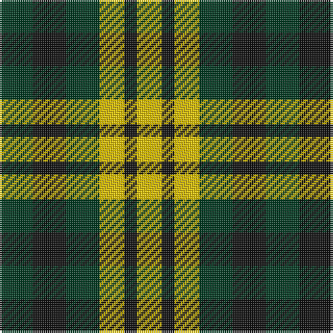

In pattern [GKGYKY](/patterns/gkgyky/).

This was sourced from tartans-authority.  It is a [6 stripes tartan](/stripes/stripes6/).

Original link http://www.tartansauthority.com/tartan-ferret/display/10845/

## Thread count
DG/16 K16 DG16 Y12 K6 Y/12

## Palette
Each colour and its ΔE from the base-6 reference it is a variant of.

| Colour | Shade | Base | ΔE (OKLab) |
|---|---|---|---|
| DG | <code style="background-color:#003820;">#003820</code> `#003820` | G <code style="background-color:#006100;">#006100</code> | 0.15 |
| K | <code style="background-color:#101010;">#101010</code> `#101010` | K <code style="background-color:#000000;">#000000</code> | 0.17 |
| Y | <code style="background-color:#E8C000;">#E8C000</code> `#E8C000` | Y <code style="background-color:#F2BF00;">#F2BF00</code> | 0.02 |

# Sample pattern

## Nearest tartans

The nearest existing variants by ΔTartan distance.

1. [Hage-West (Personal)](/setts/s6/g8k8g8y6k3y6~g23321b-k1c1714-yf8e38c~x2/) — ΔT 0.57
1. [Boxer Beauty](/setts/s7/k13g28y13g28k18w18k13~g603800-k101010-wfcfcfc-ydc943c~x2/) — ΔT 1.53
1. [Boxer Beauty](/setts/s7/k13g28y13g28k18w18k13~g603800-k101010-wffffff-ycc7f32~x2/) — ΔT 1.55
1. [Angle Dress (Fashion)](/setts/s5/k5g8y5g3y5~g408060-k101010-ybc8c00~x4/) — ΔT 1.58
1. [Wilson's, No 202](/setts/s3/g7k4r4~g008000-k000000-rc00000~x2/) — ΔT 1.72
1. [Burns Heritage Check](/setts/s9/k12w12k12w12g13w8b6g4b5~b401000-g008000-k000000-we0e0e0/) — ΔT 1.79
1. [Shepherd, Derek (Wandering)](/setts/s5/w2k2g2w1k1~g008040-k0a0a0a-w7aa9dd~x20/) — ΔT 1.79
1. [Austin / Wilson's No 173](/setts/s5/b3k3b3g6y2~b800080-g008000-k000000-yf0c000~x2/) — ΔT 1.81
1. [DAKS House (C.6700.040)](/setts/s5/b4g7k4g7y4~b304080-g008000-k000000-yf0c000~x2/) — ΔT 1.85
1. [Daks (House)](/setts/s5/b4g7k4g7y4~b2c2c80-g006818-k101010-ye8c000~x2/) — ΔT 1.85

## Neighbour map

Every grey dot is one of 15726 variants placed by the first two principal components of the ΔTartan feature space (44% of its variance). Red is this tartan; blue dots are its nearest — click one to open its page.

<svg viewBox="0 0 640 380" role="img" style="max-width:100%;height:auto;border:1px solid #e0e0e0;border-radius:4px;display:block" xmlns="http://www.w3.org/2000/svg"><image href="/nn/cloud.v1.png" width="640" height="380"/><a href="/setts/s6/g8k8g8y6k3y6~g23321b-k1c1714-yf8e38c~x2/"><circle cx="88.2" cy="324.2" r="4" fill="#3465a4"><title>Hage-West (Personal)</title></circle></a><a href="/setts/s7/k13g28y13g28k18w18k13~g603800-k101010-wfcfcfc-ydc943c~x2/"><circle cx="80.3" cy="300.3" r="4" fill="#3465a4"><title>Boxer Beauty</title></circle></a><a href="/setts/s7/k13g28y13g28k18w18k13~g603800-k101010-wffffff-ycc7f32~x2/"><circle cx="81.7" cy="300.9" r="4" fill="#3465a4"><title>Boxer Beauty</title></circle></a><a href="/setts/s5/k5g8y5g3y5~g408060-k101010-ybc8c00~x4/"><circle cx="147.6" cy="341.9" r="4" fill="#3465a4"><title>Angle Dress (Fashion)</title></circle></a><a href="/setts/s3/g7k4r4~g008000-k000000-rc00000~x2/"><circle cx="123.6" cy="366.0" r="4" fill="#3465a4"><title>Wilson's, No 202</title></circle></a><a href="/setts/s9/k12w12k12w12g13w8b6g4b5~b401000-g008000-k000000-we0e0e0/"><circle cx="39.1" cy="263.3" r="4" fill="#3465a4"><title>Burns Heritage Check</title></circle></a><a href="/setts/s5/w2k2g2w1k1~g008040-k0a0a0a-w7aa9dd~x20/"><circle cx="77.8" cy="344.9" r="4" fill="#3465a4"><title>Shepherd, Derek (Wandering)</title></circle></a><a href="/setts/s5/b3k3b3g6y2~b800080-g008000-k000000-yf0c000~x2/"><circle cx="68.7" cy="291.7" r="4" fill="#3465a4"><title>Austin / Wilson's No 173</title></circle></a><a href="/setts/s5/b4g7k4g7y4~b304080-g008000-k000000-yf0c000~x2/"><circle cx="108.9" cy="340.1" r="4" fill="#3465a4"><title>DAKS House (C.6700.040)</title></circle></a><a href="/setts/s5/b4g7k4g7y4~b2c2c80-g006818-k101010-ye8c000~x2/"><circle cx="129.6" cy="347.6" r="4" fill="#3465a4"><title>Daks (House)</title></circle></a><circle cx="93.7" cy="329.8" r="5" fill="#c00000"/></svg>

ID: /setts/s6/g8k8g8y6k3y6~g003820-k101010-ye8c000~x2/
