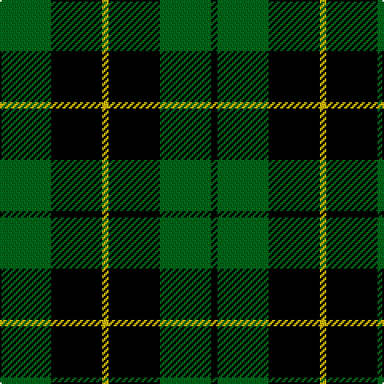

This page is one **sett** — a single exact thread-count. It belongs to the [tartan](/tartans/g8k8ly1k8g8k1/)
(the same proportion at any scale), whose colour order is pattern [GKYKGK](/stripes/gkykgk/).

Sourced from register-of-tartans.  It is a [6 stripe tartan](/stripes/stripes6/).

Original link https://www.tartanregister.gov.uk/tartanDetails.aspx?ref=4486

## Register references

External register numbers recorded for this tartan.

- Scottish Register of Tartans: [4486](https://www.tartanregister.gov.uk/tartanDetails.aspx?ref=4486)
- Scottish Tartans Authority (ITI): 1101
- Scottish Tartans World Register: 1101

## Thread count
Ga/32 K32 Y4 K32 Ga32 K/4

## Palette

Palette: <strong>Tartan Register</strong> <small style="color:#888">(4 of 5 colours)</small>
<table><thead><tr><th>Colour</th><th>Threads</th><th>Shade</th><th>Base</th><th>OKLCh</th></tr></thead><tbody><tr><td>Ga/</td><td style="text-align:right;font-variant-numeric:tabular-nums">32</td><td><code style="background-color:#006818;">#006818</code> <small style="color:#888">#006818</small></td><td>G <code style="background-color:#006100;">#006100</code></td><td><small style="color:#888">oklch(45.0% 0.142 145.0)</small></td></tr><tr><td>K</td><td style="text-align:right;font-variant-numeric:tabular-nums">32</td><td><code style="background-color:#000000;">#000000</code> <small style="color:#888">#000000</small></td><td>K <code style="background-color:#000000;">#000000</code></td><td><small style="color:#888">oklch(0.0% 0.000 0.0)</small></td></tr><tr><td>Y</td><td style="text-align:right;font-variant-numeric:tabular-nums">4</td><td><code style="background-color:#DCBC00;">#DCBC00</code> <small style="color:#888">#DCBC00</small></td><td>Y <code style="background-color:#F2BF00;">#F2BF00</code></td><td><small style="color:#888">oklch(79.9% 0.165 96.7)</small></td></tr><tr><td>K</td><td style="text-align:right;font-variant-numeric:tabular-nums">32</td><td><code style="background-color:#000000;">#000000</code> <small style="color:#888">#000000</small></td><td>K <code style="background-color:#000000;">#000000</code></td><td><small style="color:#888">oklch(0.0% 0.000 0.0)</small></td></tr><tr><td>Ga</td><td style="text-align:right;font-variant-numeric:tabular-nums">32</td><td><code style="background-color:#006818;">#006818</code> <small style="color:#888">#006818</small></td><td>G <code style="background-color:#006100;">#006100</code></td><td><small style="color:#888">oklch(45.0% 0.142 145.0)</small></td></tr><tr><td>K/</td><td style="text-align:right;font-variant-numeric:tabular-nums">4</td><td><code style="background-color:#000000;">#000000</code> <small style="color:#888">#000000</small></td><td>K <code style="background-color:#000000;">#000000</code></td><td><small style="color:#888">oklch(0.0% 0.000 0.0)</small></td></tr></tbody></table>

# Sample pattern

## Nearest tartans

The nearest existing variants by ΔTartan distance, with this tartan at the top so the swatches line up against it.

ΔTartan

Tartan

Sett

—

<a href="/ttd/edit/#slug=g8k8ly1k8g8k1~x4">Wallace Hunting</a> <a class="nn-out" href="/setts/s6/g8k8ly1k8g8k1~x4/" title="open its dictionary page">↗</a>

0.98

<a href="/ttd/edit/#slug=k32g6k12g30ly3">MacArthur</a> <a class="nn-out" href="/setts/s5/k32g6k12g30ly3/" title="open its dictionary page">↗</a>

0.99

<a href="/ttd/edit/#slug=k32dg6k12dg30ly3">MacArthur</a> <a class="nn-out" href="/setts/s5/k32dg6k12dg30ly3/" title="open its dictionary page">↗</a>

1.16

<a href="/ttd/edit/#slug=k19g8k10g31r3">MacArthur-Fox</a> <a class="nn-out" href="/setts/s5/k19g8k10g31r3/" title="open its dictionary page">↗</a>

1.17

<a href="/ttd/edit/#slug=k1g8k8ly1~x4">Wallace Htg (Clan)</a> <a class="nn-out" href="/setts/s4/k1g8k8ly1~x4/" title="open its dictionary page">↗</a>

1.20

<a href="/ttd/edit/#slug=k30db7g36k5~x2">Innes, hunting</a> <a class="nn-out" href="/setts/s4/k30db7g36k5~x2/" title="open its dictionary page">↗</a>

1.22

<a href="/ttd/edit/#slug=r2g12k12g1k12g2~x2">Gunn</a> <a class="nn-out" href="/setts/s6/r2g12k12g1k12g2~x2/" title="open its dictionary page">↗</a>

1.22

<a href="/ttd/edit/#slug=k12db3g23k23r3~x2">Douglas, (Black)</a> <a class="nn-out" href="/setts/s5/k12db3g23k23r3~x2/" title="open its dictionary page">↗</a>

1.30

<a href="/ttd/edit/#slug=k32dg6k12dg30ly3~x2">MacArthur</a> <a class="nn-out" href="/setts/s5/k32dg6k12dg30ly3~x2/" title="open its dictionary page">↗</a>

1.33

<a href="/ttd/edit/#slug=k4g33k33ly4~x2">Wallace, hunting</a> <a class="nn-out" href="/setts/s4/k4g33k33ly4~x2/" title="open its dictionary page">↗</a>

1.37

<a href="/ttd/edit/#slug=k1dg8k8ly1">Wallace Hunting</a> <a class="nn-out" href="/setts/s4/k1dg8k8ly1/" title="open its dictionary page">↗</a>

## Neighbour map

Every grey dot is one of 14359 variants placed by the first two principal components of the ΔTartan feature space (44% of its variance). Red is this tartan; blue dots are its nearest — click one to open its page.

<svg viewBox="0 0 640 380" role="img" style="max-width:100%;height:auto;border:1px solid #e0e0e0;border-radius:4px;display:block" xmlns="http://www.w3.org/2000/svg"><image href="/nn/cloud.v1.png" width="640" height="380"/><a href="/setts/s5/k32g6k12g30ly3/"><circle cx="292.2" cy="246.2" r="4" fill="#3465a4"><title>MacArthur</title></circle></a><a href="/setts/s5/k32dg6k12dg30ly3/"><circle cx="310.7" cy="255.6" r="4" fill="#3465a4"><title>MacArthur</title></circle></a><a href="/setts/s5/k19g8k10g31r3/"><circle cx="294.1" cy="249.6" r="4" fill="#3465a4"><title>MacArthur-Fox</title></circle></a><a href="/setts/s4/k1g8k8ly1~x4/"><circle cx="280.5" cy="263.2" r="4" fill="#3465a4"><title>Wallace Htg (Clan)</title></circle></a><a href="/setts/s4/k30db7g36k5~x2/"><circle cx="243.2" cy="272.5" r="4" fill="#3465a4"><title>Innes, hunting</title></circle></a><a href="/setts/s6/r2g12k12g1k12g2~x2/"><circle cx="323.6" cy="234.5" r="4" fill="#3465a4"><title>Gunn</title></circle></a><a href="/setts/s5/k12db3g23k23r3~x2/"><circle cx="258.6" cy="245.9" r="4" fill="#3465a4"><title>Douglas, (Black)</title></circle></a><a href="/setts/s5/k32dg6k12dg30ly3~x2/"><circle cx="327.6" cy="263.2" r="4" fill="#3465a4"><title>MacArthur</title></circle></a><a href="/setts/s4/k4g33k33ly4~x2/"><circle cx="273.1" cy="257.0" r="4" fill="#3465a4"><title>Wallace, hunting</title></circle></a><a href="/setts/s4/k1dg8k8ly1/"><circle cx="302.5" cy="274.0" r="4" fill="#3465a4"><title>Wallace Hunting</title></circle></a><circle cx="265.1" cy="269.5" r="5" fill="#c00000"/></svg>

ID: /setts/s6/g8k8ly1k8g8k1~x4/
