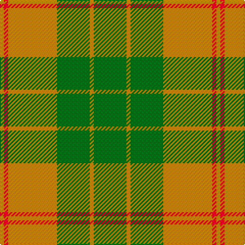

In pattern [GYGYRY](/stripes/gygyry/).

This was sourced from tartans-authority.  It is a [6 stripe tartan](/stripes/stripes6/).

Original link http://www.tartansauthority.com/tartan-ferret/display/10694/

## Thread count
G/32 DY4 G32 DY48 R4 DY/4

## Palette
Each colour and the base-6 reference it is a variant of.

| Colour | Shade | Base |
|---|---|---|
| DY | <code style="background-color:#BC8C00;">#BC8C00</code> `oklch(66.8% 0.137 84.1)` <small>#BC8C00</small> | Y <code style="background-color:#F2BF00;">#F2BF00</code> |
| G | <code style="background-color:#006818;">#006818</code> `oklch(45.0% 0.142 145.0)` <small>#006818</small> | G <code style="background-color:#006100;">#006100</code> |
| R | <code style="background-color:#C8002C;">#C8002C</code> `oklch(52.6% 0.212 22.0)` <small>#C8002C</small> | R <code style="background-color:#CC0000;">#CC0000</code> |

# Sample pattern

## Nearest tartans

The nearest existing variants by ΔTartan distance.

1. [North Dakota State University (Corp.](/setts/s6/lo11g5lo10g4g26lo4~x2/) — ΔT 1.17
1. [O'Neill Pipe Band 1983 (Corporate)](/setts/s7/o1g1o5g8lg1g1lg1~x4/) — ΔT 1.25
1. [Pendlebury, Andrew (Personal)](/setts/s5/g25lo6dg5r3lo10~x4/) — ΔT 1.50
1. [MacMillan/Isetan (Corporate)](/setts/s6/dg68r24dg8lo18dg3lo18~x2/) — ΔT 1.54
1. [Campbell & Co (Beauly) (Corporate)](/setts/s9/g4r5g31r5g31lo5g4lo27ly3~x2/) — ΔT 1.56
1. [Logan](/setts/s7/g10r4g1r4g15r4g1~x4/) — ΔT 1.68
1. [Maxwell Htg (Clan)](/setts/s7/g3r16g4k6g28r2g3~x2/) — ΔT 1.78
1. [Confederate Artillery (Military)](/setts/s6/r2g12o3g8o14g2~x2/) — ΔT 1.79
1. [O'Neill](/setts/s4/g9lo20g40w5~x2/) — ΔT 1.83
1. [O'Neill Pipe Band 1983](/setts/s12/g1lg1g8o5g1o1g1o5g8lg1g1lg1~x4/) — ΔT 1.83

## Neighbour map

Every grey dot is one of 14299 variants placed by the first two principal components of the ΔTartan feature space (44% of its variance). Red is this tartan; blue dots are its nearest — click one to open its page.

<svg viewBox="0 0 640 380" role="img" style="max-width:100%;height:auto;border:1px solid #e0e0e0;border-radius:4px;display:block" xmlns="http://www.w3.org/2000/svg"><image href="/nn/cloud.v1.png" width="640" height="380"/><a href="/setts/s6/lo11g5lo10g4g26lo4~x2/"><circle cx="345.8" cy="279.6" r="4" fill="#3465a4"><title>North Dakota State University (Corp.</title></circle></a><a href="/setts/s7/o1g1o5g8lg1g1lg1~x4/"><circle cx="369.1" cy="239.5" r="4" fill="#3465a4"><title>O'Neill Pipe Band 1983 (Corporate)</title></circle></a><a href="/setts/s5/g25lo6dg5r3lo10~x4/"><circle cx="299.1" cy="241.6" r="4" fill="#3465a4"><title>Pendlebury, Andrew (Personal)</title></circle></a><a href="/setts/s6/dg68r24dg8lo18dg3lo18~x2/"><circle cx="392.6" cy="205.8" r="4" fill="#3465a4"><title>MacMillan/Isetan (Corporate)</title></circle></a><a href="/setts/s9/g4r5g31r5g31lo5g4lo27ly3~x2/"><circle cx="374.3" cy="212.1" r="4" fill="#3465a4"><title>Campbell &amp; Co (Beauly) (Corporate)</title></circle></a><a href="/setts/s7/g10r4g1r4g15r4g1~x4/"><circle cx="445.0" cy="223.1" r="4" fill="#3465a4"><title>Logan</title></circle></a><a href="/setts/s7/g3r16g4k6g28r2g3~x2/"><circle cx="420.1" cy="223.3" r="4" fill="#3465a4"><title>Maxwell Htg (Clan)</title></circle></a><a href="/setts/s6/r2g12o3g8o14g2~x2/"><circle cx="385.1" cy="298.1" r="4" fill="#3465a4"><title>Confederate Artillery (Military)</title></circle></a><a href="/setts/s4/g9lo20g40w5~x2/"><circle cx="405.5" cy="281.2" r="4" fill="#3465a4"><title>O'Neill</title></circle></a><a href="/setts/s12/g1lg1g8o5g1o1g1o5g8lg1g1lg1~x4/"><circle cx="378.6" cy="224.0" r="4" fill="#3465a4"><title>O'Neill Pipe Band 1983</title></circle></a><circle cx="375.3" cy="243.5" r="5" fill="#c00000"/></svg>

ID: /setts/s6/g8lo1g8lo12r1lo1~x4/
