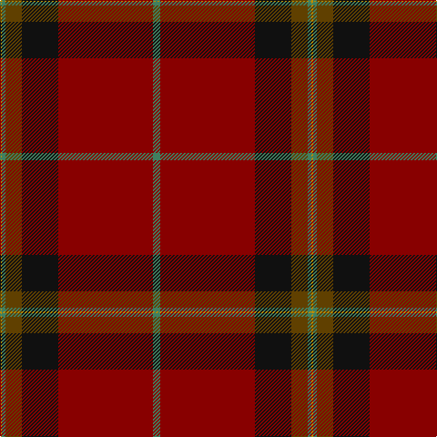

In pattern [GRKGGY](/patterns/grkggy/).

This was sourced from tartans-authority.  It is a [6 stripes tartan](/stripes/stripes6/).

Original link http://www.tartansauthority.com/tartan-ferret/display/10719/

## Thread count
DY/2 G4 T18 K40 DR104 G/8

## Palette
Each colour and its ΔE from the base-6 reference it is a variant of.

| Colour | Shade | Base | ΔE (OKLab) |
|---|---|---|---|
| DR | <code style="background-color:#880000;">#880000</code> `#880000` | R <code style="background-color:#C80000;">#C80000</code> | 0.14 |
| DY | <code style="background-color:#BC8C00;">#BC8C00</code> `#BC8C00` | Y <code style="background-color:#E8C000;">#E8C000</code> | 0.16 |
| G | <code style="background-color:#408060;">#408060</code> `#408060` | G <code style="background-color:#006400;">#006400</code> | 0.13 |
| K | <code style="background-color:#101010;">#101010</code> `#101010` | K <code style="background-color:#000000;">#000000</code> | 0.17 |
| T | <code style="background-color:#604000;">#604000</code> `#604000` | G <code style="background-color:#006400;">#006400</code> | 0.14 |

# Sample pattern

## Nearest tartans

The nearest existing variants by ΔTartan distance.

1. [Arbroath Smokie](/setts/s9/y2r90b46w2b12ra4y2ra4y2-b14283c-r880000-rac80000-we0e0e0-ybc8c00/) — ΔT 1.28
1. [Slessor (Personal)](/setts/s8/b4y8b4y24r100g22y2g4-b2c2c80-g003820-r880000-ya08858/) — ΔT 1.37
1. [Wcwm 9275 5471-1](/setts/s6/r8k4g56r76k2y8-g004c00-k000000-r780028-yc89800/) — ΔT 1.55
1. [MacGregor](/setts/s6/r72g36r8g12k2y4-g11450d-k000000-raa0000-yaaaaaa/) — ΔT 1.61
1. [MacGregor](/setts/s6/r36g18r4g6k1y2-g11450d-k000000-raa0000-yaaaaaa/) — ΔT 1.61
1. [Laporte](/setts/s10/g16r12k8r128ra2k56r12g80r12k8-g5c6428-k101010-r880000-ra888888/) — ΔT 1.68
1. [Down, County](/setts/s9/r128b18ra22b8w4y4ba10b4y26-b4c0000-ba5c5c5c-r6c2400-rab84c00-wa8ace8-yec8048/) — ΔT 1.70
1. [Redpath, Robert A (Personal)](/setts/s8/r52b8r2ba4g2b8g28w4-b505050-ba9058d8-g005020-r880000-we0e0e0/) — ΔT 1.76
1. [MacEdward (MacGregor Hastie)](/setts/s10/r12y2r48g12b4k2b4k2b24r2-b202060-g003820-k101010-r880000-yd09800/) — ΔT 1.77
1. [Moulin](/setts/s10/r144k12g12ra4g12k12r16g24k4ra8-g484800-k000000-r740010-ra8c0000/) — ΔT 1.79

## Neighbour map

Every grey dot is one of 15726 variants placed by the first two principal components of the ΔTartan feature space (44% of its variance). Red is this tartan; blue dots are its nearest — click one to open its page.

<svg viewBox="0 0 640 380" role="img" style="max-width:100%;height:auto;border:1px solid #e0e0e0;border-radius:4px;display:block" xmlns="http://www.w3.org/2000/svg"><image href="/nn/cloud.v1.png" width="640" height="380"/><a href="/setts/s9/y2r90b46w2b12ra4y2ra4y2-b14283c-r880000-rac80000-we0e0e0-ybc8c00/"><circle cx="430.3" cy="95.9" r="4" fill="#3465a4"><title>Arbroath Smokie</title></circle></a><a href="/setts/s8/b4y8b4y24r100g22y2g4-b2c2c80-g003820-r880000-ya08858/"><circle cx="457.8" cy="112.6" r="4" fill="#3465a4"><title>Slessor (Personal)</title></circle></a><a href="/setts/s6/r8k4g56r76k2y8-g004c00-k000000-r780028-yc89800/"><circle cx="411.6" cy="155.1" r="4" fill="#3465a4"><title>Wcwm 9275 5471-1</title></circle></a><a href="/setts/s6/r72g36r8g12k2y4-g11450d-k000000-raa0000-yaaaaaa/"><circle cx="450.7" cy="154.4" r="4" fill="#3465a4"><title>MacGregor</title></circle></a><a href="/setts/s6/r36g18r4g6k1y2-g11450d-k000000-raa0000-yaaaaaa/"><circle cx="450.7" cy="154.4" r="4" fill="#3465a4"><title>MacGregor</title></circle></a><a href="/setts/s10/g16r12k8r128ra2k56r12g80r12k8-g5c6428-k101010-r880000-ra888888/"><circle cx="391.7" cy="124.9" r="4" fill="#3465a4"><title>Laporte</title></circle></a><a href="/setts/s9/r128b18ra22b8w4y4ba10b4y26-b4c0000-ba5c5c5c-r6c2400-rab84c00-wa8ace8-yec8048/"><circle cx="387.9" cy="92.6" r="4" fill="#3465a4"><title>Down, County</title></circle></a><a href="/setts/s8/r52b8r2ba4g2b8g28w4-b505050-ba9058d8-g005020-r880000-we0e0e0/"><circle cx="344.1" cy="135.4" r="4" fill="#3465a4"><title>Redpath, Robert A (Personal)</title></circle></a><a href="/setts/s10/r12y2r48g12b4k2b4k2b24r2-b202060-g003820-k101010-r880000-yd09800/"><circle cx="391.3" cy="136.0" r="4" fill="#3465a4"><title>MacEdward (MacGregor Hastie)</title></circle></a><a href="/setts/s10/r144k12g12ra4g12k12r16g24k4ra8-g484800-k000000-r740010-ra8c0000/"><circle cx="502.0" cy="123.3" r="4" fill="#3465a4"><title>Moulin</title></circle></a><circle cx="445.0" cy="131.4" r="5" fill="#c00000"/></svg>

ID: /setts/s6/g8r104k40ga18g4y2-g408060-ga604000-k101010-r880000-ybc8c00/
