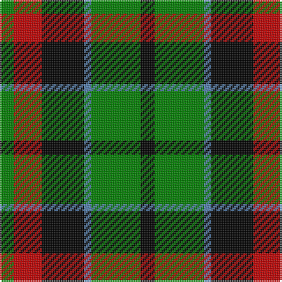

In pattern [GRKBGK](/patterns/grkbgk/).

This was sourced from weddslist.  It is a [6 stripes tartan](/stripes/stripes6/).

Original link http://www.weddslist.com/cgi-bin/tartans/pg.pl?source=sts

## Thread count
G/8 R16 K24 B4 G28 K/8

## Palette
Each colour and its ΔE from the base-6 reference it is a variant of.

| Colour | Shade | Base | ΔE (OKLab) |
|---|---|---|---|
| B | <code style="background-color:#5480B0;">#5480B0</code> `#5480B0` | B <code style="background-color:#2C4084;">#2C4084</code> | 0.20 |
| G | <code style="background-color:#008000;">#008000</code> `#008000` | G <code style="background-color:#006400;">#006400</code> | 0.09 |
| K | <code style="background-color:#000000;">#000000</code> `#000000` | K <code style="background-color:#000000;">#000000</code> | 0.00 |
| R | <code style="background-color:#C00000;">#C00000</code> `#C00000` | R <code style="background-color:#C80000;">#C80000</code> | 0.02 |

# Sample pattern

## Nearest tartans

The nearest existing variants by ΔTartan distance.

1. [Unidentified, Pinafore](/setts/s7/g48k8g48k48b14r48b14-b5480b0-g008000-k000000-r900030/) — ΔT 0.82
1. [Abercrombie, (Wilson's No 64)](/setts/s7/k24g24y4g24k24b24k4-b800080-g008000-k000000-yf0c000/) — ΔT 0.97
1. [Wilson's, No 150 "Coburg"](/setts/s6/g36b4g8k28ba24k6-b5480b0-ba800080-g008000-k000000/) — ΔT 0.99
1. [Wilson's, No 64 or Abercrombie](/setts/s7/k24g24w4g24k24b24k4-b800080-g008000-k000000-we0e0e0/) — ΔT 1.05
1. [Sinclair, hunting](/setts/s7/g12r4g26k12w4k32r6-g008000-k000000-r900030-we0e0e0/) — ΔT 1.05
1. [Wilson's, No 160](/setts/s6/g42y4g8k32b28k6-b800080-g008000-k000000-yf0c000/) — ΔT 1.06
1. [MacArthur of Milton, hunting](/setts/s6/g28b4g4k16ba18k4-b304080-ba800080-g008000-k000000/) — ΔT 1.09
1. [Wilson's, No 108](/setts/s8/k28g28k4g28k28b4ba28k4-b5480b0-ba800080-g008000-k000000/) — ΔT 1.10
1. [Wilson's, No 97](/setts/s7/k22g24k4g24k24b24w6-b800080-g008000-k000000-we0e0e0/) — ΔT 1.13
1. [Wilson's No 158](/setts/s6/g42w4g8k34b28k6-b800080-g008000-k000000-we0e0e0/) — ΔT 1.14

## Neighbour map

Every grey dot is one of 15726 variants placed by the first two principal components of the ΔTartan feature space (44% of its variance). Red is this tartan; blue dots are its nearest — click one to open its page.

<svg viewBox="0 0 640 380" role="img" style="max-width:100%;height:auto;border:1px solid #e0e0e0;border-radius:4px;display:block" xmlns="http://www.w3.org/2000/svg"><image href="/nn/cloud.v1.png" width="640" height="380"/><a href="/setts/s7/g48k8g48k48b14r48b14-b5480b0-g008000-k000000-r900030/"><circle cx="135.3" cy="241.9" r="4" fill="#3465a4"><title>Unidentified, Pinafore</title></circle></a><a href="/setts/s7/k24g24y4g24k24b24k4-b800080-g008000-k000000-yf0c000/"><circle cx="135.7" cy="250.9" r="4" fill="#3465a4"><title>Abercrombie, (Wilson's No 64)</title></circle></a><a href="/setts/s6/g36b4g8k28ba24k6-b5480b0-ba800080-g008000-k000000/"><circle cx="174.4" cy="220.1" r="4" fill="#3465a4"><title>Wilson's, No 150 &quot;Coburg&quot;</title></circle></a><a href="/setts/s7/k24g24w4g24k24b24k4-b800080-g008000-k000000-we0e0e0/"><circle cx="134.7" cy="250.6" r="4" fill="#3465a4"><title>Wilson's, No 64 or Abercrombie</title></circle></a><a href="/setts/s7/g12r4g26k12w4k32r6-g008000-k000000-r900030-we0e0e0/"><circle cx="200.8" cy="216.0" r="4" fill="#3465a4"><title>Sinclair, hunting</title></circle></a><a href="/setts/s6/g42y4g8k32b28k6-b800080-g008000-k000000-yf0c000/"><circle cx="182.4" cy="208.9" r="4" fill="#3465a4"><title>Wilson's, No 160</title></circle></a><a href="/setts/s6/g28b4g4k16ba18k4-b304080-ba800080-g008000-k000000/"><circle cx="175.4" cy="224.5" r="4" fill="#3465a4"><title>MacArthur of Milton, hunting</title></circle></a><a href="/setts/s8/k28g28k4g28k28b4ba28k4-b5480b0-ba800080-g008000-k000000/"><circle cx="161.2" cy="228.4" r="4" fill="#3465a4"><title>Wilson's, No 108</title></circle></a><a href="/setts/s7/k22g24k4g24k24b24w6-b800080-g008000-k000000-we0e0e0/"><circle cx="119.6" cy="253.0" r="4" fill="#3465a4"><title>Wilson's, No 97</title></circle></a><a href="/setts/s6/g42w4g8k34b28k6-b800080-g008000-k000000-we0e0e0/"><circle cx="179.3" cy="208.6" r="4" fill="#3465a4"><title>Wilson's No 158</title></circle></a><circle cx="156.2" cy="237.3" r="5" fill="#c00000"/></svg>

ID: /setts/s6/g8r16k24b4g28k8-b5480b0-g008000-k000000-rc00000/
