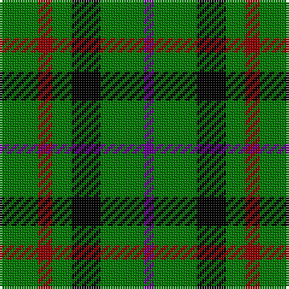

This page is one **sett** — a single exact thread-count. It belongs to the [tartan](/tartans/g8r3g4k6g9dp2/)
(the same proportion at any scale), whose colour order is pattern [BGKGRG](/stripes/bgkgrg/).

Sourced from register-of-tartans.  It is a [6 stripe tartan](/stripes/stripes6/).

Original link https://www.tartanregister.gov.uk/tartanDetails.aspx?ref=2959

## Register references

External register numbers recorded for this tartan.

- Scottish Register of Tartans: [2959](https://www.tartanregister.gov.uk/tartanDetails.aspx?ref=2959)
- Scottish Tartans Authority (ITI): 4176

## Thread count
G/16 DR6 G8 K12 G18 P/4

## Palette

Palette: <strong>Tartan Register</strong> <small style="color:#888">(3 of 4 colours)</small>
<table><thead><tr><th>Colour</th><th>Threads</th><th>Shade</th><th>Base</th><th>OKLCh</th></tr></thead><tbody><tr><td>G/</td><td style="text-align:right;font-variant-numeric:tabular-nums">16</td><td><code style="background-color:#007800;">#007800</code> <small style="color:#888">#007800</small></td><td>G <code style="background-color:#006100;">#006100</code></td><td><small style="color:#888">oklch(49.6% 0.169 142.5)</small></td></tr><tr><td>DR</td><td style="text-align:right;font-variant-numeric:tabular-nums">6</td><td><code style="background-color:#8C0000;">#8C0000</code> <small style="color:#888">#8C0000</small></td><td>R <code style="background-color:#CC0000;">#CC0000</code></td><td><small style="color:#888">oklch(40.2% 0.165 29.2)</small></td></tr><tr><td>G</td><td style="text-align:right;font-variant-numeric:tabular-nums">8</td><td><code style="background-color:#007800;">#007800</code> <small style="color:#888">#007800</small></td><td>G <code style="background-color:#006100;">#006100</code></td><td><small style="color:#888">oklch(49.6% 0.169 142.5)</small></td></tr><tr><td>K</td><td style="text-align:right;font-variant-numeric:tabular-nums">12</td><td><code style="background-color:#000000;">#000000</code> <small style="color:#888">#000000</small></td><td>K <code style="background-color:#000000;">#000000</code></td><td><small style="color:#888">oklch(0.0% 0.000 0.0)</small></td></tr><tr><td>G</td><td style="text-align:right;font-variant-numeric:tabular-nums">18</td><td><code style="background-color:#007800;">#007800</code> <small style="color:#888">#007800</small></td><td>G <code style="background-color:#006100;">#006100</code></td><td><small style="color:#888">oklch(49.6% 0.169 142.5)</small></td></tr><tr><td>P/</td><td style="text-align:right;font-variant-numeric:tabular-nums">4</td><td><code style="background-color:#64008C;">#64008C</code> <small style="color:#888">#64008C</small></td><td>B <code style="background-color:#2A418A;">#2A418A</code></td><td><small style="color:#888">oklch(38.5% 0.193 311.3)</small></td></tr></tbody></table>

# Sample pattern

## Nearest tartans

The nearest existing variants by ΔTartan distance, with this tartan at the top so the swatches line up against it.

ΔTartan

Tartan

Sett

—

<a href="/ttd/edit/#slug=g8r3g4k6g9dp2~x2">Milton</a> <a class="nn-out" href="/setts/s6/g8r3g4k6g9dp2~x2/" title="open its dictionary page">↗</a>

0.00

<a href="/ttd/edit/#slug=g8r3g4k6g9dp2~x4">Milton (Name?)</a> <a class="nn-out" href="/setts/s6/g8r3g4k6g9dp2~x4/" title="open its dictionary page">↗</a>

1.48

<a href="/ttd/edit/#slug=r1k6g6ly1g6ly1~x6">Moore Caledonian (Personal)</a> <a class="nn-out" href="/setts/s6/r1k6g6ly1g6ly1~x6/" title="open its dictionary page">↗</a>

1.53

<a href="/ttd/edit/#slug=lo21g28db24g72w16g20">Meath County Crest (Fashion)</a> <a class="nn-out" href="/setts/s6/lo21g28db24g72w16g20/" title="open its dictionary page">↗</a>

1.60

<a href="/ttd/edit/#slug=g4k5g4ly1~x2">Wilson's No.053 #2</a> <a class="nn-out" href="/setts/s4/g4k5g4ly1~x2/" title="open its dictionary page">↗</a>

1.76

<a href="/ttd/edit/#slug=g7k1g7t1k6t1~x2">Innes</a> <a class="nn-out" href="/setts/s6/g7k1g7t1k6t1~x2/" title="open its dictionary page">↗</a>

1.77

<a href="/ttd/edit/#slug=dg10db4dg4db5dg6ly10r6dg18ly4">Arkansas (Unofficial)</a> <a class="nn-out" href="/setts/s9/dg10db4dg4db5dg6ly10r6dg18ly4/" title="open its dictionary page">↗</a>

1.78

<a href="/ttd/edit/#slug=g7k1g7t1k6t1~x4">Innes, Georgina (Portrait)</a> <a class="nn-out" href="/setts/s6/g7k1g7t1k6t1~x4/" title="open its dictionary page">↗</a>

1.79

<a href="/ttd/edit/#slug=dg86lo44dg21lo44dg86t10">Special Saffron</a> <a class="nn-out" href="/setts/s6/dg86lo44dg21lo44dg86t10/" title="open its dictionary page">↗</a>

1.90

<a href="/ttd/edit/#slug=k9g3k3g12ly2~x4">MacArthur</a> <a class="nn-out" href="/setts/s5/k9g3k3g12ly2~x4/" title="open its dictionary page">↗</a>

1.92

<a href="/ttd/edit/#slug=dg2r3dg4w1dg1ly1dg4r3dg2~x2">Unidentified #33</a> <a class="nn-out" href="/setts/s9/dg2r3dg4w1dg1ly1dg4r3dg2~x2/" title="open its dictionary page">↗</a>

## Neighbour map

Every grey dot is one of 14299 variants placed by the first two principal components of the ΔTartan feature space (44% of its variance). Red is this tartan; blue dots are its nearest — click one to open its page.

<svg viewBox="0 0 640 380" role="img" style="max-width:100%;height:auto;border:1px solid #e0e0e0;border-radius:4px;display:block" xmlns="http://www.w3.org/2000/svg"><image href="/nn/cloud.v1.png" width="640" height="380"/><a href="/setts/s6/g8r3g4k6g9dp2~x4/"><circle cx="269.2" cy="280.7" r="4" fill="#3465a4"><title>Milton (Name?)</title></circle></a><a href="/setts/s6/r1k6g6ly1g6ly1~x6/"><circle cx="262.6" cy="243.2" r="4" fill="#3465a4"><title>Moore Caledonian (Personal)</title></circle></a><a href="/setts/s6/lo21g28db24g72w16g20/"><circle cx="307.6" cy="269.6" r="4" fill="#3465a4"><title>Meath County Crest (Fashion)</title></circle></a><a href="/setts/s4/g4k5g4ly1~x2/"><circle cx="279.5" cy="327.5" r="4" fill="#3465a4"><title>Wilson's No.053 #2</title></circle></a><a href="/setts/s6/g7k1g7t1k6t1~x2/"><circle cx="298.4" cy="249.9" r="4" fill="#3465a4"><title>Innes</title></circle></a><a href="/setts/s9/dg10db4dg4db5dg6ly10r6dg18ly4/"><circle cx="213.0" cy="239.5" r="4" fill="#3465a4"><title>Arkansas (Unofficial)</title></circle></a><a href="/setts/s6/g7k1g7t1k6t1~x4/"><circle cx="310.9" cy="255.7" r="4" fill="#3465a4"><title>Innes, Georgina (Portrait)</title></circle></a><a href="/setts/s6/dg86lo44dg21lo44dg86t10/"><circle cx="355.1" cy="256.4" r="4" fill="#3465a4"><title>Special Saffron</title></circle></a><a href="/setts/s5/k9g3k3g12ly2~x4/"><circle cx="282.5" cy="278.4" r="4" fill="#3465a4"><title>MacArthur</title></circle></a><a href="/setts/s9/dg2r3dg4w1dg1ly1dg4r3dg2~x2/"><circle cx="260.0" cy="257.0" r="4" fill="#3465a4"><title>Unidentified #33</title></circle></a><circle cx="269.2" cy="280.7" r="5" fill="#c00000"/></svg>

ID: /setts/s6/g8r3g4k6g9dp2~x2/
