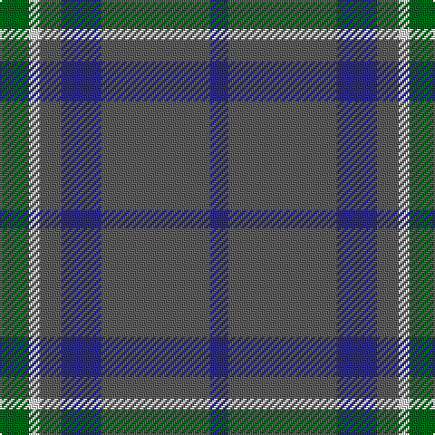

This page is one **sett** — a single exact thread-count. It belongs to the [tartan](/tartans/g8w3n6db11n30db5/)
(the same proportion at any scale), whose colour order is pattern [BBBBWG](/stripes/bbbbwg/).

Sourced from tartans-authority.  It is a [6 stripe tartan](/stripes/stripes6/).

Original link http://www.tartansauthority.com/tartan-ferret/display/10514/

## Register references

External register numbers recorded for this tartan.

- Scottish Register of Tartans: [10514](https://www.tartanregister.gov.uk/tartanDetails?ref=10514)
- Scottish Tartans Authority (ITI): 10514

## Thread count
G/16 LN6 N12 DB22 N60 DB/10

## Palette

Palette: <strong>Tartan Register</strong> <small style="color:#888">(3 of 4 colours)</small>
<table><thead><tr><th>Colour</th><th>Threads</th><th>Shade</th><th>Base</th><th>OKLCh</th></tr></thead><tbody><tr><td>G/</td><td style="text-align:right;font-variant-numeric:tabular-nums">16</td><td><code style="background-color:#006818;">#006818</code> <small style="color:#888">#006818</small></td><td>G <code style="background-color:#006100;">#006100</code></td><td><small style="color:#888">oklch(45.0% 0.142 145.0)</small></td></tr><tr><td>LN</td><td style="text-align:right;font-variant-numeric:tabular-nums">6</td><td><code style="background-color:#E0E0E0;">#E0E0E0</code> <small style="color:#888">#E0E0E0</small></td><td>W <code style="background-color:#F7F7F7;">#F7F7F7</code></td><td><small style="color:#888">oklch(90.7% 0.000 89.9)</small></td></tr><tr><td>N</td><td style="text-align:right;font-variant-numeric:tabular-nums">12</td><td><code style="background-color:#5C5C5C;">#5C5C5C</code> <small style="color:#888">#5C5C5C</small></td><td>B <code style="background-color:#2A418A;">#2A418A</code></td><td><small style="color:#888">oklch(47.5% 0.000 89.9)</small></td></tr><tr><td>DB</td><td style="text-align:right;font-variant-numeric:tabular-nums">22</td><td><code style="background-color:#2C2C80;">#2C2C80</code> <small style="color:#888">#2C2C80</small></td><td>B <code style="background-color:#2A418A;">#2A418A</code></td><td><small style="color:#888">oklch(35.0% 0.138 276.6)</small></td></tr><tr><td>N</td><td style="text-align:right;font-variant-numeric:tabular-nums">60</td><td><code style="background-color:#5C5C5C;">#5C5C5C</code> <small style="color:#888">#5C5C5C</small></td><td>B <code style="background-color:#2A418A;">#2A418A</code></td><td><small style="color:#888">oklch(47.5% 0.000 89.9)</small></td></tr><tr><td>DB/</td><td style="text-align:right;font-variant-numeric:tabular-nums">10</td><td><code style="background-color:#2C2C80;">#2C2C80</code> <small style="color:#888">#2C2C80</small></td><td>B <code style="background-color:#2A418A;">#2A418A</code></td><td><small style="color:#888">oklch(35.0% 0.138 276.6)</small></td></tr></tbody></table>

# Sample pattern

## Nearest tartans

The nearest existing variants by ΔTartan distance, with this tartan at the top so the swatches line up against it.

ΔTartan

Tartan

Sett

—

<a href="/ttd/edit/#slug=g8w3n6db11n30db5~x2">Devlin, Craig (Personal)</a> <a class="nn-out" href="/setts/s6/g8w3n6db11n30db5~x2/" title="open its dictionary page">↗</a>

0.93

<a href="/ttd/edit/#slug=dt3t14dt3o16dt34r3~x2">Thorburn (Lochcarron)</a> <a class="nn-out" href="/setts/s6/dt3t14dt3o16dt34r3~x2/" title="open its dictionary page">↗</a>

0.97

<a href="/ttd/edit/#slug=do15r5do30b32do4lo3~x2">Cameron Hunting</a> <a class="nn-out" href="/setts/s6/do15r5do30b32do4lo3~x2/" title="open its dictionary page">↗</a>

1.11

<a href="/ttd/edit/#slug=o15r5o30db32o4ly3~x2">Cameron, hunting</a> <a class="nn-out" href="/setts/s6/o15r5o30db32o4ly3~x2/" title="open its dictionary page">↗</a>

1.27

<a href="/ttd/edit/#slug=db18ly2o6ly2o19r3~x2">Balfour blue &amp; brown</a> <a class="nn-out" href="/setts/s6/db18ly2o6ly2o19r3~x2/" title="open its dictionary page">↗</a>

1.29

<a href="/ttd/edit/#slug=y30ly3y3ly3y12do30k3do5~x2">Dama Classic</a> <a class="nn-out" href="/setts/s8/y30ly3y3ly3y12do30k3do5~x2/" title="open its dictionary page">↗</a>

1.30

<a href="/ttd/edit/#slug=g15dt2w2dt11n28dt4~x2">Rhode Island, The State of</a> <a class="nn-out" href="/setts/s6/g15dt2w2dt11n28dt4~x2/" title="open its dictionary page">↗</a>

1.34

<a href="/ttd/edit/#slug=r2g5db27g11o2~x2">Hector James</a> <a class="nn-out" href="/setts/s5/r2g5db27g11o2~x2/" title="open its dictionary page">↗</a>

1.35

<a href="/ttd/edit/#slug=dy15r5dy30db32dy4ly3~x2">Cameron Hunting Brown Clan Tartan Tartan Number: 1745. Earliest known date: 1916 Nothing See products available Copyright © Blair Urquhart, Comrie, 2015</a> <a class="nn-out" href="/setts/s6/dy15r5dy30db32dy4ly3~x2/" title="open its dictionary page">↗</a>

1.42

<a href="/ttd/edit/#slug=dg20k2dg20dp25w2n3~x2">Lawrence of Broughty Ferry</a> <a class="nn-out" href="/setts/s6/dg20k2dg20dp25w2n3~x2/" title="open its dictionary page">↗</a>

1.42

<a href="/setts/s7/dp3n24ni10n2g11n8w3~x2/">Hesco</a>

## Neighbour map

Every grey dot is one of 14359 variants placed by the first two principal components of the ΔTartan feature space (44% of its variance). Red is this tartan; blue dots are its nearest — click one to open its page.

<svg viewBox="0 0 640 380" role="img" style="max-width:100%;height:auto;border:1px solid #e0e0e0;border-radius:4px;display:block" xmlns="http://www.w3.org/2000/svg"><image href="/nn/cloud.v1.png" width="640" height="380"/><a href="/setts/s6/dt3t14dt3o16dt34r3~x2/"><circle cx="332.7" cy="226.1" r="4" fill="#3465a4"><title>Thorburn (Lochcarron)</title></circle></a><a href="/setts/s6/do15r5do30b32do4lo3~x2/"><circle cx="348.6" cy="235.1" r="4" fill="#3465a4"><title>Cameron Hunting</title></circle></a><a href="/setts/s6/o15r5o30db32o4ly3~x2/"><circle cx="378.5" cy="245.6" r="4" fill="#3465a4"><title>Cameron, hunting</title></circle></a><a href="/setts/s6/db18ly2o6ly2o19r3~x2/"><circle cx="316.9" cy="227.3" r="4" fill="#3465a4"><title>Balfour blue &amp; brown</title></circle></a><a href="/setts/s8/y30ly3y3ly3y12do30k3do5~x2/"><circle cx="335.5" cy="212.8" r="4" fill="#3465a4"><title>Dama Classic</title></circle></a><a href="/setts/s6/g15dt2w2dt11n28dt4~x2/"><circle cx="299.4" cy="223.6" r="4" fill="#3465a4"><title>Rhode Island, The State of</title></circle></a><a href="/setts/s5/r2g5db27g11o2~x2/"><circle cx="378.7" cy="224.5" r="4" fill="#3465a4"><title>Hector James</title></circle></a><a href="/setts/s6/dy15r5dy30db32dy4ly3~x2/"><circle cx="355.4" cy="235.9" r="4" fill="#3465a4"><title>Cameron Hunting Brown Clan Tartan Tartan Number: 1745. Earliest known date: 1916 Nothing See products available Copyright © Blair Urquhart, Comrie, 2015</title></circle></a><a href="/setts/s6/dg20k2dg20dp25w2n3~x2/"><circle cx="360.5" cy="237.8" r="4" fill="#3465a4"><title>Lawrence of Broughty Ferry</title></circle></a><a href="/setts/s7/dp3n24ni10n2g11n8w3~x2/"><circle cx="323.9" cy="218.0" r="4" fill="#3465a4"><title>Hesco</title></circle></a><circle cx="357.4" cy="242.9" r="5" fill="#c00000"/></svg>

ID: /setts/s6/g8w3n6db11n30db5~x2/
