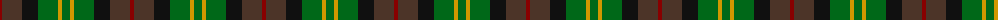
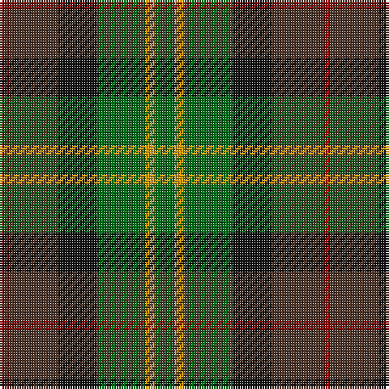

In pattern [GYGKBR](/patterns/gygkbr/).

This was sourced from register-of-tartans.  It is a [6 stripes tartan](/stripes/stripes6/).

Original link https://www.tartanregister.gov.uk/tartanDetails.aspx?ref=1231

## Thread count
DR/4 T20 K16 G20 DY4 G/8

## Palette
Each colour and its ΔE from the base-6 reference it is a variant of.

| Colour | Shade | Base | ΔE (OKLab) |
|---|---|---|---|
| DR | <code style="background-color:#880000;">#880000</code> `#880000` | R <code style="background-color:#C80000;">#C80000</code> | 0.14 |
| DY | <code style="background-color:#D09800;">#D09800</code> `#D09800` | Y <code style="background-color:#E8C000;">#E8C000</code> | 0.11 |
| G | <code style="background-color:#006818;">#006818</code> `#006818` | G <code style="background-color:#006400;">#006400</code> | 0.02 |
| K | <code style="background-color:#101010;">#101010</code> `#101010` | K <code style="background-color:#000000;">#000000</code> | 0.17 |
| T | <code style="background-color:#4C3428;">#4C3428</code> `#4C3428` | B <code style="background-color:#2C4084;">#2C4084</code> | 0.16 |

# Sample pattern

## Nearest tartans

The nearest existing variants by ΔTartan distance.

1. [Tennant (Clan)](/setts/s7/r4g28b28k28ga28g28r4-b1474b4-g604000-ga006818-k101010-rc80000/) — ΔT 0.95
1. [Tennant Family Tartan Tartan Number: 1653. Earliest known date: 1930 MacGregor-Hastie made few notes about his sample collection. In December 1967, Captain Tennant wrote to the Scottish Tartans Society, saying, ".. and I have no objection to other Tennants wearing it (Tennant tartan) but their problem will be to get hold of it ... I don't know of any other Tennant tartan and that is why I think my father designed this one." The head of the Tennant family is Lord Glenconner, descended from John Tennant of Blairston, Ayr. (1635). See products available Copyright © Blair Urquhart, Comrie, 2015](/setts/s7/r4g28b28k28ga28g28r4-b2c2c80-g604000-ga006818-k101010-rc80000/) — ΔT 1.15
1. [Casely](/setts/s6/r16g44k44g8b44ga12-b506878-g30644c-ga446428-k101010-rc80000/) — ΔT 1.20
1. [Scottish Parliament (unofficial)](/setts/s7/b28g36k6g36r40k28y6-b1c0070-g006818-k101010-r880000-yd09800/) — ΔT 1.23
1. [Unidentified Pinafore](/setts/s7/g48k8g48k48b14r48b14-b3c82af-g005020-k101010-r960028/) — ΔT 1.29
1. [Birse](/setts/s6/k8g32k28y6b32r8-b105880-g00643c-k101010-rc80000-ybc8c00/) — ΔT 1.31
1. [Styrian (Fashion)](/setts/s5/g16b38ga58r32ra8-b5c5c5c-g006818-ga003820-r888888-ra880000/) — ΔT 1.37
1. [Parliament Trade Tartan Tartan Number: 2477. Earliest known date: 1998 Created to celebrate the referendum result for the re-establishment of a Scottish Parliament as well as to provide a Parliamentary livery tartan. See products available Copyright © Blair Urquhart, Comrie, 2015](/setts/s7/b16g22k6g22r24ba20y4-b2c2c80-ba003c64-g006818-k101010-r880000-ye8c000/) — ΔT 1.39
1. [Wilson's No.122](/setts/s8/g28b22ga6k10ga6b22g28y4-b14283c-g006818-ga789484-k101010-yd8b000/) — ΔT 1.39
1. [Scottish Airports](/setts/s6/b8g36b6k34b36ba8-b3c505c-ba9058d8-g006818-k101010/) — ΔT 1.43

## Neighbour map

Every grey dot is one of 15726 variants placed by the first two principal components of the ΔTartan feature space (44% of its variance). Red is this tartan; blue dots are its nearest — click one to open its page.

<svg viewBox="0 0 640 380" role="img" style="max-width:100%;height:auto;border:1px solid #e0e0e0;border-radius:4px;display:block" xmlns="http://www.w3.org/2000/svg"><image href="/nn/cloud.v1.png" width="640" height="380"/><a href="/setts/s7/r4g28b28k28ga28g28r4-b1474b4-g604000-ga006818-k101010-rc80000/"><circle cx="148.8" cy="248.6" r="4" fill="#3465a4"><title>Tennant (Clan)</title></circle></a><a href="/setts/s7/r4g28b28k28ga28g28r4-b2c2c80-g604000-ga006818-k101010-rc80000/"><circle cx="164.8" cy="255.2" r="4" fill="#3465a4"><title>Tennant Family Tartan Tartan Number: 1653. Earliest known date: 1930 MacGregor-Hastie made few notes about his sample collection. In December 1967, Captain Tennant wrote to the Scottish Tartans Society, saying, &quot;.. and I have no objection to other Tennants wearing it (Tennant tartan) but their problem will be to get hold of it ... I don't know of any other Tennant tartan and that is why I think my father designed this one.&quot; The head of the Tennant family is Lord Glenconner, descended from John Tennant of Blairston, Ayr. (1635). See products available Copyright © Blair Urquhart, Comrie, 2015</title></circle></a><a href="/setts/s6/r16g44k44g8b44ga12-b506878-g30644c-ga446428-k101010-rc80000/"><circle cx="129.7" cy="258.2" r="4" fill="#3465a4"><title>Casely</title></circle></a><a href="/setts/s7/b28g36k6g36r40k28y6-b1c0070-g006818-k101010-r880000-yd09800/"><circle cx="140.8" cy="242.8" r="4" fill="#3465a4"><title>Scottish Parliament (unofficial)</title></circle></a><a href="/setts/s7/g48k8g48k48b14r48b14-b3c82af-g005020-k101010-r960028/"><circle cx="190.4" cy="264.7" r="4" fill="#3465a4"><title>Unidentified Pinafore</title></circle></a><a href="/setts/s6/k8g32k28y6b32r8-b105880-g00643c-k101010-rc80000-ybc8c00/"><circle cx="123.6" cy="250.2" r="4" fill="#3465a4"><title>Birse</title></circle></a><a href="/setts/s5/g16b38ga58r32ra8-b5c5c5c-g006818-ga003820-r888888-ra880000/"><circle cx="191.9" cy="266.3" r="4" fill="#3465a4"><title>Styrian (Fashion)</title></circle></a><a href="/setts/s7/b16g22k6g22r24ba20y4-b2c2c80-ba003c64-g006818-k101010-r880000-ye8c000/"><circle cx="112.3" cy="242.7" r="4" fill="#3465a4"><title>Parliament Trade Tartan Tartan Number: 2477. Earliest known date: 1998 Created to celebrate the referendum result for the re-establishment of a Scottish Parliament as well as to provide a Parliamentary livery tartan. See products available Copyright © Blair Urquhart, Comrie, 2015</title></circle></a><a href="/setts/s8/g28b22ga6k10ga6b22g28y4-b14283c-g006818-ga789484-k101010-yd8b000/"><circle cx="196.8" cy="237.0" r="4" fill="#3465a4"><title>Wilson's No.122</title></circle></a><a href="/setts/s6/b8g36b6k34b36ba8-b3c505c-ba9058d8-g006818-k101010/"><circle cx="208.4" cy="269.1" r="4" fill="#3465a4"><title>Scottish Airports</title></circle></a><circle cx="164.0" cy="263.8" r="5" fill="#c00000"/></svg>

ID: /setts/s6/g8y4g20k16b20r4-b4c3428-g006818-k101010-r880000-yd09800/
