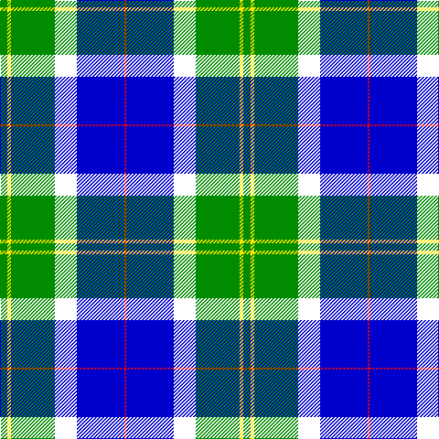

In pattern [GYGWBR](/patterns/gygwbr/).

This was sourced from register-of-tartans.  It is a [6 stripes tartan](/stripes/stripes6/).

Original link https://www.tartanregister.gov.uk/tartanDetails.aspx?ref=4442

## Thread count
G/8 Y4 G48 W24 B52 R/2

## Palette
Each colour and its ΔE from the base-6 reference it is a variant of.

| Colour | Shade | Base | ΔE (OKLab) |
|---|---|---|---|
| B | <code style="background-color:#0000CD;">#0000CD</code> `#0000CD` | B <code style="background-color:#2A418A;">#2A418A</code> | 0.14 |
| G | <code style="background-color:#008B00;">#008B00</code> `#008B00` | G <code style="background-color:#006100;">#006100</code> | 0.13 |
| R | <code style="background-color:#FF0000;">#FF0000</code> `#FF0000` | R <code style="background-color:#CC0000;">#CC0000</code> | 0.11 |
| W | <code style="background-color:#FFFFFF;">#FFFFFF</code> `#FFFFFF` | W <code style="background-color:#F7F7F7;">#F7F7F7</code> | 0.02 |
| Y | <code style="background-color:#FFE600;">#FFE600</code> `#FFE600` | Y <code style="background-color:#F2BF00;">#F2BF00</code> | 0.10 |

# Sample pattern

## Nearest tartans

The nearest existing variants by ΔTartan distance.

1. [Eeraerts, Laurent (Personal)](/setts/s6/w12b48ba4g60r12w4-b3474fc-ba2c2c80-g006818-r9c68a4-wffffff/) — ΔT 1.22
1. [Vancouver Centennial Commemorative Tartan Tartan Number: 2083. Earliest known date: 1988 Registered by Lord Lyon on 30th August, 1991. See products available Copyright © Blair Urquhart, Comrie, 2015](/setts/s6/g8y4g48w24b52r2-b2c2c80-g006818-rc80000-we0e0e0-ye8c000/) — ΔT 1.26
1. [Militello (Palermo) Dress (Personal)](/setts/s6/r6w6b72g72k4r4-b0000cd-g008b00-k101010-rff0000-wffffff/) — ΔT 1.39
1. [Vancouver, Centennial](/setts/s6/g8y4g48w24b52r2-b304080-g008000-rc00000-we0e0e0-yf0c000/) — ΔT 1.42
1. [Herriot New Zealand](/setts/s6/w15y2k5wa3b40k10-b006699-k000033-wffffff-wac0c0c0-yffff33/) — ΔT 1.51
1. [Ferguson, dress](/setts/s7/b68ba48w36r6w36g4w6-b5480b0-ba000050-g008000-rc00000-we0e0e0/) — ΔT 1.56
1. [Berger-MacLaren](/setts/s7/b74k24r34ra6r34k2y6-b007fff-k101010-rac7f24-racc1100-yffe303/) — ΔT 1.60
1. [Centennial-King George Lodge No.171](/setts/s5/r4w14b60g72y4-b1870a4-g004028-rff0000-wffffff-yffe600/) — ΔT 1.61
1. [Afternoon Tea / Mint Tea](/setts/s6/w15y98b72ba25b8ya15-b003c64-ba1474b4-wffffff-y48a4c0-yaf8e38c/) — ΔT 1.63
1. [Crookstoun (Personal)](/setts/s6/b106w54r10k38y2g22-b1474b4-g006818-k101010-rc8002c-wfcfcfc-ybc8c00/) — ΔT 1.66

## Neighbour map

Every grey dot is one of 15726 variants placed by the first two principal components of the ΔTartan feature space (44% of its variance). Red is this tartan; blue dots are its nearest — click one to open its page.

<svg viewBox="0 0 640 380" role="img" style="max-width:100%;height:auto;border:1px solid #e0e0e0;border-radius:4px;display:block" xmlns="http://www.w3.org/2000/svg"><image href="/nn/cloud.v1.png" width="640" height="380"/><a href="/setts/s6/w12b48ba4g60r12w4-b3474fc-ba2c2c80-g006818-r9c68a4-wffffff/"><circle cx="200.5" cy="163.2" r="4" fill="#3465a4"><title>Eeraerts, Laurent (Personal)</title></circle></a><a href="/setts/s6/g8y4g48w24b52r2-b2c2c80-g006818-rc80000-we0e0e0-ye8c000/"><circle cx="214.4" cy="148.7" r="4" fill="#3465a4"><title>Vancouver Centennial Commemorative Tartan Tartan Number: 2083. Earliest known date: 1988 Registered by Lord Lyon on 30th August, 1991. See products available Copyright © Blair Urquhart, Comrie, 2015</title></circle></a><a href="/setts/s6/r6w6b72g72k4r4-b0000cd-g008b00-k101010-rff0000-wffffff/"><circle cx="238.8" cy="146.7" r="4" fill="#3465a4"><title>Militello (Palermo) Dress (Personal)</title></circle></a><a href="/setts/s6/g8y4g48w24b52r2-b304080-g008000-rc00000-we0e0e0-yf0c000/"><circle cx="216.9" cy="149.6" r="4" fill="#3465a4"><title>Vancouver, Centennial</title></circle></a><a href="/setts/s6/w15y2k5wa3b40k10-b006699-k000033-wffffff-wac0c0c0-yffff33/"><circle cx="248.2" cy="138.6" r="4" fill="#3465a4"><title>Herriot New Zealand</title></circle></a><a href="/setts/s7/b68ba48w36r6w36g4w6-b5480b0-ba000050-g008000-rc00000-we0e0e0/"><circle cx="155.3" cy="150.5" r="4" fill="#3465a4"><title>Ferguson, dress</title></circle></a><a href="/setts/s7/b74k24r34ra6r34k2y6-b007fff-k101010-rac7f24-racc1100-yffe303/"><circle cx="229.2" cy="122.5" r="4" fill="#3465a4"><title>Berger-MacLaren</title></circle></a><a href="/setts/s5/r4w14b60g72y4-b1870a4-g004028-rff0000-wffffff-yffe600/"><circle cx="252.0" cy="171.8" r="4" fill="#3465a4"><title>Centennial-King George Lodge No.171</title></circle></a><a href="/setts/s6/w15y98b72ba25b8ya15-b003c64-ba1474b4-wffffff-y48a4c0-yaf8e38c/"><circle cx="188.8" cy="179.3" r="4" fill="#3465a4"><title>Afternoon Tea / Mint Tea</title></circle></a><a href="/setts/s6/b106w54r10k38y2g22-b1474b4-g006818-k101010-rc8002c-wfcfcfc-ybc8c00/"><circle cx="208.3" cy="97.8" r="4" fill="#3465a4"><title>Crookstoun (Personal)</title></circle></a><circle cx="189.3" cy="141.4" r="5" fill="#c00000"/></svg>

ID: /setts/s6/g8y4g48w24b52r2-b0000cd-g008b00-rff0000-wffffff-yffe600/
