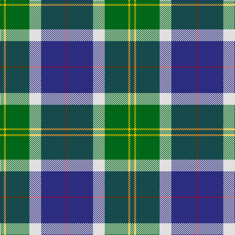

In pattern [GYGWBR](/patterns/gygwbr/).

This was sourced from house-of-tartan.  It is a [6 stripes tartan](/stripes/stripes6/).

Original link http://www.house-of-tartan.scotland.net/house/TartanViewjs.asp?colr=Def&tnam=2083

## Thread count
G/8 Y4 G48 LN24 DB52 R/2

## Palette
Each colour and its ΔE from the base-6 reference it is a variant of.

| Colour | Shade | Base | ΔE (OKLab) |
|---|---|---|---|
| DB | <code style="background-color:#2C2C80;">#2C2C80</code> `#2C2C80` | B <code style="background-color:#2A418A;">#2A418A</code> | 0.06 |
| G | <code style="background-color:#006818;">#006818</code> `#006818` | G <code style="background-color:#006100;">#006100</code> | 0.02 |
| LN | <code style="background-color:#E0E0E0;">#E0E0E0</code> `#E0E0E0` | W <code style="background-color:#F7F7F7;">#F7F7F7</code> | 0.07 |
| R | <code style="background-color:#C80000;">#C80000</code> `#C80000` | R <code style="background-color:#CC0000;">#CC0000</code> | 0.01 |
| Y | <code style="background-color:#E8C000;">#E8C000</code> `#E8C000` | Y <code style="background-color:#F2BF00;">#F2BF00</code> | 0.02 |

# Sample pattern

## Nearest tartans

The nearest existing variants by ΔTartan distance.

1. [Vancouver, Centennial](/setts/s6/g8y4g48w24b52r2-b304080-g008000-rc00000-we0e0e0-yf0c000/) — ΔT 0.70
1. [Big Sur MacLaren (Personal)](/setts/s7/y62k36g26r6g26k2ya6-g005030-k101010-rc80000-y88acb8-yae8c000/) — ΔT 0.79
1. [Centennial-King George Lodge No.171](/setts/s5/r4w14b60g72y4-b1870a4-g004028-rff0000-wffffff-yffe600/) — ΔT 1.01
1. [Centennial-King George Lodge No.171](/setts/s5/r4w14b60g72y4-b202060-g006818-rc80000-wfcfcfc-ye8c000/) — ΔT 1.09
1. [Berger-MacLaren](/setts/s7/b74k24r34ra6r34k2y6-b007fff-k101010-rac7f24-racc1100-yffe303/) — ΔT 1.10
1. [Ferguson of Athol](/setts/s7/b48k16g16r4g16k2w4-b304080-g008000-k000000-rc00000-we0e0e0/) — ΔT 1.12
1. [MacLaren](/setts/s7/b48k16g16r4g16k2y4-b304080-g008000-k000000-rc00000-yf0c000/) — ΔT 1.15
1. [Colquhoun](/setts/s7/b8k4b32w2k16g48r8-b304080-g008000-k000000-rc00000-we0e0e0/) — ΔT 1.15
1. [Ferguson of Atholl Clan](/setts/s7/b48k16g16r4g16k2w4-b1860a8-g006818-k101010-rc80000-wfcfcfc/) — ΔT 1.17
1. [MacCord / McCord (Personal)](/setts/s7/g12r4b2r6b32ga40w4-b202060-g285800-ga048888-rc80000-we0e0e0/) — ΔT 1.24

## Neighbour map

Every grey dot is one of 15726 variants placed by the first two principal components of the ΔTartan feature space (44% of its variance). Red is this tartan; blue dots are its nearest — click one to open its page.

<svg viewBox="0 0 640 380" role="img" style="max-width:100%;height:auto;border:1px solid #e0e0e0;border-radius:4px;display:block" xmlns="http://www.w3.org/2000/svg"><image href="/nn/cloud.v1.png" width="640" height="380"/><a href="/setts/s6/g8y4g48w24b52r2-b304080-g008000-rc00000-we0e0e0-yf0c000/"><circle cx="216.9" cy="149.6" r="4" fill="#3465a4"><title>Vancouver, Centennial</title></circle></a><a href="/setts/s7/y62k36g26r6g26k2ya6-g005030-k101010-rc80000-y88acb8-yae8c000/"><circle cx="193.9" cy="138.4" r="4" fill="#3465a4"><title>Big Sur MacLaren (Personal)</title></circle></a><a href="/setts/s5/r4w14b60g72y4-b1870a4-g004028-rff0000-wffffff-yffe600/"><circle cx="252.0" cy="171.8" r="4" fill="#3465a4"><title>Centennial-King George Lodge No.171</title></circle></a><a href="/setts/s5/r4w14b60g72y4-b202060-g006818-rc80000-wfcfcfc-ye8c000/"><circle cx="248.9" cy="170.3" r="4" fill="#3465a4"><title>Centennial-King George Lodge No.171</title></circle></a><a href="/setts/s7/b74k24r34ra6r34k2y6-b007fff-k101010-rac7f24-racc1100-yffe303/"><circle cx="229.2" cy="122.5" r="4" fill="#3465a4"><title>Berger-MacLaren</title></circle></a><a href="/setts/s7/b48k16g16r4g16k2w4-b304080-g008000-k000000-rc00000-we0e0e0/"><circle cx="230.1" cy="144.6" r="4" fill="#3465a4"><title>Ferguson of Athol</title></circle></a><a href="/setts/s7/b48k16g16r4g16k2y4-b304080-g008000-k000000-rc00000-yf0c000/"><circle cx="231.8" cy="145.2" r="4" fill="#3465a4"><title>MacLaren</title></circle></a><a href="/setts/s7/b8k4b32w2k16g48r8-b304080-g008000-k000000-rc00000-we0e0e0/"><circle cx="208.1" cy="146.8" r="4" fill="#3465a4"><title>Colquhoun</title></circle></a><a href="/setts/s7/b48k16g16r4g16k2w4-b1860a8-g006818-k101010-rc80000-wfcfcfc/"><circle cx="248.6" cy="153.3" r="4" fill="#3465a4"><title>Ferguson of Atholl Clan</title></circle></a><a href="/setts/s7/g12r4b2r6b32ga40w4-b202060-g285800-ga048888-rc80000-we0e0e0/"><circle cx="221.6" cy="154.2" r="4" fill="#3465a4"><title>MacCord / McCord (Personal)</title></circle></a><circle cx="214.4" cy="148.7" r="5" fill="#c00000"/></svg>

ID: /setts/s6/g8y4g48w24b52r2-b2c2c80-g006818-rc80000-we0e0e0-ye8c000/
