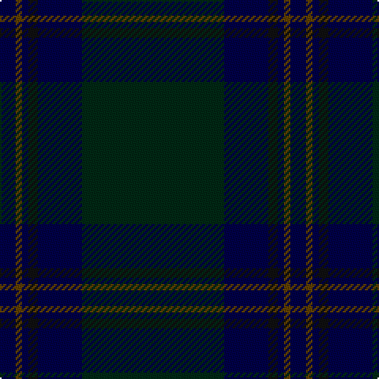

In pattern [BGBKBG](/patterns/bgbkbg/).

This was sourced from register-of-tartans.  It is a [6 stripes tartan](/stripes/stripes6/).

Original link https://www.tartanregister.gov.uk/tartanDetails.aspx?ref=3883

## Thread count
DB/10 T4 DB4 K6 DB28 DG/90

## Palette
Each colour and its ΔE from the base-6 reference it is a variant of.

| Colour | Shade | Base | ΔE (OKLab) |
|---|---|---|---|
| DB | <code style="background-color:#000048;">#000048</code> `#000048` | B <code style="background-color:#2A418A;">#2A418A</code> | 0.22 |
| DG | <code style="background-color:#002814;">#002814</code> `#002814` | G <code style="background-color:#006100;">#006100</code> | 0.20 |
| DGa | <code style="background-color:#003820;">#003820</code> `#003820` | G <code style="background-color:#006100;">#006100</code> | 0.15 |
| K | <code style="background-color:#101010;">#101010</code> `#101010` | K <code style="background-color:#000000;">#000000</code> | 0.17 |
| T | <code style="background-color:#604000;">#604000</code> `#604000` | G <code style="background-color:#006100;">#006100</code> | 0.14 |

# Sample pattern

## Nearest tartans

The nearest existing variants by ΔTartan distance.

1. [Tern House](/setts/s7/g23b3k8b4g4b56ga8-b141e46-g003820-ga604000-k101010/) — ΔT 1.37
1. [Little of Morton Rigg Red (Personal)](/setts/s8/k6b2k64ba12k8ba32k6r4-b5c8ca8-ba1c1c50-k101010-rc80000/) — ΔT 1.70
1. [Orman (Personal)](/setts/s9/k20ka6k6ka64g2ka2g2ka4b4-b5c5c5c-g003820-k101010-ka00002c/) — ΔT 1.83
1. [Land's End, Blue (Fashion)](/setts/s8/b4g18r4g18b4g4b52g4-b003054-g004c2c-r901c38/) — ΔT 1.86
1. [McGovern (2016)](/setts/s5/b124r8g20ga6gb42-b061d37-g452700-ga2a230c-gb004f15-r9e411f/) — ΔT 1.86
1. [Feddinch Club, St Andrews Limited, The](/setts/s4/g86k28ka28r4-g003820-k101010-ka1c0030-r880000/) — ΔT 1.89
1. [Little Hunting](/setts/s8/b10ba6b8ba6b8k56b16r2-b1c1c50-ba2c2c80-k101010-rc80000/) — ΔT 2.00
1. [Comme Ça Il Principe](/setts/s10/b3k53b4k4b4k4b24ba10b1r1-b003c64-ba141e46-k101010-rb03000/) — ΔT 2.02
1. [Hector, James (Corporate)](/setts/s5/b4g22ba54g16r4-b441800-ba003c64-g003820-r880000/) — ΔT 2.11
1. [Heslop Lurdenlaw by Kelso](/setts/s4/b88g24ga2r12-b1e2025-g23321b-ga43a5a0-ra32d18/) — ΔT 2.12

## Neighbour map

Every grey dot is one of 15726 variants placed by the first two principal components of the ΔTartan feature space (44% of its variance). Red is this tartan; blue dots are its nearest — click one to open its page.

<svg viewBox="0 0 640 380" role="img" style="max-width:100%;height:auto;border:1px solid #e0e0e0;border-radius:4px;display:block" xmlns="http://www.w3.org/2000/svg"><image href="/nn/cloud.v1.png" width="640" height="380"/><a href="/setts/s7/g23b3k8b4g4b56ga8-b141e46-g003820-ga604000-k101010/"><circle cx="522.5" cy="248.1" r="4" fill="#3465a4"><title>Tern House</title></circle></a><a href="/setts/s8/k6b2k64ba12k8ba32k6r4-b5c8ca8-ba1c1c50-k101010-rc80000/"><circle cx="535.2" cy="202.9" r="4" fill="#3465a4"><title>Little of Morton Rigg Red (Personal)</title></circle></a><a href="/setts/s9/k20ka6k6ka64g2ka2g2ka4b4-b5c5c5c-g003820-k101010-ka00002c/"><circle cx="622.0" cy="205.7" r="4" fill="#3465a4"><title>Orman (Personal)</title></circle></a><a href="/setts/s8/b4g18r4g18b4g4b52g4-b003054-g004c2c-r901c38/"><circle cx="518.9" cy="270.4" r="4" fill="#3465a4"><title>Land's End, Blue (Fashion)</title></circle></a><a href="/setts/s5/b124r8g20ga6gb42-b061d37-g452700-ga2a230c-gb004f15-r9e411f/"><circle cx="468.0" cy="221.4" r="4" fill="#3465a4"><title>McGovern (2016)</title></circle></a><a href="/setts/s4/g86k28ka28r4-g003820-k101010-ka1c0030-r880000/"><circle cx="477.3" cy="275.2" r="4" fill="#3465a4"><title>Feddinch Club, St Andrews Limited, The</title></circle></a><a href="/setts/s8/b10ba6b8ba6b8k56b16r2-b1c1c50-ba2c2c80-k101010-rc80000/"><circle cx="469.1" cy="215.0" r="4" fill="#3465a4"><title>Little Hunting</title></circle></a><a href="/setts/s10/b3k53b4k4b4k4b24ba10b1r1-b003c64-ba141e46-k101010-rb03000/"><circle cx="520.5" cy="167.2" r="4" fill="#3465a4"><title>Comme Ça Il Principe</title></circle></a><a href="/setts/s5/b4g22ba54g16r4-b441800-ba003c64-g003820-r880000/"><circle cx="488.1" cy="293.4" r="4" fill="#3465a4"><title>Hector, James (Corporate)</title></circle></a><a href="/setts/s4/b88g24ga2r12-b1e2025-g23321b-ga43a5a0-ra32d18/"><circle cx="593.8" cy="229.0" r="4" fill="#3465a4"><title>Heslop Lurdenlaw by Kelso</title></circle></a><circle cx="557.3" cy="238.6" r="5" fill="#c00000"/></svg>

ID: /setts/s6/g90b28k6b4ga4b10-b000048-g002814-ga604000-k101010/
