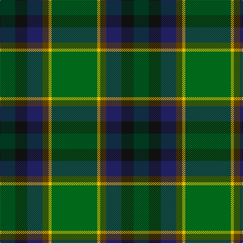

In pattern [GKBGYG](/patterns/gkbgyg/).

This was sourced from tartans-authority.  It is a [6 stripes tartan](/stripes/stripes6/).

Original link http://www.tartansauthority.com/tartan-ferret/display/10943/

## Thread count
DG/30 K24 DB30 T12 Y6 G/90

## Palette
Each colour and its ΔE from the base-6 reference it is a variant of.

| Colour | Shade | Base | ΔE (OKLab) |
|---|---|---|---|
| DB | <code style="background-color:#202060;">#202060</code> `#202060` | B <code style="background-color:#2C4084;">#2C4084</code> | 0.11 |
| DG | <code style="background-color:#003820;">#003820</code> `#003820` | G <code style="background-color:#006400;">#006400</code> | 0.16 |
| G | <code style="background-color:#006818;">#006818</code> `#006818` | G <code style="background-color:#006400;">#006400</code> | 0.02 |
| K | <code style="background-color:#101010;">#101010</code> `#101010` | K <code style="background-color:#000000;">#000000</code> | 0.17 |
| T | <code style="background-color:#604000;">#604000</code> `#604000` | G <code style="background-color:#006400;">#006400</code> | 0.14 |
| Y | <code style="background-color:#E8C000;">#E8C000</code> `#E8C000` | Y <code style="background-color:#E8C000;">#E8C000</code> | 0.00 |

# Sample pattern

## Nearest tartans

The nearest existing variants by ΔTartan distance.

1. [Zimmermann, Martin (Personal)](/setts/s6/b6g38ga58k22r8y4-b000048-g285800-ga003820-k101010-rff0000-yffe600/) — ΔT 0.80
1. [Dobson (Palm Bay) (Personal)](/setts/s6/g90y6b12ba30k24ga30-b441800-ba202060-g00643c-ga003820-k1c1714-ye0a126/) — ΔT 0.96
1. [Glencross (Tynron) (Personal)](/setts/s6/b6g26ba26y4ga68w6-b680018-ba084555-g3b522f-ga052f14-wddd5af-yc58310/) — ΔT 1.17
1. [Wagland (Name)](/setts/s7/r6b12y4b30g24ga78w6-b2c2c80-g006818-ga285800-rc80000-we0e0e0-ye8c000/) — ΔT 1.19
1. [Vipont (White line)](/setts/s7/r8g28k6ra6g24b72w8-b0c585c-g006818-k101010-rc80000-ra9c68a4-wfcfcfc/) — ΔT 1.25
1. [Reidy Wedding](/setts/s7/g62b14y6b28g16ba36bb10-b002814-ba2c4084-bb780078-g146000-yd87c00/) — ΔT 1.27
1. [MacSween Hunting (Lochs, Isle of Lew](/setts/s7/g3r3g31ga18g4k22y3-g006818-ga003820-k101010-rc80000-ye8c000/) — ΔT 1.29
1. [Waterford Irish County Tartan Tartan Number: 2255. Earliest known date: 1993 One of a series of Irish District tartans designed by Polly Wittering of the House of Edgar, with colours reminiscent of the Country with soft warm colours dominating. See products available Copyright © Blair Urquhart, Comrie, 2015](/setts/s6/g84y4ga32b14k32r10-b003860-g043828-ga006840-k000000-ra00028-ye4b448/) — ΔT 1.36
1. [Symonds (2016)](/setts/s6/g72y4b20y4ga72r4-b780078-g006818-ga003820-rc80000-ye8c000/) — ΔT 1.36
1. [Connelly, James (Personal)](/setts/s8/g48ga24r4g24ga16b32y8w8-b442050-g004830-ga006430-rbc1828-we8e8e8-yf0c400/) — ΔT 1.36

## Neighbour map

Every grey dot is one of 15726 variants placed by the first two principal components of the ΔTartan feature space (44% of its variance). Red is this tartan; blue dots are its nearest — click one to open its page.

<svg viewBox="0 0 640 380" role="img" style="max-width:100%;height:auto;border:1px solid #e0e0e0;border-radius:4px;display:block" xmlns="http://www.w3.org/2000/svg"><image href="/nn/cloud.v1.png" width="640" height="380"/><a href="/setts/s6/b6g38ga58k22r8y4-b000048-g285800-ga003820-k101010-rff0000-yffe600/"><circle cx="216.3" cy="183.2" r="4" fill="#3465a4"><title>Zimmermann, Martin (Personal)</title></circle></a><a href="/setts/s6/g90y6b12ba30k24ga30-b441800-ba202060-g00643c-ga003820-k1c1714-ye0a126/"><circle cx="261.3" cy="198.8" r="4" fill="#3465a4"><title>Dobson (Palm Bay) (Personal)</title></circle></a><a href="/setts/s6/b6g26ba26y4ga68w6-b680018-ba084555-g3b522f-ga052f14-wddd5af-yc58310/"><circle cx="297.5" cy="185.0" r="4" fill="#3465a4"><title>Glencross (Tynron) (Personal)</title></circle></a><a href="/setts/s7/r6b12y4b30g24ga78w6-b2c2c80-g006818-ga285800-rc80000-we0e0e0-ye8c000/"><circle cx="267.0" cy="148.9" r="4" fill="#3465a4"><title>Wagland (Name)</title></circle></a><a href="/setts/s7/r8g28k6ra6g24b72w8-b0c585c-g006818-k101010-rc80000-ra9c68a4-wfcfcfc/"><circle cx="251.0" cy="171.3" r="4" fill="#3465a4"><title>Vipont (White line)</title></circle></a><a href="/setts/s7/g62b14y6b28g16ba36bb10-b002814-ba2c4084-bb780078-g146000-yd87c00/"><circle cx="241.8" cy="224.3" r="4" fill="#3465a4"><title>Reidy Wedding</title></circle></a><a href="/setts/s7/g3r3g31ga18g4k22y3-g006818-ga003820-k101010-rc80000-ye8c000/"><circle cx="236.1" cy="202.7" r="4" fill="#3465a4"><title>MacSween Hunting (Lochs, Isle of Lew</title></circle></a><a href="/setts/s6/g84y4ga32b14k32r10-b003860-g043828-ga006840-k000000-ra00028-ye4b448/"><circle cx="245.6" cy="165.6" r="4" fill="#3465a4"><title>Waterford Irish County Tartan Tartan Number: 2255. Earliest known date: 1993 One of a series of Irish District tartans designed by Polly Wittering of the House of Edgar, with colours reminiscent of the Country with soft warm colours dominating. See products available Copyright © Blair Urquhart, Comrie, 2015</title></circle></a><a href="/setts/s6/g72y4b20y4ga72r4-b780078-g006818-ga003820-rc80000-ye8c000/"><circle cx="274.6" cy="180.3" r="4" fill="#3465a4"><title>Symonds (2016)</title></circle></a><a href="/setts/s8/g48ga24r4g24ga16b32y8w8-b442050-g004830-ga006430-rbc1828-we8e8e8-yf0c400/"><circle cx="182.5" cy="189.1" r="4" fill="#3465a4"><title>Connelly, James (Personal)</title></circle></a><circle cx="238.0" cy="188.8" r="5" fill="#c00000"/></svg>

ID: /setts/s6/g90y6ga12b30k24gb30-b202060-g006818-ga604000-gb003820-k101010-ye8c000/
