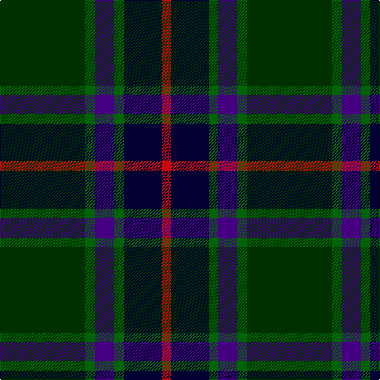

In pattern [GGBGKR](/patterns/ggbgkr/).

This was sourced from register-of-tartans.  It is a [6 stripes tartan](/stripes/stripes6/).

Original link https://www.tartanregister.gov.uk/tartanDetails.aspx?ref=10029

## Thread count
DG/108 G12 P24 G12 DB48 R/12

## Palette
Each colour and its ΔE from the base-6 reference it is a variant of.

| Colour | Shade | Base | ΔE (OKLab) |
|---|---|---|---|
| DB | <code style="background-color:#020031;">#020031</code> `#020031` | K <code style="background-color:#000000;">#000000</code> | 0.17 |
| DG | <code style="background-color:#003000;">#003000</code> `#003000` | G <code style="background-color:#006100;">#006100</code> | 0.17 |
| G | <code style="background-color:#026306;">#026306</code> `#026306` | G <code style="background-color:#006100;">#006100</code> | 0.01 |
| P | <code style="background-color:#450082;">#450082</code> `#450082` | B <code style="background-color:#2A418A;">#2A418A</code> | 0.12 |
| R | <code style="background-color:#CB080C;">#CB080C</code> `#CB080C` | R <code style="background-color:#CC0000;">#CC0000</code> | 0.00 |

# Sample pattern

## Nearest tartans

The nearest existing variants by ΔTartan distance.

1. [Kilkenny, County (District)](/setts/s7/b4g27r2ba25y5g3r3~b480800-ba202060-g003820-rb84c00-ybc8c00~x2/) — ΔT 1.18
1. [Cultoquhey Hotel Corporate Tartan Tartan Number: 3393. Earliest known date: circa1990 Designed by Peter MacDonald as a Cook tartan for the former owners (David & Anna) of the Cultoquhey Hotel near Crieff. When they left, if became the house tartan of the hotel See products available Copyright © Blair Urquhart, Comrie, 2015](/setts/s5/r3b22k11g32y3~b202060-g003820-k101010-rc80000-yd8b000~x2/) — ΔT 1.18
1. [Joe Strummer Commemorative](/setts/s7/k3g3ga6k12gb1gc2g2~g572700-ga794400-gb675223-gc524e26-k00011f~x4/) — ΔT 1.24
1. [Lisbon](/setts/s6/g2b12ba3ga22ba22r2~b1c0070-ba441800-g8c7038-ga006818-r880000~x2/) — ΔT 1.24
1. [Douglas, (Brown)](/setts/s5/k7b3g30ba30w3~b3c82af-ba141e46-g503c14-k101010-we0e0e0~x2/) — ΔT 1.27
1. [Black Raven (Fashion)](/setts/s7/k62b15ba15g20y5b5k15~b2c2c80-ba1870a4-g604000-k101010-yc4bc68~x2/) — ΔT 1.30
1. [Womens Rural Institute](/setts/s8/g4ga24b4k6g4r3g4b3~b440044-g003820-ga408060-k101010-r880000~x2/) — ΔT 1.32
1. [Manroth (Personal)](/setts/s9/g15b20k2r4k2b20g15k2y2~b202060-g285800-k101010-rc80000-ye8c000~x2/) — ΔT 1.32
1. [Fraser Gathering, Green (1997)](/setts/s9/r2b12g2ga11g4b5ga2g24w2~b1c0070-g003820-ga006818-rc80000-wfcfcfc~x2/) — ΔT 1.34
1. [MacPhedran/MacFadzean](/setts/s7/g3b12w1k12g13r2g2~b2c2c80-g285800-k101010-rc80000-wc0c0c0~x2/) — ΔT 1.36

## Neighbour map

Every grey dot is one of 15726 variants placed by the first two principal components of the ΔTartan feature space (44% of its variance). Red is this tartan; blue dots are its nearest — click one to open its page.

<svg viewBox="0 0 640 380" role="img" style="max-width:100%;height:auto;border:1px solid #e0e0e0;border-radius:4px;display:block" xmlns="http://www.w3.org/2000/svg"><image href="/nn/cloud.v1.png" width="640" height="380"/><a href="/setts/s7/b4g27r2ba25y5g3r3~b480800-ba202060-g003820-rb84c00-ybc8c00~x2/"><circle cx="280.3" cy="187.4" r="4" fill="#3465a4"><title>Kilkenny, County (District)</title></circle></a><a href="/setts/s5/r3b22k11g32y3~b202060-g003820-k101010-rc80000-yd8b000~x2/"><circle cx="268.8" cy="234.8" r="4" fill="#3465a4"><title>Cultoquhey Hotel Corporate Tartan Tartan Number: 3393. Earliest known date: circa1990 Designed by Peter MacDonald as a Cook tartan for the former owners (David &amp; Anna) of the Cultoquhey Hotel near Crieff. When they left, if became the house tartan of the hotel See products available Copyright © Blair Urquhart, Comrie, 2015</title></circle></a><a href="/setts/s7/k3g3ga6k12gb1gc2g2~g572700-ga794400-gb675223-gc524e26-k00011f~x4/"><circle cx="282.6" cy="201.6" r="4" fill="#3465a4"><title>Joe Strummer Commemorative</title></circle></a><a href="/setts/s6/g2b12ba3ga22ba22r2~b1c0070-ba441800-g8c7038-ga006818-r880000~x2/"><circle cx="238.6" cy="211.4" r="4" fill="#3465a4"><title>Lisbon</title></circle></a><a href="/setts/s5/k7b3g30ba30w3~b3c82af-ba141e46-g503c14-k101010-we0e0e0~x2/"><circle cx="257.1" cy="222.7" r="4" fill="#3465a4"><title>Douglas, (Brown)</title></circle></a><a href="/setts/s7/k62b15ba15g20y5b5k15~b2c2c80-ba1870a4-g604000-k101010-yc4bc68~x2/"><circle cx="302.2" cy="192.6" r="4" fill="#3465a4"><title>Black Raven (Fashion)</title></circle></a><a href="/setts/s8/g4ga24b4k6g4r3g4b3~b440044-g003820-ga408060-k101010-r880000~x2/"><circle cx="231.9" cy="189.8" r="4" fill="#3465a4"><title>Womens Rural Institute</title></circle></a><a href="/setts/s9/g15b20k2r4k2b20g15k2y2~b202060-g285800-k101010-rc80000-ye8c000~x2/"><circle cx="267.9" cy="197.5" r="4" fill="#3465a4"><title>Manroth (Personal)</title></circle></a><a href="/setts/s9/r2b12g2ga11g4b5ga2g24w2~b1c0070-g003820-ga006818-rc80000-wfcfcfc~x2/"><circle cx="247.9" cy="177.5" r="4" fill="#3465a4"><title>Fraser Gathering, Green (1997)</title></circle></a><a href="/setts/s7/g3b12w1k12g13r2g2~b2c2c80-g285800-k101010-rc80000-wc0c0c0~x2/"><circle cx="217.6" cy="197.7" r="4" fill="#3465a4"><title>MacPhedran/MacFadzean</title></circle></a><circle cx="273.7" cy="215.4" r="5" fill="#c00000"/></svg>

ID: /setts/s6/g9ga1b2ga1k4r1~b450082-g003000-ga026306-k020031-rcb080c~x12/
