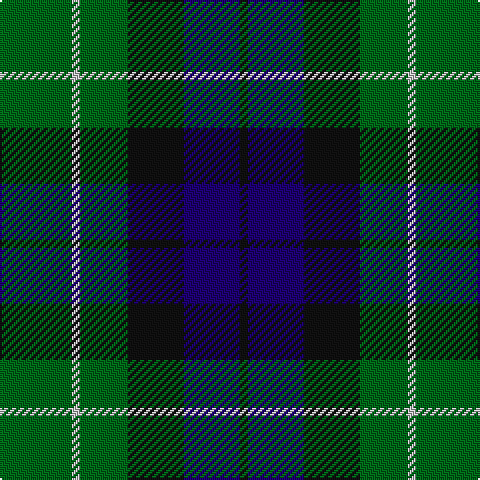

This page is one **sett** — a single exact thread-count. It belongs to the [tartan](/tartans/g9lb1g6k7db7k1/)
(the same proportion at any scale), whose colour order is pattern [GWGKBK](/stripes/gwgkbk/).

Sourced from register-of-tartans.  It is a [6 stripe tartan](/stripes/stripes6/).

Original link https://www.tartanregister.gov.uk/tartanDetails.aspx?ref=2919

2 attestations — the source records this cloth was collapsed from (oldest owns this page)

<ul>
<li>01/01/2002 — Menteith (register-of-tartans, <a href="https://www.tartanregister.gov.uk/tartanDetails.aspx?ref=2919">record</a>)</li>
<li>pre 2002 — Menteith (District) (tartans-authority, <a href="http://www.tartansauthority.com/tartan-ferret/display/929/">record</a>)</li>
</ul>

## Register references

External register numbers recorded for this tartan.

- Scottish Register of Tartans: [2919](https://www.tartanregister.gov.uk/tartanDetails.aspx?ref=2919)
- Scottish Tartans Authority (ITI): 929
- Scottish Tartans World Register: 929

## Thread count
G/36 N4 G24 K28 DB28 K/4

## Palette

Palette: <strong>Tartan Register</strong>
<table><thead><tr><th>Colour</th><th>Threads</th><th>Shade</th><th>Base</th><th>OKLCh</th></tr></thead><tbody><tr><td>G/</td><td style="text-align:right;font-variant-numeric:tabular-nums">36</td><td><code style="background-color:#006818;">#006818</code> <small style="color:#888">#006818</small></td><td>G <code style="background-color:#006100;">#006100</code></td><td><small style="color:#888">oklch(45.0% 0.142 145.0)</small></td></tr><tr><td>N</td><td style="text-align:right;font-variant-numeric:tabular-nums">4</td><td><code style="background-color:#C0C0C0;">#C0C0C0</code> <small style="color:#888">#C0C0C0</small></td><td>W <code style="background-color:#F7F7F7;">#F7F7F7</code></td><td><small style="color:#888">oklch(80.8% 0.000 89.9)</small></td></tr><tr><td>G</td><td style="text-align:right;font-variant-numeric:tabular-nums">24</td><td><code style="background-color:#006818;">#006818</code> <small style="color:#888">#006818</small></td><td>G <code style="background-color:#006100;">#006100</code></td><td><small style="color:#888">oklch(45.0% 0.142 145.0)</small></td></tr><tr><td>K</td><td style="text-align:right;font-variant-numeric:tabular-nums">28</td><td><code style="background-color:#101010;">#101010</code> <small style="color:#888">#101010</small></td><td>K <code style="background-color:#000000;">#000000</code></td><td><small style="color:#888">oklch(17.3% 0.000 89.9)</small></td></tr><tr><td>DB</td><td style="text-align:right;font-variant-numeric:tabular-nums">28</td><td><code style="background-color:#1C0070;">#1C0070</code> <small style="color:#888">#1C0070</small></td><td>B <code style="background-color:#2A418A;">#2A418A</code></td><td><small style="color:#888">oklch(26.3% 0.162 277.1)</small></td></tr><tr><td>K/</td><td style="text-align:right;font-variant-numeric:tabular-nums">4</td><td><code style="background-color:#101010;">#101010</code> <small style="color:#888">#101010</small></td><td>K <code style="background-color:#000000;">#000000</code></td><td><small style="color:#888">oklch(17.3% 0.000 89.9)</small></td></tr></tbody></table>

# Sample pattern

## Nearest tartans

The nearest existing variants by ΔTartan distance, with this tartan at the top so the swatches line up against it.

ΔTartan

Tartan

Sett

—

<a href="/ttd/edit/#slug=g9lb1g6k7db7k1~x4">Menteith</a> <a class="nn-out" href="/setts/s6/g9lb1g6k7db7k1~x4/" title="open its dictionary page">↗</a>

0.54

<a href="/ttd/edit/#slug=k2dg9t1k6b4dg2~x2">Unidentified #28</a> <a class="nn-out" href="/setts/s6/k2dg9t1k6b4dg2~x2/" title="open its dictionary page">↗</a>

0.72

<a href="/ttd/edit/#slug=g3db1g8db7k3ly1~x2">Trafalgar (Fashion)</a> <a class="nn-out" href="/setts/s6/g3db1g8db7k3ly1~x2/" title="open its dictionary page">↗</a>

0.86

<a href="/ttd/edit/#slug=g52lb7g9k35db35k7">Redland</a> <a class="nn-out" href="/setts/s6/g52lb7g9k35db35k7/" title="open its dictionary page">↗</a>

0.97

<a href="/ttd/edit/#slug=g21k6t3g11k17db17k3~x2">MacCallum</a> <a class="nn-out" href="/setts/s7/g21k6t3g11k17db17k3~x2/" title="open its dictionary page">↗</a>

1.00

<a href="/ttd/edit/#slug=r3k9g20k16g7b3~x2">Holman (Personal)</a> <a class="nn-out" href="/setts/s6/r3k9g20k16g7b3~x2/" title="open its dictionary page">↗</a>

1.06

<a href="/ttd/edit/#slug=r3dg10r3dg14db16dg3ly2">Cameron Hunting</a> <a class="nn-out" href="/setts/s7/r3dg10r3dg14db16dg3ly2/" title="open its dictionary page">↗</a>

1.08

<a href="/ttd/edit/#slug=g18t2g4k14dp12k3~x2">Coburg</a> <a class="nn-out" href="/setts/s6/g18t2g4k14dp12k3~x2/" title="open its dictionary page">↗</a>

1.10

<a href="/ttd/edit/#slug=r3dg10r3dg14db16dg3ly2~x2">Cameron Hunting</a> <a class="nn-out" href="/setts/s7/r3dg10r3dg14db16dg3ly2~x2/" title="open its dictionary page">↗</a>

1.11

<a href="/ttd/edit/#slug=g24db6t3k6db12k15g4~x2">Blaylock Annandale (Name)</a> <a class="nn-out" href="/setts/s7/g24db6t3k6db12k15g4~x2/" title="open its dictionary page">↗</a>

1.11

<a href="/ttd/edit/#slug=g24b6lb3k6b12k15g4~x2">Blaylock Annandale</a> <a class="nn-out" href="/setts/s7/g24b6lb3k6b12k15g4~x2/" title="open its dictionary page">↗</a>

## Neighbour map

Every grey dot is one of 14299 variants placed by the first two principal components of the ΔTartan feature space (44% of its variance). Red is this tartan; blue dots are its nearest — click one to open its page.

<svg viewBox="0 0 640 380" role="img" style="max-width:100%;height:auto;border:1px solid #e0e0e0;border-radius:4px;display:block" xmlns="http://www.w3.org/2000/svg"><image href="/nn/cloud.v1.png" width="640" height="380"/><a href="/setts/s6/k2dg9t1k6b4dg2~x2/"><circle cx="229.3" cy="242.6" r="4" fill="#3465a4"><title>Unidentified #28</title></circle></a><a href="/setts/s6/g3db1g8db7k3ly1~x2/"><circle cx="248.8" cy="247.4" r="4" fill="#3465a4"><title>Trafalgar (Fashion)</title></circle></a><a href="/setts/s6/g52lb7g9k35db35k7/"><circle cx="207.6" cy="246.5" r="4" fill="#3465a4"><title>Redland</title></circle></a><a href="/setts/s7/g21k6t3g11k17db17k3~x2/"><circle cx="205.9" cy="262.1" r="4" fill="#3465a4"><title>MacCallum</title></circle></a><a href="/setts/s6/r3k9g20k16g7b3~x2/"><circle cx="252.3" cy="262.9" r="4" fill="#3465a4"><title>Holman (Personal)</title></circle></a><a href="/setts/s7/r3dg10r3dg14db16dg3ly2/"><circle cx="263.7" cy="229.7" r="4" fill="#3465a4"><title>Cameron Hunting</title></circle></a><a href="/setts/s6/g18t2g4k14dp12k3~x2/"><circle cx="229.5" cy="248.4" r="4" fill="#3465a4"><title>Coburg</title></circle></a><a href="/setts/s7/r3dg10r3dg14db16dg3ly2~x2/"><circle cx="285.4" cy="241.4" r="4" fill="#3465a4"><title>Cameron Hunting</title></circle></a><a href="/setts/s7/g24db6t3k6db12k15g4~x2/"><circle cx="212.8" cy="248.1" r="4" fill="#3465a4"><title>Blaylock Annandale (Name)</title></circle></a><a href="/setts/s7/g24b6lb3k6b12k15g4~x2/"><circle cx="189.5" cy="235.8" r="4" fill="#3465a4"><title>Blaylock Annandale</title></circle></a><circle cx="232.9" cy="254.6" r="5" fill="#c00000"/></svg>

ID: /setts/s6/g9lb1g6k7db7k1~x4/
