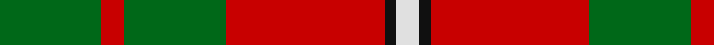

In pattern [GRGRKW](/patterns/grgrkw/).

This was sourced from register-of-tartans.  It is a [6 stripes tartan](/stripes/stripes6/).

Original link https://www.tartanregister.gov.uk/tartanDetails.aspx?ref=2456

## Attestations

This cloth appears in 2 source records; the oldest owns this page.

- 01/01/1842 — MacGregor of Balquidder (Logan) (register-of-tartans, [record](https://www.tartanregister.gov.uk/tartanDetails.aspx?ref=2456))
- undated — MacGregor of Balquhidder Clan Tartan Tartan Number: 988. Earliest known date: 1831 This sett is shown in the earliest publication of clan tartans. James Logan collected material for, 'The Scottish Gael', around 1826 and published in 1831. A number of minor anomilies in Logans method of recording tartans has led to errors appearing in some versions of the sett. See products available Copyright © Blair Urquhart, Comrie, 2015 (house-of-tartan, [record](http://www.house-of-tartan.scotland.net/house/TartanViewjs.asp?colr=Def&tnam=988))

## Thread count
G/18 R4 G18 R28 K2 LN/4

## Palette
Each colour and its ΔE from the base-6 reference it is a variant of.

| Colour | Shade | Base | ΔE (OKLab) |
|---|---|---|---|
| G | <code style="background-color:#006818;">#006818</code> `#006818` | G <code style="background-color:#006100;">#006100</code> | 0.02 |
| K | <code style="background-color:#101010;">#101010</code> `#101010` | K <code style="background-color:#000000;">#000000</code> | 0.17 |
| LN | <code style="background-color:#E0E0E0;">#E0E0E0</code> `#E0E0E0` | W <code style="background-color:#F7F7F7;">#F7F7F7</code> | 0.07 |
| R | <code style="background-color:#C80000;">#C80000</code> `#C80000` | R <code style="background-color:#CC0000;">#CC0000</code> | 0.01 |

# Sample pattern

## Nearest tartans

The nearest existing variants by ΔTartan distance.

1. [MacGregor of Balquidder - 1831 (Clan](/setts/s6/g9r2g9r14k1w2x4~g009020-k101010-rc80000-we0e0e0/) — ΔT 0.66
1. [Cetoloni (Personal)](/setts/s6/b1r12g6y1g6b1x4~b2c2c80-g006818-rc80000-ye8c000/) — ΔT 0.71
1. [MacAulay](/setts/s6/k2r16g6r3g8w1x2~g008000-k000000-rc00000-we0e0e0/) — ΔT 0.73
1. [MacAulay (Clan)](/setts/s6/k2r16g6r3g8w1x4~g006818-k101010-rc80000-we0e0e0/) — ΔT 0.79
1. [MacAulay Tartan Tartan Number: 1164. Earliest known date: 1881 This shorter version tallies with the count published by M'Intyre North in 1881 as having been given him by Logan. There are two Clans of the name associated with districts as far apart as Dumbarton and Lewis and they have no family connection with each other. They are the MacAulays of Ardencaple associated with the MacGregors and the MacAulays of Lewis who are associated with the MacLeods. This sett in its shortened form begins to resemble the MacGregor tartan. See products available Copyright © Blair Urquhart, Comrie, 2015](/setts/s6/k2r16g6r3g8w1x2~g006818-k101010-rc80000-we0e0e0/) — ΔT 0.79
1. [Cumming #2](/setts/s8/r3g9w1g9r3g6r18k2x2~g006818-k101010-rc80000-wfcfcfc/) — ΔT 0.79
1. [MacAulay](/setts/s6/k2r16g6r3g8w1x2~g006818-k101010-rc80000-wc0c0c0/) — ΔT 0.82
1. [Comyn, or MacAulay](/setts/s8/r3g9w1g9r3g6r18k2x2~g008000-k000000-rc00000-we0e0e0/) — ΔT 0.82
1. [Comyn or MacAulay Tartan Tartan Number: 1157. Earliest known date: 1850 This sett closely resembles the 'Vestiarium' version, but is in fact the one given by Logan as MacAuley and illustrated by MacIan in 'The Clans of the Scottish Highlands', 1847. The Smith brothers said that the sett had the approval of the head of the family og Cumming. See products available Copyright © Blair Urquhart, Comrie, 2015](/setts/s8/r3g9w1g9r3g6r18k2x2~g006818-k101010-rc80000-we0e0e0/) — ΔT 0.82
1. [Starr (1978) (Name)](/setts/s7/k2r4w1r10g12r2w2x4~g00881c-k101010-rc80000-we0e0e0/) — ΔT 0.95

## Neighbour map

Every grey dot is one of 15726 variants placed by the first two principal components of the ΔTartan feature space (44% of its variance). Red is this tartan; blue dots are its nearest — click one to open its page.

<svg viewBox="0 0 640 380" role="img" style="max-width:100%;height:auto;border:1px solid #e0e0e0;border-radius:4px;display:block" xmlns="http://www.w3.org/2000/svg"><image href="/nn/cloud.v1.png" width="640" height="380"/><a href="/setts/s6/g9r2g9r14k1w2x4~g009020-k101010-rc80000-we0e0e0/"><circle cx="288.5" cy="197.0" r="4" fill="#3465a4"><title>MacGregor of Balquidder - 1831 (Clan</title></circle></a><a href="/setts/s6/b1r12g6y1g6b1x4~b2c2c80-g006818-rc80000-ye8c000/"><circle cx="287.4" cy="198.6" r="4" fill="#3465a4"><title>Cetoloni (Personal)</title></circle></a><a href="/setts/s6/k2r16g6r3g8w1x2~g008000-k000000-rc00000-we0e0e0/"><circle cx="314.7" cy="185.1" r="4" fill="#3465a4"><title>MacAulay</title></circle></a><a href="/setts/s6/k2r16g6r3g8w1x4~g006818-k101010-rc80000-we0e0e0/"><circle cx="331.4" cy="190.4" r="4" fill="#3465a4"><title>MacAulay (Clan)</title></circle></a><a href="/setts/s6/k2r16g6r3g8w1x2~g006818-k101010-rc80000-we0e0e0/"><circle cx="331.4" cy="190.4" r="4" fill="#3465a4"><title>MacAulay Tartan Tartan Number: 1164. Earliest known date: 1881 This shorter version tallies with the count published by M'Intyre North in 1881 as having been given him by Logan. There are two Clans of the name associated with districts as far apart as Dumbarton and Lewis and they have no family connection with each other. They are the MacAulays of Ardencaple associated with the MacGregors and the MacAulays of Lewis who are associated with the MacLeods. This sett in its shortened form begins to resemble the MacGregor tartan. See products available Copyright © Blair Urquhart, Comrie, 2015</title></circle></a><a href="/setts/s8/r3g9w1g9r3g6r18k2x2~g006818-k101010-rc80000-wfcfcfc/"><circle cx="312.8" cy="178.7" r="4" fill="#3465a4"><title>Cumming #2</title></circle></a><a href="/setts/s6/k2r16g6r3g8w1x2~g006818-k101010-rc80000-wc0c0c0/"><circle cx="335.5" cy="192.1" r="4" fill="#3465a4"><title>MacAulay</title></circle></a><a href="/setts/s8/r3g9w1g9r3g6r18k2x2~g008000-k000000-rc00000-we0e0e0/"><circle cx="300.2" cy="174.9" r="4" fill="#3465a4"><title>Comyn, or MacAulay</title></circle></a><a href="/setts/s8/r3g9w1g9r3g6r18k2x2~g006818-k101010-rc80000-we0e0e0/"><circle cx="315.8" cy="180.0" r="4" fill="#3465a4"><title>Comyn or MacAulay Tartan Tartan Number: 1157. Earliest known date: 1850 This sett closely resembles the 'Vestiarium' version, but is in fact the one given by Logan as MacAuley and illustrated by MacIan in 'The Clans of the Scottish Highlands', 1847. The Smith brothers said that the sett had the approval of the head of the family og Cumming. See products available Copyright © Blair Urquhart, Comrie, 2015</title></circle></a><a href="/setts/s7/k2r4w1r10g12r2w2x4~g00881c-k101010-rc80000-we0e0e0/"><circle cx="264.1" cy="180.6" r="4" fill="#3465a4"><title>Starr (1978) (Name)</title></circle></a><circle cx="297.3" cy="201.0" r="5" fill="#c00000"/></svg>

ID: /setts/s6/g9r2g9r14k1w2x2~g006818-k101010-rc80000-we0e0e0/
