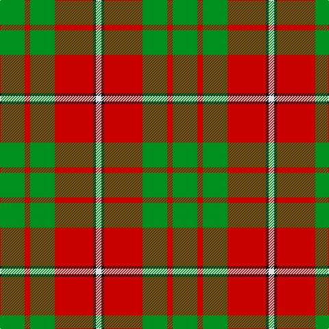

**Bands:** [GRGRKW](/stripes/grgrkw/) · **Stripes:** [G R G R K W](/stripes/stripes6/) G R G R K W

This was sourced from tartans-authority.  It is a [6 band tartan](/bands/bands6/).

Original link http://www.tartansauthority.com/tartan-ferret/display/988/

## Also known as

This cloth is also recorded under:

- MacGregor of Balquidder

## Variants

Other setts woven to the same stripe pattern.

- [Colchester & District Pipes & Drums](/setts/s6/g10r4g46r69k2w6/)
- [MacGregor of Balquidder (Logan)](/setts/s6/g9r2g9r14k1w2~x2/)
- [Princess Margaret Rose Tartan Tartan Number: 986. Earliest known date: 1930 Colours reversed from MacGregor See products available Copyright © Blair Urquhart, Comrie, 2015](/setts/s6/g36r18g4r6k1w2~x2/)

## Thread count
G/36 R8 G36 R56 K4 LN/8

## Palette
Each colour and its ΔE from the base-6 reference it is a variant of.

| Colour | Shade | Base | ΔE (OKLab) |
|---|---|---|---|
| G | <code style="background-color:#009020;">#009020</code> `#009020` | G <code style="background-color:#006100;">#006100</code> | 0.15 |
| K | <code style="background-color:#101010;">#101010</code> `#101010` | K <code style="background-color:#000000;">#000000</code> | 0.17 |
| LN | <code style="background-color:#E0E0E0;">#E0E0E0</code> `#E0E0E0` | W <code style="background-color:#F7F7F7;">#F7F7F7</code> | 0.07 |
| R | <code style="background-color:#C80000;">#C80000</code> `#C80000` | R <code style="background-color:#CC0000;">#CC0000</code> | 0.01 |

# Sample pattern

## Nearest tartans

The nearest existing variants by ΔTartan distance.

1. [MacGregor of Balquidder (Logan)](/setts/s6/g9r2g9r14k1w2~x2/) — ΔT 0.66
1. [Starr (1978) (Name)](/setts/s7/k2r4w1r10g12r2w2~x4/) — ΔT 1.00
1. [MacAulay](/setts/s6/k2r16g6r3g8w1~x2/) — ΔT 1.00
1. [Cetoloni (Personal)](/setts/s6/db1r12g6ly1g6db1~x4/) — ΔT 1.14
1. [Cumming #2](/setts/s8/r3g9w1g9r3g6r18k2~x2/) — ΔT 1.16
1. [Unidentfied (Ligioner Highland Games](/setts/s6/do4g25lo10g3lo18r4~x2/) — ΔT 1.22
1. [MacDuck #2](/setts/s6/k4r5k2lo21g8k2~x2/) — ΔT 1.23
1. [Forget Family (Yonne)](/setts/s6/dg8lo1dg8lo12r1lo1~x4/) — ΔT 1.24
1. [MacAulay (Clan)](/setts/s6/k2r16g6r3g8w1~x4/) — ΔT 1.26
1. [Denny, hunting](/setts/s6/k1g6k1g6r16db1~x2/) — ΔT 1.29

## Neighbour map

Every grey dot is one of 14299 variants placed by the first two principal components of the ΔTartan feature space (44% of its variance). Red is this tartan; blue dots are its nearest — click one to open its page.

<svg viewBox="0 0 640 380" role="img" style="max-width:100%;height:auto;border:1px solid #e0e0e0;border-radius:4px;display:block" xmlns="http://www.w3.org/2000/svg"><image href="/nn/cloud.v1.png" width="640" height="380"/><a href="/setts/s6/g9r2g9r14k1w2~x2/"><circle cx="298.1" cy="198.9" r="4" fill="#3465a4"><title>MacGregor of Balquidder (Logan)</title></circle></a><a href="/setts/s7/k2r4w1r10g12r2w2~x4/"><circle cx="264.8" cy="177.1" r="4" fill="#3465a4"><title>Starr (1978) (Name)</title></circle></a><a href="/setts/s6/k2r16g6r3g8w1~x2/"><circle cx="315.2" cy="181.0" r="4" fill="#3465a4"><title>MacAulay</title></circle></a><a href="/setts/s6/db1r12g6ly1g6db1~x4/"><circle cx="288.3" cy="197.8" r="4" fill="#3465a4"><title>Cetoloni (Personal)</title></circle></a><a href="/setts/s8/r3g9w1g9r3g6r18k2~x2/"><circle cx="313.4" cy="177.3" r="4" fill="#3465a4"><title>Cumming #2</title></circle></a><a href="/setts/s6/do4g25lo10g3lo18r4~x2/"><circle cx="222.4" cy="205.2" r="4" fill="#3465a4"><title>Unidentfied (Ligioner Highland Games</title></circle></a><a href="/setts/s6/k4r5k2lo21g8k2~x2/"><circle cx="247.2" cy="181.5" r="4" fill="#3465a4"><title>MacDuck #2</title></circle></a><a href="/setts/s6/dg8lo1dg8lo12r1lo1~x4/"><circle cx="321.5" cy="211.4" r="4" fill="#3465a4"><title>Forget Family (Yonne)</title></circle></a><a href="/setts/s6/k2r16g6r3g8w1~x4/"><circle cx="331.6" cy="187.7" r="4" fill="#3465a4"><title>MacAulay (Clan)</title></circle></a><a href="/setts/s6/k1g6k1g6r16db1~x2/"><circle cx="323.7" cy="169.3" r="4" fill="#3465a4"><title>Denny, hunting</title></circle></a><circle cx="289.3" cy="194.3" r="5" fill="#c00000"/></svg>

ID: /setts/s6/g9r2g9r14k1w2~x4/
