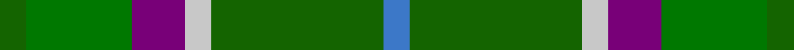

This page is one **sett** — a single exact thread-count. It belongs to the [tartan](/tartans/gi2g8dp4lb2gi13b2/)
(the same proportion at any scale), whose colour order is pattern [BGWBGG](/stripes/bgwbgg/).

Sourced from register-of-tartans.  It is a [6 stripe tartan](/stripes/stripes6/).

Original link https://www.tartanregister.gov.uk/tartanDetails.aspx?ref=1099

## Register references

External register numbers recorded for this tartan.

- Scottish Register of Tartans: [1099](https://www.tartanregister.gov.uk/tartanDetails.aspx?ref=1099)
- Scottish Tartans Authority (ITI): 4804

## Thread count
G/8 Ga32 P16 N8 G52 B/8

## Palette

Palette: <strong>Tartan Register</strong> <small style="color:#888">(4 of 5 colours)</small>
<table><thead><tr><th>Colour</th><th>Threads</th><th>Shade</th><th>Base</th><th>OKLCh</th></tr></thead><tbody><tr><td>G/</td><td style="text-align:right;font-variant-numeric:tabular-nums">8</td><td><code style="background-color:#146400;">#146400</code> <small style="color:#888">#146400</small></td><td>G <code style="background-color:#006100;">#006100</code></td><td><small style="color:#888">oklch(43.9% 0.144 140.9)</small></td></tr><tr><td>Ga</td><td style="text-align:right;font-variant-numeric:tabular-nums">32</td><td><code style="background-color:#007800;">#007800</code> <small style="color:#888">#007800</small></td><td>G <code style="background-color:#006100;">#006100</code></td><td><small style="color:#888">oklch(49.6% 0.169 142.5)</small></td></tr><tr><td>P</td><td style="text-align:right;font-variant-numeric:tabular-nums">16</td><td><code style="background-color:#780078;">#780078</code> <small style="color:#888">#780078</small></td><td>B <code style="background-color:#2A418A;">#2A418A</code></td><td><small style="color:#888">oklch(40.2% 0.185 328.4)</small></td></tr><tr><td>N</td><td style="text-align:right;font-variant-numeric:tabular-nums">8</td><td><code style="background-color:#C8C8C8;">#C8C8C8</code> <small style="color:#888">#C8C8C8</small></td><td>W <code style="background-color:#F7F7F7;">#F7F7F7</code></td><td><small style="color:#888">oklch(83.3% 0.000 89.9)</small></td></tr><tr><td>G</td><td style="text-align:right;font-variant-numeric:tabular-nums">52</td><td><code style="background-color:#146400;">#146400</code> <small style="color:#888">#146400</small></td><td>G <code style="background-color:#006100;">#006100</code></td><td><small style="color:#888">oklch(43.9% 0.144 140.9)</small></td></tr><tr><td>B/</td><td style="text-align:right;font-variant-numeric:tabular-nums">8</td><td><code style="background-color:#3C78C8;">#3C78C8</code> <small style="color:#888">#3C78C8</small></td><td>B <code style="background-color:#2A418A;">#2A418A</code></td><td><small style="color:#888">oklch(57.2% 0.139 256.5)</small></td></tr></tbody></table>

# Sample pattern

## Nearest tartans

The nearest existing variants by ΔTartan distance, with this tartan at the top so the swatches line up against it.

ΔTartan

Tartan

Sett

—

<a href="/ttd/edit/#slug=gi2g8dp4lb2gi13b2~x4">Ellan Vannin</a> <a class="nn-out" href="/setts/s6/gi2g8dp4lb2gi13b2~x4/" title="open its dictionary page">↗</a>

1.11

<a href="/ttd/edit/#slug=r3g28db9dg18w3~x2">Simple Technology (Corporate)</a> <a class="nn-out" href="/setts/s5/r3g28db9dg18w3~x2/" title="open its dictionary page">↗</a>

1.30

<a href="/ttd/edit/#slug=gi2lo1gi12lb6g12r1~x4">City of Vancouver (Commemorative)</a> <a class="nn-out" href="/setts/s6/gi2lo1gi12lb6g12r1~x4/" title="open its dictionary page">↗</a>

1.31

<a href="/ttd/edit/#slug=g10db42r5dg42g42ly5g10">New Mexico</a> <a class="nn-out" href="/setts/s7/g10db42r5dg42g42ly5g10/" title="open its dictionary page">↗</a>

1.35

<a href="/ttd/edit/#slug=g28db9dg18w3dg18db9g28r3~x2">Simple Technology</a> <a class="nn-out" href="/setts/s8/g28db9dg18w3dg18db9g28r3~x2/" title="open its dictionary page">↗</a>

1.39

<a href="/ttd/edit/#slug=r4g3o8w3o4g18ly3~x2">Newfoundland</a> <a class="nn-out" href="/setts/s7/r4g3o8w3o4g18ly3~x2/" title="open its dictionary page">↗</a>

1.39

<a href="/ttd/edit/#slug=b30ly3dy11ly3g33r6~x2">Balfour Hunting</a> <a class="nn-out" href="/setts/s6/b30ly3dy11ly3g33r6~x2/" title="open its dictionary page">↗</a>

1.41

<a href="/ttd/edit/#slug=r4g3dy8w3dy4g18ly3~x2">Newfoundland District Tartan Tartan Number: 1543. Earliest known date: 1972 The colours of the Newfoundland tartan are related to the 'Ode to Newfoundland', the second anthem of the province. Gold for the sun, green for the pine clad hill, white for the snow, brown for the minerals under the earth and red to denote her British origins. In 1972, the Minute of Provincial Affairs of the Province petitioned the Lord Lyon to record the tartan in the Writs section of the Lyon Court Books. This was done on the 3rd of September, 1973. See products available Copyright © Blair Urquhart, Comrie, 2015</a> <a class="nn-out" href="/setts/s7/r4g3dy8w3dy4g18ly3~x2/" title="open its dictionary page">↗</a>

1.46

<a href="/ttd/edit/#slug=g6ly3g26dg10dt30lb3~x2">Wcwm 1716</a> <a class="nn-out" href="/setts/s6/g6ly3g26dg10dt30lb3~x2/" title="open its dictionary page">↗</a>

1.46

<a href="/ttd/edit/#slug=g14dt11y3k5y3dt11g14ly2~x2">Wilson's No.122</a> <a class="nn-out" href="/setts/s8/g14dt11y3k5y3dt11g14ly2~x2/" title="open its dictionary page">↗</a>

1.46

<a href="/ttd/edit/#slug=g31dg7lo3dg14g8db18dp5~x2">Reidy Wedding</a> <a class="nn-out" href="/setts/s7/g31dg7lo3dg14g8db18dp5~x2/" title="open its dictionary page">↗</a>

## Neighbour map

Every grey dot is one of 14359 variants placed by the first two principal components of the ΔTartan feature space (44% of its variance). Red is this tartan; blue dots are its nearest — click one to open its page.

<svg viewBox="0 0 640 380" role="img" style="max-width:100%;height:auto;border:1px solid #e0e0e0;border-radius:4px;display:block" xmlns="http://www.w3.org/2000/svg"><image href="/nn/cloud.v1.png" width="640" height="380"/><a href="/setts/s5/r3g28db9dg18w3~x2/"><circle cx="234.7" cy="232.5" r="4" fill="#3465a4"><title>Simple Technology (Corporate)</title></circle></a><a href="/setts/s6/gi2lo1gi12lb6g12r1~x4/"><circle cx="246.1" cy="215.0" r="4" fill="#3465a4"><title>City of Vancouver (Commemorative)</title></circle></a><a href="/setts/s7/g10db42r5dg42g42ly5g10/"><circle cx="187.8" cy="219.0" r="4" fill="#3465a4"><title>New Mexico</title></circle></a><a href="/setts/s8/g28db9dg18w3dg18db9g28r3~x2/"><circle cx="253.0" cy="240.7" r="4" fill="#3465a4"><title>Simple Technology</title></circle></a><a href="/setts/s7/r4g3o8w3o4g18ly3~x2/"><circle cx="224.5" cy="215.3" r="4" fill="#3465a4"><title>Newfoundland</title></circle></a><a href="/setts/s6/b30ly3dy11ly3g33r6~x2/"><circle cx="216.8" cy="209.7" r="4" fill="#3465a4"><title>Balfour Hunting</title></circle></a><a href="/setts/s7/r4g3dy8w3dy4g18ly3~x2/"><circle cx="219.6" cy="214.4" r="4" fill="#3465a4"><title>Newfoundland District Tartan Tartan Number: 1543. Earliest known date: 1972 The colours of the Newfoundland tartan are related to the 'Ode to Newfoundland', the second anthem of the province. Gold for the sun, green for the pine clad hill, white for the snow, brown for the minerals under the earth and red to denote her British origins. In 1972, the Minute of Provincial Affairs of the Province petitioned the Lord Lyon to record the tartan in the Writs section of the Lyon Court Books. This was done on the 3rd of September, 1973. See products available Copyright © Blair Urquhart, Comrie, 2015</title></circle></a><a href="/setts/s6/g6ly3g26dg10dt30lb3~x2/"><circle cx="216.2" cy="212.7" r="4" fill="#3465a4"><title>Wcwm 1716</title></circle></a><a href="/setts/s8/g14dt11y3k5y3dt11g14ly2~x2/"><circle cx="200.1" cy="242.9" r="4" fill="#3465a4"><title>Wilson's No.122</title></circle></a><a href="/setts/s7/g31dg7lo3dg14g8db18dp5~x2/"><circle cx="245.7" cy="231.9" r="4" fill="#3465a4"><title>Reidy Wedding</title></circle></a><circle cx="234.1" cy="240.1" r="5" fill="#c00000"/></svg>

ID: /setts/s6/gi2g8dp4lb2gi13b2~x4/
