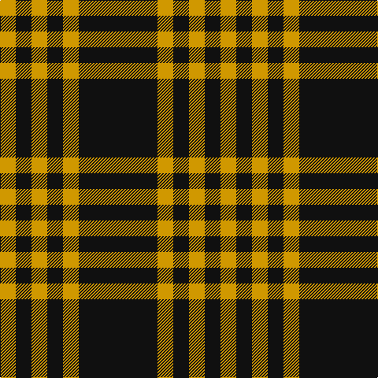

In pattern [KYKYKY](/patterns/kykyky/).

This was sourced from register-of-tartans.  It is a [6 stripes tartan](/stripes/stripes6/).

Original link https://www.tartanregister.gov.uk/tartanDetails.aspx?ref=1917

## Thread count
DY/20 K20 DY20 K20 DY20 K/100

## Palette
Each colour and its ΔE from the base-6 reference it is a variant of.

| Colour | Shade | Base | ΔE (OKLab) |
|---|---|---|---|
| DY | <code style="background-color:#D09800;">#D09800</code> `#D09800` | Y <code style="background-color:#F2BF00;">#F2BF00</code> | 0.12 |
| K | <code style="background-color:#101010;">#101010</code> `#101010` | K <code style="background-color:#000000;">#000000</code> | 0.17 |

# Sample pattern

## Nearest tartans

The nearest existing variants by ΔTartan distance.

1. [Justus #2 (Personal)](/setts/s4/k100y20k20y20-k101010-yd09800/) — ΔT 1.05
1. [Justus](/setts/s4/k60y12k12y12-k000000-yf0c000/) — ΔT 1.61
1. [Welsh National #3](/setts/s5/y14k8y8k78r8-k101010-rdc0000-ye8c000/) — ΔT 1.63
1. [Lords of Skye Trade Tartan Tartan Number: 1218. Earliest known date: 1983 Nothing See products available Copyright © Blair Urquhart, Comrie, 2015](/setts/s4/k92g14k16w40-g604000-k101010-we0e0e0/) — ΔT 1.74
1. [Lords of Skye](/setts/s4/k92g14k16w40-g503c14-k101010-we0e0e0/) — ΔT 1.75
1. [New Zealand District Tartan Tartan Number: 3250. Earliest known date: 2000 Designed as a District sett by Timely Marketing Promotions, Christchurch, New Zealand See products available Copyright © Blair Urquhart, Comrie, 2015](/setts/s6/k84w8k20w36k52g8-g006818-k101010-we0e0e0/) — ΔT 1.78
1. [Lundy Reform](/setts/s7/k8w20k4w4k40r4k4-k101010-rc80000-wc0c0c0/) — ΔT 1.79
1. [Gwynn (Name)](/setts/s5/y18k8y8k90r8-k101010-rc80000-ye8c000/) — ΔT 1.80
1. [Lords of Skye (Fashion?)](/setts/s4/k92g14k16w40-g604000-k101010-wfcfcfc/) — ΔT 1.82
1. [Scott Black and Grey](/setts/s7/g16k6g34k26g12k6g8-g808080-k101010/) — ΔT 1.86

## Neighbour map

Every grey dot is one of 15726 variants placed by the first two principal components of the ΔTartan feature space (44% of its variance). Red is this tartan; blue dots are its nearest — click one to open its page.

<svg viewBox="0 0 640 380" role="img" style="max-width:100%;height:auto;border:1px solid #e0e0e0;border-radius:4px;display:block" xmlns="http://www.w3.org/2000/svg"><image href="/nn/cloud.v1.png" width="640" height="380"/><a href="/setts/s4/k100y20k20y20-k101010-yd09800/"><circle cx="445.7" cy="285.6" r="4" fill="#3465a4"><title>Justus #2 (Personal)</title></circle></a><a href="/setts/s4/k60y12k12y12-k000000-yf0c000/"><circle cx="428.2" cy="284.1" r="4" fill="#3465a4"><title>Justus</title></circle></a><a href="/setts/s5/y14k8y8k78r8-k101010-rdc0000-ye8c000/"><circle cx="445.4" cy="209.2" r="4" fill="#3465a4"><title>Welsh National #3</title></circle></a><a href="/setts/s4/k92g14k16w40-g604000-k101010-we0e0e0/"><circle cx="341.9" cy="255.5" r="4" fill="#3465a4"><title>Lords of Skye Trade Tartan Tartan Number: 1218. Earliest known date: 1983 Nothing See products available Copyright © Blair Urquhart, Comrie, 2015</title></circle></a><a href="/setts/s4/k92g14k16w40-g503c14-k101010-we0e0e0/"><circle cx="342.0" cy="255.8" r="4" fill="#3465a4"><title>Lords of Skye</title></circle></a><a href="/setts/s6/k84w8k20w36k52g8-g006818-k101010-we0e0e0/"><circle cx="416.3" cy="229.1" r="4" fill="#3465a4"><title>New Zealand District Tartan Tartan Number: 3250. Earliest known date: 2000 Designed as a District sett by Timely Marketing Promotions, Christchurch, New Zealand See products available Copyright © Blair Urquhart, Comrie, 2015</title></circle></a><a href="/setts/s7/k8w20k4w4k40r4k4-k101010-rc80000-wc0c0c0/"><circle cx="376.4" cy="197.0" r="4" fill="#3465a4"><title>Lundy Reform</title></circle></a><a href="/setts/s5/y18k8y8k90r8-k101010-rc80000-ye8c000/"><circle cx="453.5" cy="203.0" r="4" fill="#3465a4"><title>Gwynn (Name)</title></circle></a><a href="/setts/s4/k92g14k16w40-g604000-k101010-wfcfcfc/"><circle cx="336.6" cy="252.5" r="4" fill="#3465a4"><title>Lords of Skye (Fashion?)</title></circle></a><a href="/setts/s7/g16k6g34k26g12k6g8-g808080-k101010/"><circle cx="363.9" cy="274.3" r="4" fill="#3465a4"><title>Scott Black and Grey</title></circle></a><circle cx="401.3" cy="261.1" r="5" fill="#c00000"/></svg>

ID: /setts/s6/k100y20k20y20k20y20-k101010-yd09800/
