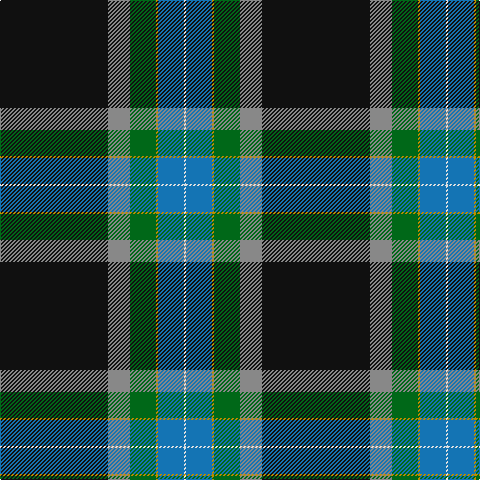

In pattern [KRGYBW](/patterns/krgybw/).

This was sourced from tartans-authority.  It is a [6 stripes tartan](/stripes/stripes6/).

Original link http://www.tartansauthority.com/tartan-ferret/display/10423/

## Thread count
K/108 N22 G26 DY2 B26 LN/2

## Palette
Each colour and its ΔE from the base-6 reference it is a variant of.

| Colour | Shade | Base | ΔE (OKLab) |
|---|---|---|---|
| B | <code style="background-color:#1474B4;">#1474B4</code> `#1474B4` | B <code style="background-color:#2C4084;">#2C4084</code> | 0.15 |
| DY | <code style="background-color:#BC8C00;">#BC8C00</code> `#BC8C00` | Y <code style="background-color:#E8C000;">#E8C000</code> | 0.16 |
| G | <code style="background-color:#006818;">#006818</code> `#006818` | G <code style="background-color:#006400;">#006400</code> | 0.02 |
| K | <code style="background-color:#101010;">#101010</code> `#101010` | K <code style="background-color:#000000;">#000000</code> | 0.17 |
| LN | <code style="background-color:#E0E0E0;">#E0E0E0</code> `#E0E0E0` | W <code style="background-color:#F4F4F0;">#F4F4F0</code> | 0.06 |
| N | <code style="background-color:#888888;">#888888</code> `#888888` | R <code style="background-color:#C80000;">#C80000</code> | 0.24 |

# Sample pattern

## Nearest tartans

The nearest existing variants by ΔTartan distance.

1. [Kilmaine Saints](/setts/s6/k108b22g26y2ba26w2-b666666-ba0000cd-g008b00-k101010-wffffff-yffe700/) — ΔT 0.42
1. [Wells (2014)](/setts/s7/b100g50y6r16ra2w2ra2-b141e46-g285800-r888888-ra960028-wf8f8f8-yd87c00/) — ΔT 1.03
1. [MacNeill, Royce (Personal)](/setts/s8/k80g42w6r2y4k24b24k20-b304048-g2c5c44-k101010-rc80000-we0e0e0-ye8c000/) — ΔT 1.31
1. [Royal Yacht Britannia](/setts/s8/k86y6g2w2b2y6b50r4-b202060-g005448-k101010-rc80000-wfcfcfc-ye8c000/) — ΔT 1.35
1. [Kirkcaldy Name Tartan Tartan Number: 9072. Earliest known date: 2008 Blue and white for the Scottish flag, the red and yellow is from William Kirkcaldy's shield (it is also my son's army colours). It is for general use. See products available Copyright © Blair Urquhart, Comrie, 2015](/setts/s6/b46w6k20r4ba90y2-b4878a4-ba1c2448-k101010-r9c2430-wececec-yc8a438/) — ΔT 1.39
1. [MacLaurin, of Brioch](/setts/s7/b72k20g6r6g12k2y4-b304080-g008000-k000000-rc00000-yf0c000/) — ΔT 1.39
1. [Wells (2014)](/setts/s7/b100g50y6w16r2wa2r2-b003c64-g288028-rc80000-wc0c0c0-wafcfcfc-yfccc00/) — ΔT 1.43
1. [Montgomerie, Colin](/setts/s9/y4k2r10b6ra24b8y2k80ba2-b5c5c5c-ba5c4494-k101010-rc80000-ra888888-ya0a0a0/) — ΔT 1.48
1. [Ataç, H.M. & I.C. (Personal)](/setts/s8/b18g10w2g30k4g2k88r2-b000080-g006400-k101010-rff0000-wffffff/) — ΔT 1.50
1. [Sinclair-Brown](/setts/s8/b128k22r4k8r4k8g64ga8-b304080-g008000-ga908000-k000000-rc00000/) — ΔT 1.51

## Neighbour map

Every grey dot is one of 15726 variants placed by the first two principal components of the ΔTartan feature space (44% of its variance). Red is this tartan; blue dots are its nearest — click one to open its page.

<svg viewBox="0 0 640 380" role="img" style="max-width:100%;height:auto;border:1px solid #e0e0e0;border-radius:4px;display:block" xmlns="http://www.w3.org/2000/svg"><image href="/nn/cloud.v1.png" width="640" height="380"/><a href="/setts/s6/k108b22g26y2ba26w2-b666666-ba0000cd-g008b00-k101010-wffffff-yffe700/"><circle cx="331.2" cy="106.0" r="4" fill="#3465a4"><title>Kilmaine Saints</title></circle></a><a href="/setts/s7/b100g50y6r16ra2w2ra2-b141e46-g285800-r888888-ra960028-wf8f8f8-yd87c00/"><circle cx="366.4" cy="99.0" r="4" fill="#3465a4"><title>Wells (2014)</title></circle></a><a href="/setts/s8/k80g42w6r2y4k24b24k20-b304048-g2c5c44-k101010-rc80000-we0e0e0-ye8c000/"><circle cx="361.9" cy="128.7" r="4" fill="#3465a4"><title>MacNeill, Royce (Personal)</title></circle></a><a href="/setts/s8/k86y6g2w2b2y6b50r4-b202060-g005448-k101010-rc80000-wfcfcfc-ye8c000/"><circle cx="348.6" cy="86.8" r="4" fill="#3465a4"><title>Royal Yacht Britannia</title></circle></a><a href="/setts/s6/b46w6k20r4ba90y2-b4878a4-ba1c2448-k101010-r9c2430-wececec-yc8a438/"><circle cx="326.9" cy="116.5" r="4" fill="#3465a4"><title>Kirkcaldy Name Tartan Tartan Number: 9072. Earliest known date: 2008 Blue and white for the Scottish flag, the red and yellow is from William Kirkcaldy's shield (it is also my son's army colours). It is for general use. See products available Copyright © Blair Urquhart, Comrie, 2015</title></circle></a><a href="/setts/s7/b72k20g6r6g12k2y4-b304080-g008000-k000000-rc00000-yf0c000/"><circle cx="348.6" cy="113.5" r="4" fill="#3465a4"><title>MacLaurin, of Brioch</title></circle></a><a href="/setts/s7/b100g50y6w16r2wa2r2-b003c64-g288028-rc80000-wc0c0c0-wafcfcfc-yfccc00/"><circle cx="340.2" cy="88.1" r="4" fill="#3465a4"><title>Wells (2014)</title></circle></a><a href="/setts/s9/y4k2r10b6ra24b8y2k80ba2-b5c5c5c-ba5c4494-k101010-rc80000-ra888888-ya0a0a0/"><circle cx="351.8" cy="72.6" r="4" fill="#3465a4"><title>Montgomerie, Colin</title></circle></a><a href="/setts/s8/b18g10w2g30k4g2k88r2-b000080-g006400-k101010-rff0000-wffffff/"><circle cx="397.2" cy="115.2" r="4" fill="#3465a4"><title>Ataç, H.M. &amp; I.C. (Personal)</title></circle></a><a href="/setts/s8/b128k22r4k8r4k8g64ga8-b304080-g008000-ga908000-k000000-rc00000/"><circle cx="307.5" cy="112.7" r="4" fill="#3465a4"><title>Sinclair-Brown</title></circle></a><circle cx="337.8" cy="107.3" r="5" fill="#c00000"/></svg>

ID: /setts/s6/k108r22g26y2b26w2-b1474b4-g006818-k101010-r888888-we0e0e0-ybc8c00/
