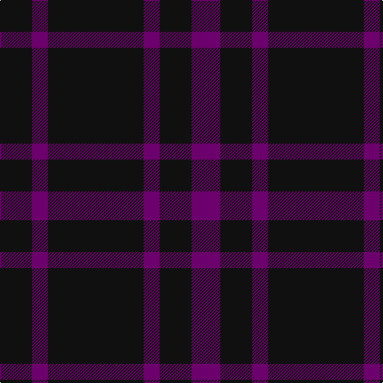

**Bands:** [BKBKBK](/stripes/bkbkbk/) · **Stripes:** [DP K DP K DP K](/stripes/stripes6/) DP K DP K DP K

This was sourced from register-of-tartans.  It is a [6 band tartan](/bands/bands6/).

Original link https://www.tartanregister.gov.uk/tartanDetails.aspx?ref=2099

## Register references

External register numbers recorded for this tartan.

- Scottish Register of Tartans: [2099](https://www.tartanregister.gov.uk/tartanDetails.aspx?ref=2099)
- Scottish Tartans Authority (ITI): 5417

## Thread count
K/40 P20 K120 P20 K40 P/36

## Palette
Each colour and its ΔE from the base-6 reference it is a variant of.

| Colour | Shade | Base | ΔE (OKLab) |
|---|---|---|---|
| K | <code style="background-color:#101010;">#101010</code> `#101010` | K <code style="background-color:#000000;">#000000</code> | 0.17 |
| P | <code style="background-color:#6C006C;">#6C006C</code> `#6C006C` | B <code style="background-color:#2A418A;">#2A418A</code> | 0.16 |

# Sample pattern

## Nearest tartans

The nearest existing variants by ΔTartan distance.

1. [Leonard Hunting (Name)](/setts/s4/k30dp5k10dp9~x4/) — ΔT 0.85
1. [Romsdal Tresfjord](/setts/s5/k2r4k7r1k2~x2/) — ΔT 1.28
1. [Freedom of Scotland](/setts/s6/k15n7k6n11k50n4~x2/) — ΔT 1.93
1. [The Caledonian Hotel](/setts/s8/k24k3k3k3k3k18dg20r4~x2/) — ΔT 1.95
1. [Spirit of Glyndwr Grey (Fashion)](/setts/s8/k24n18k11n4k11n18k53n4/) — ΔT 1.98
1. [Auchincloss (Personal)](/setts/s4/k34db13k7db14~x2/) — ΔT 2.05
1. [Wcwm 9275-1333-2](/setts/s4/k20r3k20r20~x2/) — ΔT 2.16
1. [Highland Spring (1988)](/setts/s6/dp3g1dp9r3dp9g1~x4/) — ΔT 2.18
1. [Spirit of Glyndwr Gold (Fashion)](/setts/s8/k24n18k11n4k11n18k53r4/) — ΔT 2.24
1. [Sligo, County](/setts/s6/db50do4db12do23ly4do4~x2/) — ΔT 2.35

## Neighbour map

Every grey dot is one of 14313 variants placed by the first two principal components of the ΔTartan feature space (44% of its variance). Red is this tartan; blue dots are its nearest — click one to open its page.

<svg viewBox="0 0 640 380" role="img" style="max-width:100%;height:auto;border:1px solid #e0e0e0;border-radius:4px;display:block" xmlns="http://www.w3.org/2000/svg"><image href="/nn/cloud.v1.png" width="640" height="380"/><a href="/setts/s4/k30dp5k10dp9~x4/"><circle cx="530.7" cy="340.1" r="4" fill="#3465a4"><title>Leonard Hunting (Name)</title></circle></a><a href="/setts/s5/k2r4k7r1k2~x2/"><circle cx="481.0" cy="318.9" r="4" fill="#3465a4"><title>Romsdal Tresfjord</title></circle></a><a href="/setts/s6/k15n7k6n11k50n4~x2/"><circle cx="565.2" cy="266.2" r="4" fill="#3465a4"><title>Freedom of Scotland</title></circle></a><a href="/setts/s8/k24k3k3k3k3k18dg20r4~x2/"><circle cx="464.2" cy="274.3" r="4" fill="#3465a4"><title>The Caledonian Hotel</title></circle></a><a href="/setts/s8/k24n18k11n4k11n18k53n4/"><circle cx="489.3" cy="259.0" r="4" fill="#3465a4"><title>Spirit of Glyndwr Grey (Fashion)</title></circle></a><a href="/setts/s4/k34db13k7db14~x2/"><circle cx="440.6" cy="366.0" r="4" fill="#3465a4"><title>Auchincloss (Personal)</title></circle></a><a href="/setts/s4/k20r3k20r20~x2/"><circle cx="427.8" cy="347.9" r="4" fill="#3465a4"><title>Wcwm 9275-1333-2</title></circle></a><a href="/setts/s6/dp3g1dp9r3dp9g1~x4/"><circle cx="552.0" cy="265.4" r="4" fill="#3465a4"><title>Highland Spring (1988)</title></circle></a><a href="/setts/s8/k24n18k11n4k11n18k53r4/"><circle cx="461.2" cy="239.5" r="4" fill="#3465a4"><title>Spirit of Glyndwr Gold (Fashion)</title></circle></a><a href="/setts/s6/db50do4db12do23ly4do4~x2/"><circle cx="472.4" cy="248.0" r="4" fill="#3465a4"><title>Sligo, County</title></circle></a><circle cx="511.7" cy="319.0" r="5" fill="#c00000"/></svg>

ID: /setts/s6/k10dp5k30dp5k10dp9~x4/
