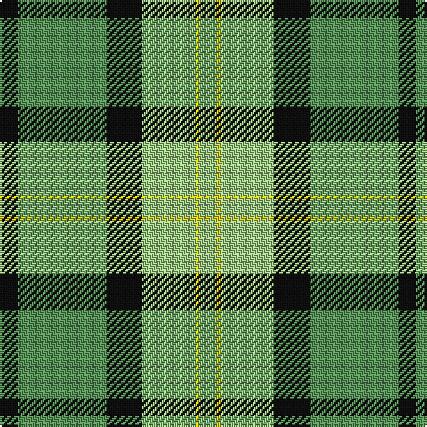

In pattern [KGKYYY](/patterns/kgkyyy/).

This was sourced from tartans-authority.  It is a [6 stripes tartan](/stripes/stripes6/).

Original link http://www.tartansauthority.com/tartan-ferret/display/10204/

## Thread count
K/10 LG50 K20 LGa30 Y2 LGa/10

## Palette
Each colour and its ΔE from the base-6 reference it is a variant of.

| Colour | Shade | Base | ΔE (OKLab) |
|---|---|---|---|
| K | <code style="background-color:#101010;">#101010</code> `#101010` | K <code style="background-color:#000000;">#000000</code> | 0.17 |
| LG | <code style="background-color:#589058;">#589058</code> `#589058` | G <code style="background-color:#006400;">#006400</code> | 0.17 |
| LGa | <code style="background-color:#9CC484;">#9CC484</code> `#9CC484` | Y <code style="background-color:#E8C000;">#E8C000</code> | 0.12 |
| Y | <code style="background-color:#E8C000;">#E8C000</code> `#E8C000` | Y <code style="background-color:#E8C000;">#E8C000</code> | 0.00 |

# Sample pattern

ID: /setts/s6/k10g50k20y30ya2y10-g589058-k101010-y9cc484-yae8c000/
