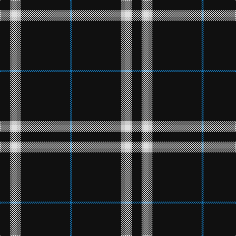

In pattern [BKYWYK](/stripes/bkywyk/).

This was sourced from register-of-tartans.  It is a [6 stripe tartan](/stripes/stripes6/).

Original link https://www.tartanregister.gov.uk/tartanDetails.aspx?ref=2197

## Attestations

This cloth appears in 2 source records; the oldest owns this page.

- 01/01/2007 — London Fog Black (register-of-tartans, [record](https://www.tartanregister.gov.uk/tartanDetails.aspx?ref=2197))
- pre 2007 — London Fog Black (Fashion) (tartans-authority, [record](http://www.tartansauthority.com/tartan-ferret/display/7269/))

## Register references

External register numbers recorded for this tartan.

- Scottish Register of Tartans: [2197](https://www.tartanregister.gov.uk/tartanDetails.aspx?ref=2197)
- Scottish Tartans Authority (ITI): 7269

## Thread count
K/20 N4 LN10 N8 K100 B/4

## Palette
Each colour and the base-6 reference it is a variant of.

| Colour | Shade | Base |
|---|---|---|
| B | <code style="background-color:#1474B4;">#1474B4</code> `oklch(54.0% 0.129 245.1)` <small>#1474B4</small> | B <code style="background-color:#2A418A;">#2A418A</code> |
| K | <code style="background-color:#101010;">#101010</code> `oklch(17.3% 0.000 89.9)` <small>#101010</small> | K <code style="background-color:#000000;">#000000</code> |
| LN | <code style="background-color:#E0E0E0;">#E0E0E0</code> `oklch(90.7% 0.000 89.9)` <small>#E0E0E0</small> | W <code style="background-color:#F7F7F7;">#F7F7F7</code> |
| N | <code style="background-color:#B8B8B8;">#B8B8B8</code> `oklch(78.3% 0.000 89.9)` <small>#B8B8B8</small> | Y <code style="background-color:#F2BF00;">#F2BF00</code> |

# Sample pattern

## Nearest tartans

The nearest existing variants by ΔTartan distance.

1. [Black Country (District)](/setts/s8/k21r1k1ly1k1r1k3w3~x6/) — ΔT 0.87
1. [Auld Bernensis](/setts/s8/k62r3k3lo3k3r3k9lr5~x2/) — ΔT 1.19
1. [Merola (2016)](/setts/s6/k36ly5k1ly1lr5k12~x2/) — ΔT 1.19
1. [East of Scotland Tartan Army](/setts/s6/dt40ly10dt8r20dt100w5/) — ΔT 1.21
1. [Volkswagen Black Trim (Fashion)](/setts/s8/k20w1k1w3k1r1k1w1~x4/) — ΔT 1.34
1. [Fily, Sylvain Roger](/setts/s5/r2g2k20w1db1~x6/) — ΔT 1.34
1. [Dellen](/setts/s6/k80r6g3r12k2w2~x2/) — ΔT 1.35
1. [Whitaker (2014)](/setts/s8/k60r3k15r3lb2r5b3r2~x2/) — ΔT 1.37
1. [Savannah Harley Davidson (Corporate)](/setts/s9/k25w1n3w1k31n3k31w2o9~x2/) — ΔT 1.43
1. [Capco](/setts/s8/k31w1k2w2dt3k2t4w2~x4/) — ΔT 1.48

## Neighbour map

Every grey dot is one of 14299 variants placed by the first two principal components of the ΔTartan feature space (44% of its variance). Red is this tartan; blue dots are its nearest — click one to open its page.

<svg viewBox="0 0 640 380" role="img" style="max-width:100%;height:auto;border:1px solid #e0e0e0;border-radius:4px;display:block" xmlns="http://www.w3.org/2000/svg"><image href="/nn/cloud.v1.png" width="640" height="380"/><a href="/setts/s8/k21r1k1ly1k1r1k3w3~x6/"><circle cx="528.7" cy="133.7" r="4" fill="#3465a4"><title>Black Country (District)</title></circle></a><a href="/setts/s8/k62r3k3lo3k3r3k9lr5~x2/"><circle cx="578.8" cy="141.7" r="4" fill="#3465a4"><title>Auld Bernensis</title></circle></a><a href="/setts/s6/k36ly5k1ly1lr5k12~x2/"><circle cx="552.1" cy="161.6" r="4" fill="#3465a4"><title>Merola (2016)</title></circle></a><a href="/setts/s6/dt40ly10dt8r20dt100w5/"><circle cx="518.4" cy="180.8" r="4" fill="#3465a4"><title>East of Scotland Tartan Army</title></circle></a><a href="/setts/s8/k20w1k1w3k1r1k1w1~x4/"><circle cx="526.3" cy="141.9" r="4" fill="#3465a4"><title>Volkswagen Black Trim (Fashion)</title></circle></a><a href="/setts/s5/r2g2k20w1db1~x6/"><circle cx="476.6" cy="149.8" r="4" fill="#3465a4"><title>Fily, Sylvain Roger</title></circle></a><a href="/setts/s6/k80r6g3r12k2w2~x2/"><circle cx="557.6" cy="131.3" r="4" fill="#3465a4"><title>Dellen</title></circle></a><a href="/setts/s8/k60r3k15r3lb2r5b3r2~x2/"><circle cx="568.1" cy="133.5" r="4" fill="#3465a4"><title>Whitaker (2014)</title></circle></a><a href="/setts/s9/k25w1n3w1k31n3k31w2o9~x2/"><circle cx="539.7" cy="155.7" r="4" fill="#3465a4"><title>Savannah Harley Davidson (Corporate)</title></circle></a><a href="/setts/s8/k31w1k2w2dt3k2t4w2~x4/"><circle cx="484.1" cy="117.0" r="4" fill="#3465a4"><title>Capco</title></circle></a><circle cx="539.5" cy="152.5" r="5" fill="#c00000"/></svg>

ID: /setts/s6/k10lr2w5lr4k50b2~x2/
