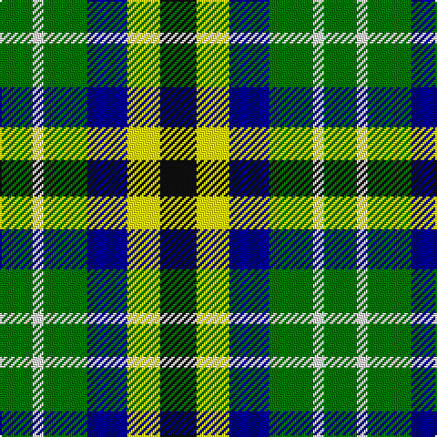

**Bands:** [GWGBYK](/stripes/gwgbyk/) · **Stripes:** [G W G DB LY K](/stripes/stripes6/) G W G DB LY K

This was sourced from register-of-tartans.  It is a [6 band tartan](/bands/bands6/).

Original link https://www.tartanregister.gov.uk/tartanDetails.aspx?ref=10892

## Register references

External register numbers recorded for this tartan.

- Scottish Register of Tartans: [10892](https://www.tartanregister.gov.uk/tartanDetails.aspx?ref=10892)

## Thread count
G/18 W6 G24 DB22 Y18 K/20

## Palette
Each colour and its ΔE from the base-6 reference it is a variant of.

| Colour | Shade | Base | ΔE (OKLab) |
|---|---|---|---|
| DB | <code style="background-color:#00008C;">#00008C</code> `#00008C` | B <code style="background-color:#2A418A;">#2A418A</code> | 0.13 |
| G | <code style="background-color:#007800;">#007800</code> `#007800` | G <code style="background-color:#006100;">#006100</code> | 0.07 |
| K | <code style="background-color:#101010;">#101010</code> `#101010` | K <code style="background-color:#000000;">#000000</code> | 0.17 |
| W | <code style="background-color:#F9F5EF;">#F9F5EF</code> `#F9F5EF` | W <code style="background-color:#F7F7F7;">#F7F7F7</code> | 0.01 |
| Y | <code style="background-color:#FFFF00;">#FFFF00</code> `#FFFF00` | Y <code style="background-color:#F2BF00;">#F2BF00</code> | 0.16 |

# Sample pattern

## Nearest tartans

The nearest existing variants by ΔTartan distance.

1. [Centeno-Oxford](/setts/s6/g12k10ly9db11ly3g9~x2/) — ΔT 0.83
1. [Loch Katrine](/setts/s7/b8k11w3k11g12g10m2~x2/) — ΔT 1.57
1. [Burns Heritage Check](/setts/s9/k12w12k12w12g13w8dr6g4dr5/) — ΔT 1.67
1. [Gallowater, Old](/setts/s5/k19t10p19g40ly10/) — ΔT 1.73
1. [Arrol](/setts/s9/r2db4k4g4lb1g4k4g4lb1~x4/) — ΔT 1.80
1. [Pollard (2014)](/setts/s7/g5dg5g5db5db5dg10w2~x8/) — ΔT 1.88
1. [Burns Heritage Check](/setts/s9/k6w6k6w6g7w4dy3g2dy3~x2/) — ΔT 1.90
1. [Ramsay (Orange)](/setts/s7/k4lo9k13g6lo3g9w4~x2/) — ΔT 1.97
1. [Unidentified Silk Plaid](/setts/s5/db7o8dg15ly6lo3~x10/) — ΔT 1.98
1. [Gallowater Old District Tartan Tartan Number: 1025. Earliest known date: 1819 Both 'Old' and 'New' appear in Wilson's 1819 pattern book. See products available Copyright © Blair Urquhart, Comrie, 2015](/setts/s5/k19t10dp19g40ly10/) — ΔT 2.03

## Neighbour map

Every grey dot is one of 14313 variants placed by the first two principal components of the ΔTartan feature space (44% of its variance). Red is this tartan; blue dots are its nearest — click one to open its page.

<svg viewBox="0 0 640 380" role="img" style="max-width:100%;height:auto;border:1px solid #e0e0e0;border-radius:4px;display:block" xmlns="http://www.w3.org/2000/svg"><image href="/nn/cloud.v1.png" width="640" height="380"/><a href="/setts/s6/g12k10ly9db11ly3g9~x2/"><circle cx="46.4" cy="274.8" r="4" fill="#3465a4"><title>Centeno-Oxford</title></circle></a><a href="/setts/s7/b8k11w3k11g12g10m2~x2/"><circle cx="92.2" cy="235.3" r="4" fill="#3465a4"><title>Loch Katrine</title></circle></a><a href="/setts/s9/k12w12k12w12g13w8dr6g4dr5/"><circle cx="42.1" cy="259.9" r="4" fill="#3465a4"><title>Burns Heritage Check</title></circle></a><a href="/setts/s5/k19t10p19g40ly10/"><circle cx="86.8" cy="245.7" r="4" fill="#3465a4"><title>Gallowater, Old</title></circle></a><a href="/setts/s9/r2db4k4g4lb1g4k4g4lb1~x4/"><circle cx="76.5" cy="250.4" r="4" fill="#3465a4"><title>Arrol</title></circle></a><a href="/setts/s7/g5dg5g5db5db5dg10w2~x8/"><circle cx="67.6" cy="250.0" r="4" fill="#3465a4"><title>Pollard (2014)</title></circle></a><a href="/setts/s9/k6w6k6w6g7w4dy3g2dy3~x2/"><circle cx="39.7" cy="253.6" r="4" fill="#3465a4"><title>Burns Heritage Check</title></circle></a><a href="/setts/s7/k4lo9k13g6lo3g9w4~x2/"><circle cx="95.0" cy="254.8" r="4" fill="#3465a4"><title>Ramsay (Orange)</title></circle></a><a href="/setts/s5/db7o8dg15ly6lo3~x10/"><circle cx="92.0" cy="242.2" r="4" fill="#3465a4"><title>Unidentified Silk Plaid</title></circle></a><a href="/setts/s5/k19t10dp19g40ly10/"><circle cx="108.7" cy="255.8" r="4" fill="#3465a4"><title>Gallowater Old District Tartan Tartan Number: 1025. Earliest known date: 1819 Both 'Old' and 'New' appear in Wilson's 1819 pattern book. See products available Copyright © Blair Urquhart, Comrie, 2015</title></circle></a><circle cx="28.7" cy="268.5" r="5" fill="#c00000"/></svg>

ID: /setts/s6/k10ly9db11g12w3g9~x2/
