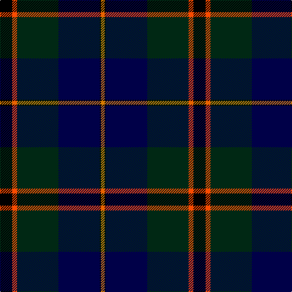

In pattern [KRGBKY](/stripes/krgbky/).

This was sourced from register-of-tartans.  It is a [6 stripe tartan](/stripes/stripes6/).

Original link https://www.tartanregister.gov.uk/tartanDetails.aspx?ref=11357

## Register references

External register numbers recorded for this tartan.

- Scottish Register of Tartans: [11357](https://www.tartanregister.gov.uk/tartanDetails.aspx?ref=11357)

## Thread count
K/20 R8 DG68 DB68 K2 O/6

## Palette
Each colour and the base-6 reference it is a variant of.

| Colour | Shade | Base |
|---|---|---|
| DB | <code style="background-color:#000048;">#000048</code> `oklch(18.2% 0.126 264.1)` <small>#000048</small> | B <code style="background-color:#2A418A;">#2A418A</code> |
| DG | <code style="background-color:#002814;">#002814</code> `oklch(24.4% 0.059 156.5)` <small>#002814</small> | G <code style="background-color:#006100;">#006100</code> |
| K | <code style="background-color:#000000;">#000000</code> `oklch(0.0% 0.000 0.0)` <small>#000000</small> | K <code style="background-color:#000000;">#000000</code> |
| O | <code style="background-color:#D87C00;">#D87C00</code> `oklch(67.3% 0.155 61.8)` <small>#D87C00</small> | Y <code style="background-color:#F2BF00;">#F2BF00</code> |
| R | <code style="background-color:#FA4B00;">#FA4B00</code> `oklch(65.7% 0.220 36.9)` <small>#FA4B00</small> | R <code style="background-color:#CC0000;">#CC0000</code> |

# Sample pattern

## Nearest tartans

The nearest existing variants by ΔTartan distance, with this tartan at the top so the swatches line up against it.

ΔTartan

Tartan

Sett

—

<a href="/ttd/edit/#slug=k10r4dg34db34k1lo3~x2">Singh, Gopal (Personal)</a> <a class="nn-out" href="/setts/s6/k10r4dg34db34k1lo3~x2/" title="open its dictionary page">↗</a>

0.90

<a href="/ttd/edit/#slug=db4k2db16lr1k8dg24r4~x2">Colqhoun VS</a> <a class="nn-out" href="/setts/s7/db4k2db16lr1k8dg24r4~x2/" title="open its dictionary page">↗</a>

0.96

<a href="/ttd/edit/#slug=db24k8dg8r2dg8k1ly2~x2">MacLaren</a> <a class="nn-out" href="/setts/s7/db24k8dg8r2dg8k1ly2~x2/" title="open its dictionary page">↗</a>

0.97

<a href="/ttd/edit/#slug=db24k8dg8r2dg8k1lr2~x2">Fergusson</a> <a class="nn-out" href="/setts/s7/db24k8dg8r2dg8k1lr2~x2/" title="open its dictionary page">↗</a>

0.97

<a href="/ttd/edit/#slug=db24k8dg8r2dg8k1lr2">Fergusson</a> <a class="nn-out" href="/setts/s7/db24k8dg8r2dg8k1lr2/" title="open its dictionary page">↗</a>

1.07

<a href="/ttd/edit/#slug=db28ly1db2k16dg24k1dg2r3~x2">Ogilvy VS</a> <a class="nn-out" href="/setts/s8/db28ly1db2k16dg24k1dg2r3~x2/" title="open its dictionary page">↗</a>

1.14

<a href="/ttd/edit/#slug=k6db3dg28w1db28db2w3~x2">Weisfeld</a> <a class="nn-out" href="/setts/s7/k6db3dg28w1db28db2w3~x2/" title="open its dictionary page">↗</a>

1.16

<a href="/ttd/edit/#slug=dg2r1dg30k16lr1db16r2~x2">Sinclair Hunting</a> <a class="nn-out" href="/setts/s7/dg2r1dg30k16lr1db16r2~x2/" title="open its dictionary page">↗</a>

1.23

<a href="/ttd/edit/#slug=r3k2db25k28dg25k2r1db2~x2">Common Kilt</a> <a class="nn-out" href="/setts/s8/r3k2db25k28dg25k2r1db2~x2/" title="open its dictionary page">↗</a>

1.24

<a href="/ttd/edit/#slug=db24k8dg8r2dg8k1lb2">Fergusson</a> <a class="nn-out" href="/setts/s7/db24k8dg8r2dg8k1lb2/" title="open its dictionary page">↗</a>

1.26

<a href="/ttd/edit/#slug=ly2k4ly1dg16k14db23k4r1~x2">Thomas of Craigie (Personal)</a> <a class="nn-out" href="/setts/s8/ly2k4ly1dg16k14db23k4r1~x2/" title="open its dictionary page">↗</a>

## Neighbour map

Every grey dot is one of 14299 variants placed by the first two principal components of the ΔTartan feature space (44% of its variance). Red is this tartan; blue dots are its nearest — click one to open its page.

<svg viewBox="0 0 640 380" role="img" style="max-width:100%;height:auto;border:1px solid #e0e0e0;border-radius:4px;display:block" xmlns="http://www.w3.org/2000/svg"><image href="/nn/cloud.v1.png" width="640" height="380"/><a href="/setts/s7/db4k2db16lr1k8dg24r4~x2/"><circle cx="248.6" cy="171.1" r="4" fill="#3465a4"><title>Colqhoun VS</title></circle></a><a href="/setts/s7/db24k8dg8r2dg8k1ly2~x2/"><circle cx="267.5" cy="169.2" r="4" fill="#3465a4"><title>MacLaren</title></circle></a><a href="/setts/s7/db24k8dg8r2dg8k1lr2~x2/"><circle cx="268.1" cy="169.3" r="4" fill="#3465a4"><title>Fergusson</title></circle></a><a href="/setts/s7/db24k8dg8r2dg8k1lr2/"><circle cx="268.1" cy="169.3" r="4" fill="#3465a4"><title>Fergusson</title></circle></a><a href="/setts/s8/db28ly1db2k16dg24k1dg2r3~x2/"><circle cx="250.2" cy="147.2" r="4" fill="#3465a4"><title>Ogilvy VS</title></circle></a><a href="/setts/s7/k6db3dg28w1db28db2w3~x2/"><circle cx="253.9" cy="149.1" r="4" fill="#3465a4"><title>Weisfeld</title></circle></a><a href="/setts/s7/dg2r1dg30k16lr1db16r2~x2/"><circle cx="292.9" cy="154.6" r="4" fill="#3465a4"><title>Sinclair Hunting</title></circle></a><a href="/setts/s8/r3k2db25k28dg25k2r1db2~x2/"><circle cx="274.3" cy="175.1" r="4" fill="#3465a4"><title>Common Kilt</title></circle></a><a href="/setts/s7/db24k8dg8r2dg8k1lb2/"><circle cx="254.2" cy="162.3" r="4" fill="#3465a4"><title>Fergusson</title></circle></a><a href="/setts/s8/ly2k4ly1dg16k14db23k4r1~x2/"><circle cx="235.2" cy="165.9" r="4" fill="#3465a4"><title>Thomas of Craigie (Personal)</title></circle></a><circle cx="282.0" cy="168.7" r="5" fill="#c00000"/></svg>

ID: /setts/s6/k10r4dg34db34k1lo3~x2/
