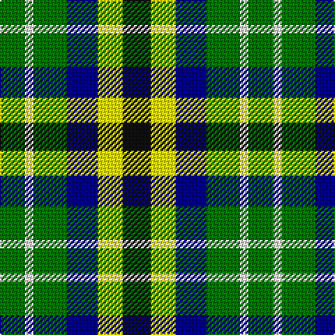

In pattern [GWGBYK](/patterns/gwgbyk/).

This was sourced from register-of-tartans.  It is a [6 stripes tartan](/stripes/stripes6/).

Original link https://www.tartanregister.gov.uk/tartanDetails.aspx?ref=10892

## Thread count
G/18 W6 G24 DB22 Y18 K/20

## Palette
Each colour and its ΔE from the base-6 reference it is a variant of.

| Colour | Shade | Base | ΔE (OKLab) |
|---|---|---|---|
| DB | <code style="background-color:#00008C;">#00008C</code> `#00008C` | B <code style="background-color:#2A418A;">#2A418A</code> | 0.13 |
| G | <code style="background-color:#007800;">#007800</code> `#007800` | G <code style="background-color:#006100;">#006100</code> | 0.07 |
| K | <code style="background-color:#101010;">#101010</code> `#101010` | K <code style="background-color:#000000;">#000000</code> | 0.17 |
| W | <code style="background-color:#F9F5EF;">#F9F5EF</code> `#F9F5EF` | W <code style="background-color:#F7F7F7;">#F7F7F7</code> | 0.01 |
| Y | <code style="background-color:#FFFF00;">#FFFF00</code> `#FFFF00` | Y <code style="background-color:#F2BF00;">#F2BF00</code> | 0.16 |

# Sample pattern

## Nearest tartans

The nearest existing variants by ΔTartan distance.

1. [Centeno-Oxford](/setts/s6/g12k10y9b11ya3g9x2~b1c0070-g006818-k101010-ye8c000-yafccc00/) — ΔT 0.82
1. [Loch Katrine](/setts/s7/b8k11w3k11g12g10r2x2~b8080d0-g30a010-k000030-r802040-we0e0e0/) — ΔT 1.57
1. [Burns Heritage Check](/setts/s9/k12w12k12w12g13w8b6g4b5~b401000-g008000-k000000-we0e0e0/) — ΔT 1.67
1. [Gallowater, Old](/setts/s5/k19b10ba19g40y10~b5480b0-ba800080-g008000-k000000-yf0c000/) — ΔT 1.72
1. [Arrol](/setts/s9/r2b4k4g4w1g4k4g4w1x4~b00008c-g007800-k000000-r8c0000-wc8c8c8/) — ΔT 1.80
1. [Pollard (2014)](/setts/s7/g5ga5gb5b5ba5ga10w2x8~b000048-ba2c2c80-g289c18-ga005020-gb007800-wffffff/) — ΔT 1.88
1. [Burns Heritage Check](/setts/s9/k6w6k6w6g7w4ga3g2ga3x2~g408060-ga604000-k101010-wfcfcfc/) — ΔT 1.89
1. [Ramsay (Orange)](/setts/s7/k4y9k13g6y3g9w4x2~g006818-k101010-we0e0e0-yd87c00/) — ΔT 1.96
1. [Unidentified Silk Plaid](/setts/s5/b7r8g15y6ya3x10~b2c4084-g005020-rec7440-yfadc00-yac89600/) — ΔT 1.97
1. [Gallowater Old District Tartan Tartan Number: 1025. Earliest known date: 1819 Both 'Old' and 'New' appear in Wilson's 1819 pattern book. See products available Copyright © Blair Urquhart, Comrie, 2015](/setts/s5/k19b10ba19g40y10~b5c8ca8-ba780078-g006818-k101010-ye8c000/) — ΔT 2.02

## Neighbour map

Every grey dot is one of 15726 variants placed by the first two principal components of the ΔTartan feature space (44% of its variance). Red is this tartan; blue dots are its nearest — click one to open its page.

<svg viewBox="0 0 640 380" role="img" style="max-width:100%;height:auto;border:1px solid #e0e0e0;border-radius:4px;display:block" xmlns="http://www.w3.org/2000/svg"><image href="/nn/cloud.v1.png" width="640" height="380"/><a href="/setts/s6/g12k10y9b11ya3g9x2~b1c0070-g006818-k101010-ye8c000-yafccc00/"><circle cx="43.4" cy="275.0" r="4" fill="#3465a4"><title>Centeno-Oxford</title></circle></a><a href="/setts/s7/b8k11w3k11g12g10r2x2~b8080d0-g30a010-k000030-r802040-we0e0e0/"><circle cx="88.5" cy="236.0" r="4" fill="#3465a4"><title>Loch Katrine</title></circle></a><a href="/setts/s9/k12w12k12w12g13w8b6g4b5~b401000-g008000-k000000-we0e0e0/"><circle cx="39.1" cy="263.3" r="4" fill="#3465a4"><title>Burns Heritage Check</title></circle></a><a href="/setts/s5/k19b10ba19g40y10~b5480b0-ba800080-g008000-k000000-yf0c000/"><circle cx="83.7" cy="247.3" r="4" fill="#3465a4"><title>Gallowater, Old</title></circle></a><a href="/setts/s9/r2b4k4g4w1g4k4g4w1x4~b00008c-g007800-k000000-r8c0000-wc8c8c8/"><circle cx="73.0" cy="250.5" r="4" fill="#3465a4"><title>Arrol</title></circle></a><a href="/setts/s7/g5ga5gb5b5ba5ga10w2x8~b000048-ba2c2c80-g289c18-ga005020-gb007800-wffffff/"><circle cx="64.2" cy="245.3" r="4" fill="#3465a4"><title>Pollard (2014)</title></circle></a><a href="/setts/s9/k6w6k6w6g7w4ga3g2ga3x2~g408060-ga604000-k101010-wfcfcfc/"><circle cx="36.9" cy="256.9" r="4" fill="#3465a4"><title>Burns Heritage Check</title></circle></a><a href="/setts/s7/k4y9k13g6y3g9w4x2~g006818-k101010-we0e0e0-yd87c00/"><circle cx="92.4" cy="256.2" r="4" fill="#3465a4"><title>Ramsay (Orange)</title></circle></a><a href="/setts/s5/b7r8g15y6ya3x10~b2c4084-g005020-rec7440-yfadc00-yac89600/"><circle cx="89.8" cy="242.9" r="4" fill="#3465a4"><title>Unidentified Silk Plaid</title></circle></a><a href="/setts/s5/k19b10ba19g40y10~b5c8ca8-ba780078-g006818-k101010-ye8c000/"><circle cx="105.9" cy="255.1" r="4" fill="#3465a4"><title>Gallowater Old District Tartan Tartan Number: 1025. Earliest known date: 1819 Both 'Old' and 'New' appear in Wilson's 1819 pattern book. See products available Copyright © Blair Urquhart, Comrie, 2015</title></circle></a><circle cx="25.3" cy="269.7" r="5" fill="#c00000"/></svg>

ID: /setts/s6/k10y9b11g12w3g9x2~b00008c-g007800-k101010-wf9f5ef-yffff00/
