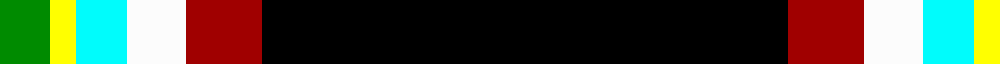

In pattern [GYWWRK](/patterns/gywwrk/).

This was sourced from register-of-tartans.  It is a [6 stripes tartan](/stripes/stripes6/).

Original link https://www.tartanregister.gov.uk/tartanDetails.aspx?ref=11582

## Thread count
G/12 Y6 LB12 W14 DR18 K/124

## Palette
Each colour and its ΔE from the base-6 reference it is a variant of.

| Colour | Shade | Base | ΔE (OKLab) |
|---|---|---|---|
| DR | <code style="background-color:#A00000;">#A00000</code> `#A00000` | R <code style="background-color:#CC0000;">#CC0000</code> | 0.09 |
| G | <code style="background-color:#008B00;">#008B00</code> `#008B00` | G <code style="background-color:#006100;">#006100</code> | 0.13 |
| K | <code style="background-color:#000000;">#000000</code> `#000000` | K <code style="background-color:#000000;">#000000</code> | 0.00 |
| LB | <code style="background-color:#00FCFC;">#00FCFC</code> `#00FCFC` | W <code style="background-color:#F7F7F7;">#F7F7F7</code> | 0.17 |
| W | <code style="background-color:#FCFCFC;">#FCFCFC</code> `#FCFCFC` | W <code style="background-color:#F7F7F7;">#F7F7F7</code> | 0.01 |
| Y | <code style="background-color:#FFFF00;">#FFFF00</code> `#FFFF00` | Y <code style="background-color:#F2BF00;">#F2BF00</code> | 0.16 |

# Sample pattern

## Nearest tartans

The nearest existing variants by ΔTartan distance.

1. [Friends of Nordegg](/setts/s6/k100g12b12r12ba12w6-b0000cd-ba666666-g008b00-k101010-rff0000-wffffff/) — ΔT 1.20
1. [Victory](/setts/s9/k4r6k72b4k10b14y6w10ya4-b666666-k101010-re3170d-w82cffd-yffe600-ya86c67c/) — ΔT 1.38
1. [Pavelka Limited](/setts/s8/w6g10ga4y6wa6y10k96wa6-g048888-ga00643c-k101010-w00fcfc-waf8f8f8-ya08858/) — ΔT 1.39
1. [Down Irish County Tartan Tartan Number: 2266. Earliest known date: 1995 One of a series of Irish District tartans designed by Polly Wittering of the House of Edgar, with colours reminiscent of the Country with soft warm colours dominating. See products available Copyright © Blair Urquhart, Comrie, 2015](/setts/s9/k130g18r22k10b4y4ya10k4y26-b6490a8-g28200c-k000000-rbc401c-yd49464-yab49870/) — ΔT 1.39
1. [Pavelka Ltd](/setts/s8/g6k96g10w6g6ga4gb10wa6-g604000-ga006818-gb048888-k101010-wfcfcfc-wa98c8e8/) — ΔT 1.47
1. [Avalon](/setts/s7/r10g6y12w6y10k110w10-g006818-k101010-rc80000-wf8f8f8-ye8c000/) — ΔT 1.52
1. [Braveheart - ( Warrior)](/setts/s12/k86b6k14ba6k4ba6k4g22r12k4r6w6-b8080d0-ba300030-g008000-k000000-rc00000-we0e0e0/) — ΔT 1.66
1. [CREATeGlasgow](/setts/s6/k98r2w8b10g10y10-b000080-g005020-k101010-ra00000-wc49cd8-yffff00/) — ΔT 1.72
1. [Charlotte Fire Department](/setts/s6/k150r20g14y6b4w10-b202060-g006818-k101010-rc80000-wfcfcfc-ye8c000/) — ΔT 1.73
1. [Hawes (2014)](/setts/s10/w4b6g10k100g8b6w4ba6k4y4-b441800-ba5c8ca8-g007800-k101010-wffffff-yffd700/) — ΔT 1.73

## Neighbour map

Every grey dot is one of 15726 variants placed by the first two principal components of the ΔTartan feature space (44% of its variance). Red is this tartan; blue dots are its nearest — click one to open its page.

<svg viewBox="0 0 640 380" role="img" style="max-width:100%;height:auto;border:1px solid #e0e0e0;border-radius:4px;display:block" xmlns="http://www.w3.org/2000/svg"><image href="/nn/cloud.v1.png" width="640" height="380"/><a href="/setts/s6/k100g12b12r12ba12w6-b0000cd-ba666666-g008b00-k101010-rff0000-wffffff/"><circle cx="336.8" cy="130.7" r="4" fill="#3465a4"><title>Friends of Nordegg</title></circle></a><a href="/setts/s9/k4r6k72b4k10b14y6w10ya4-b666666-k101010-re3170d-w82cffd-yffe600-ya86c67c/"><circle cx="342.2" cy="101.4" r="4" fill="#3465a4"><title>Victory</title></circle></a><a href="/setts/s8/w6g10ga4y6wa6y10k96wa6-g048888-ga00643c-k101010-w00fcfc-waf8f8f8-ya08858/"><circle cx="358.6" cy="85.4" r="4" fill="#3465a4"><title>Pavelka Limited</title></circle></a><a href="/setts/s9/k130g18r22k10b4y4ya10k4y26-b6490a8-g28200c-k000000-rbc401c-yd49464-yab49870/"><circle cx="344.7" cy="78.2" r="4" fill="#3465a4"><title>Down Irish County Tartan Tartan Number: 2266. Earliest known date: 1995 One of a series of Irish District tartans designed by Polly Wittering of the House of Edgar, with colours reminiscent of the Country with soft warm colours dominating. See products available Copyright © Blair Urquhart, Comrie, 2015</title></circle></a><a href="/setts/s8/g6k96g10w6g6ga4gb10wa6-g604000-ga006818-gb048888-k101010-wfcfcfc-wa98c8e8/"><circle cx="383.3" cy="96.1" r="4" fill="#3465a4"><title>Pavelka Ltd</title></circle></a><a href="/setts/s7/r10g6y12w6y10k110w10-g006818-k101010-rc80000-wf8f8f8-ye8c000/"><circle cx="368.0" cy="116.3" r="4" fill="#3465a4"><title>Avalon</title></circle></a><a href="/setts/s12/k86b6k14ba6k4ba6k4g22r12k4r6w6-b8080d0-ba300030-g008000-k000000-rc00000-we0e0e0/"><circle cx="329.1" cy="84.2" r="4" fill="#3465a4"><title>Braveheart - ( Warrior)</title></circle></a><a href="/setts/s6/k98r2w8b10g10y10-b000080-g005020-k101010-ra00000-wc49cd8-yffff00/"><circle cx="429.9" cy="89.2" r="4" fill="#3465a4"><title>CREATeGlasgow</title></circle></a><a href="/setts/s6/k150r20g14y6b4w10-b202060-g006818-k101010-rc80000-wfcfcfc-ye8c000/"><circle cx="452.5" cy="96.3" r="4" fill="#3465a4"><title>Charlotte Fire Department</title></circle></a><a href="/setts/s10/w4b6g10k100g8b6w4ba6k4y4-b441800-ba5c8ca8-g007800-k101010-wffffff-yffd700/"><circle cx="392.9" cy="75.4" r="4" fill="#3465a4"><title>Hawes (2014)</title></circle></a><circle cx="339.4" cy="116.6" r="5" fill="#c00000"/></svg>

ID: /setts/s6/k124r18w14wa12y6g12-g008b00-k000000-ra00000-wfcfcfc-wa00fcfc-yffff00/
