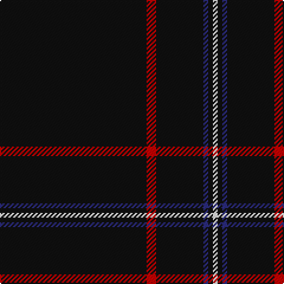

In pattern [KRKBKW](/patterns/krkbkw/).

This was sourced from tartans-authority.  It is a [6 stripes tartan](/stripes/stripes6/).

Original link http://www.tartansauthority.com/tartan-ferret/display/11058/

## Thread count
K/124 R8 K40 DB4 K4 W/4

## Palette
Each colour and its ΔE from the base-6 reference it is a variant of.

| Colour | Shade | Base | ΔE (OKLab) |
|---|---|---|---|
| DB | <code style="background-color:#2C2C80;">#2C2C80</code> `#2C2C80` | B <code style="background-color:#2A418A;">#2A418A</code> | 0.06 |
| K | <code style="background-color:#101010;">#101010</code> `#101010` | K <code style="background-color:#000000;">#000000</code> | 0.17 |
| R | <code style="background-color:#C80000;">#C80000</code> `#C80000` | R <code style="background-color:#CC0000;">#CC0000</code> | 0.01 |
| W | <code style="background-color:#FCFCFC;">#FCFCFC</code> `#FCFCFC` | W <code style="background-color:#F7F7F7;">#F7F7F7</code> | 0.01 |

# Sample pattern

## Nearest tartans

The nearest existing variants by ΔTartan distance.

1. [NewGeneration Alchemy (NGA) Inc](/setts/s6/k124r8k40b4k4w4-b0000cd-k101010-rc8002c-wffffff/) — ΔT 0.18
1. [Chafyn House (School)](/setts/s7/k72r3k11b9k11r3k37-b2888c4-k101010-rc80000/) — ΔT 1.30
1. [Lochaber (Hesketh)](/setts/s7/k16y6k240y6k80b4k8-b5c8ca8-k101010-ye8c000/) — ΔT 1.57
1. [Dunnotar (School)](/setts/s4/k72w3k11b9-b2c2c80-k101010-we0e0e0/) — ΔT 1.60
1. [Auld Bernensis](/setts/s8/k124r6k6y6k6r6k18ra10-k101010-rc80000-ra888888-yd09800/) — ΔT 1.64
1. [Wallington (Corporate?)](/setts/s4/k60b3k9g7-b2888c4-g289c18-k101010/) — ΔT 1.70
1. [McHattie (Personal)](/setts/s5/k90b4r8y2w2-b202060-k101010-rc80000-we0e0e0-ye8c000/) — ΔT 1.72
1. [Fettes (Personal)](/setts/s5/k200b12ba8r12w4-b004878-baa060bc-k101010-rc80000-we0e0e0/) — ΔT 1.72
1. [Fettes Personal Tartan Tartan Number: 7565. Earliest known date: 2008 Designed online for four kilts by Fiona Fettes. See products available Copyright © Blair Urquhart, Comrie, 2015](/setts/s5/k100b6w4r6wa2-b003c64-k101010-rc80000-wc49cd8-wae0e0e0/) — ΔT 1.77
1. [Gourlay, George (Personal)](/setts/s7/k48w2r12k42y4k48g2-g006818-k101010-rc80000-we0e0e0-ybc8c00/) — ΔT 1.78

## Neighbour map

Every grey dot is one of 15726 variants placed by the first two principal components of the ΔTartan feature space (44% of its variance). Red is this tartan; blue dots are its nearest — click one to open its page.

<svg viewBox="0 0 640 380" role="img" style="max-width:100%;height:auto;border:1px solid #e0e0e0;border-radius:4px;display:block" xmlns="http://www.w3.org/2000/svg"><image href="/nn/cloud.v1.png" width="640" height="380"/><a href="/setts/s6/k124r8k40b4k4w4-b0000cd-k101010-rc8002c-wffffff/"><circle cx="626.0" cy="169.9" r="4" fill="#3465a4"><title>NewGeneration Alchemy (NGA) Inc</title></circle></a><a href="/setts/s7/k72r3k11b9k11r3k37-b2888c4-k101010-rc80000/"><circle cx="626.0" cy="210.3" r="4" fill="#3465a4"><title>Chafyn House (School)</title></circle></a><a href="/setts/s7/k16y6k240y6k80b4k8-b5c8ca8-k101010-ye8c000/"><circle cx="626.0" cy="165.9" r="4" fill="#3465a4"><title>Lochaber (Hesketh)</title></circle></a><a href="/setts/s4/k72w3k11b9-b2c2c80-k101010-we0e0e0/"><circle cx="626.0" cy="229.5" r="4" fill="#3465a4"><title>Dunnotar (School)</title></circle></a><a href="/setts/s8/k124r6k6y6k6r6k18ra10-k101010-rc80000-ra888888-yd09800/"><circle cx="597.9" cy="150.3" r="4" fill="#3465a4"><title>Auld Bernensis</title></circle></a><a href="/setts/s4/k60b3k9g7-b2888c4-g289c18-k101010/"><circle cx="626.0" cy="229.1" r="4" fill="#3465a4"><title>Wallington (Corporate?)</title></circle></a><a href="/setts/s5/k90b4r8y2w2-b202060-k101010-rc80000-we0e0e0-ye8c000/"><circle cx="619.3" cy="131.0" r="4" fill="#3465a4"><title>McHattie (Personal)</title></circle></a><a href="/setts/s5/k200b12ba8r12w4-b004878-baa060bc-k101010-rc80000-we0e0e0/"><circle cx="626.0" cy="132.0" r="4" fill="#3465a4"><title>Fettes (Personal)</title></circle></a><a href="/setts/s5/k100b6w4r6wa2-b003c64-k101010-rc80000-wc49cd8-wae0e0e0/"><circle cx="622.2" cy="128.9" r="4" fill="#3465a4"><title>Fettes Personal Tartan Tartan Number: 7565. Earliest known date: 2008 Designed online for four kilts by Fiona Fettes. See products available Copyright © Blair Urquhart, Comrie, 2015</title></circle></a><a href="/setts/s7/k48w2r12k42y4k48g2-g006818-k101010-rc80000-we0e0e0-ybc8c00/"><circle cx="582.4" cy="183.6" r="4" fill="#3465a4"><title>Gourlay, George (Personal)</title></circle></a><circle cx="626.0" cy="171.7" r="5" fill="#c00000"/></svg>

ID: /setts/s6/k124r8k40b4k4w4-b2c2c80-k101010-rc80000-wfcfcfc/
