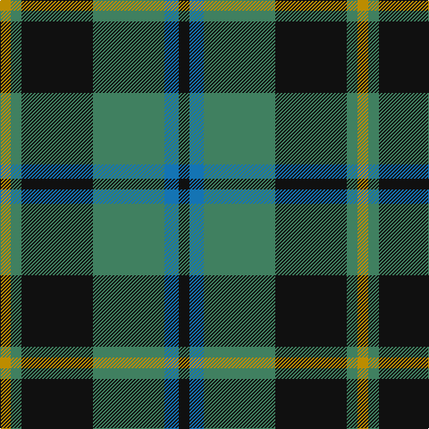

In pattern [KBGKGY](/patterns/kbgkgy/).

This was sourced from register-of-tartans.  It is a [6 stripes tartan](/stripes/stripes6/).

Original link https://www.tartanregister.gov.uk/tartanDetails.aspx?ref=2944

## Attestations

This cloth appears in 2 source records; the oldest owns this page.

- 01/05/2003 — Michaluk (Personal) (register-of-tartans, [record](https://www.tartanregister.gov.uk/tartanDetails.aspx?ref=2944))
- pre 2004 — Michaluk (Personal) (tartans-authority, [record](http://www.tartansauthority.com/tartan-ferret/display/6217/))

## Thread count
DY/12 G12 K80 G80 B16 K/12

## Palette
Each colour and its ΔE from the base-6 reference it is a variant of.

| Colour | Shade | Base | ΔE (OKLab) |
|---|---|---|---|
| B | <code style="background-color:#1474B4;">#1474B4</code> `#1474B4` | B <code style="background-color:#2A418A;">#2A418A</code> | 0.15 |
| DY | <code style="background-color:#BC8C00;">#BC8C00</code> `#BC8C00` | Y <code style="background-color:#F2BF00;">#F2BF00</code> | 0.16 |
| G | <code style="background-color:#408060;">#408060</code> `#408060` | G <code style="background-color:#006100;">#006100</code> | 0.14 |
| K | <code style="background-color:#101010;">#101010</code> `#101010` | K <code style="background-color:#000000;">#000000</code> | 0.17 |

# Sample pattern

## Nearest tartans

The nearest existing variants by ΔTartan distance.

1. [Davidson, Half..](/setts/s6/k6g44b6g6b38r6-b304080-g008000-k000000-rc00000/) — ΔT 0.77
1. [Irving of Bonshaw Tower (Personal)](/setts/s6/r4g6b4g28b28y4-b1c0070-g006818-r880000-yb8b8b8/) — ΔT 0.88
1. [Flower of Scotland](/setts/s6/b3g28b3k16b28r3-b304080-g008000-k000000-rc00000/) — ΔT 0.91
1. [Thayer USA](/setts/s6/r10b50w10b6g50b6-b202060-g255210-ra51805-wffffff/) — ΔT 0.94
1. [Cameron of Lochiel (Hunting)](/setts/s7/r6g20r6g28b32g6y4-b1c0070-g006818-rc80000-ye8c000/) — ΔT 1.01
1. [Cameron Hunting](/setts/s7/r3g10r3g14b16g3y2-b000064-g004c00-rc80000-yffc800/) — ΔT 1.03
1. [Eglinton District Tartan Tartan Number: 2075. Earliest known date: pre 1847 The Eglinton tartan is the Montgomerie with a narrower ground. D W Stewart in his book, Old and Rare, was of the opinion that the Montgomerie tartan was adopted by the Montgomeries of Ayrshire in 1707. He stated that in 1893 there were historic relics at Eglinton Castle which furnished evidence of the early use of the tartan. See products available Copyright © Blair Urquhart, Comrie, 2015](/setts/s7/k6g6k6b32k6r6k6-b5c8ca8-g006818-k101010-rc80000/) — ΔT 1.04
1. [Thayer USA (Name)](/setts/s6/r10b50w10b6g50b6-b2c2c80-g006818-rc80000-we0e0e0/) — ΔT 1.04
1. [Daks, Navy](/setts/s8/r5g12b4ba4b22g18b4r5-b000050-ba304080-g008000-rc00000/) — ΔT 1.05
1. [Banff Centennial (Commemorative)](/setts/s8/k4b4k4b28g32k4g4y4-b1870a4-g004c00-k000000-yfcb000/) — ΔT 1.06

## Neighbour map

Every grey dot is one of 15726 variants placed by the first two principal components of the ΔTartan feature space (44% of its variance). Red is this tartan; blue dots are its nearest — click one to open its page.

<svg viewBox="0 0 640 380" role="img" style="max-width:100%;height:auto;border:1px solid #e0e0e0;border-radius:4px;display:block" xmlns="http://www.w3.org/2000/svg"><image href="/nn/cloud.v1.png" width="640" height="380"/><a href="/setts/s6/k6g44b6g6b38r6-b304080-g008000-k000000-rc00000/"><circle cx="262.5" cy="223.2" r="4" fill="#3465a4"><title>Davidson, Half..</title></circle></a><a href="/setts/s6/r4g6b4g28b28y4-b1c0070-g006818-r880000-yb8b8b8/"><circle cx="253.1" cy="227.6" r="4" fill="#3465a4"><title>Irving of Bonshaw Tower (Personal)</title></circle></a><a href="/setts/s6/b3g28b3k16b28r3-b304080-g008000-k000000-rc00000/"><circle cx="203.7" cy="214.4" r="4" fill="#3465a4"><title>Flower of Scotland</title></circle></a><a href="/setts/s6/r10b50w10b6g50b6-b202060-g255210-ra51805-wffffff/"><circle cx="247.6" cy="213.9" r="4" fill="#3465a4"><title>Thayer USA</title></circle></a><a href="/setts/s7/r6g20r6g28b32g6y4-b1c0070-g006818-rc80000-ye8c000/"><circle cx="257.9" cy="223.3" r="4" fill="#3465a4"><title>Cameron of Lochiel (Hunting)</title></circle></a><a href="/setts/s7/r3g10r3g14b16g3y2-b000064-g004c00-rc80000-yffc800/"><circle cx="261.3" cy="227.6" r="4" fill="#3465a4"><title>Cameron Hunting</title></circle></a><a href="/setts/s7/k6g6k6b32k6r6k6-b5c8ca8-g006818-k101010-rc80000/"><circle cx="218.1" cy="213.9" r="4" fill="#3465a4"><title>Eglinton District Tartan Tartan Number: 2075. Earliest known date: pre 1847 The Eglinton tartan is the Montgomerie with a narrower ground. D W Stewart in his book, Old and Rare, was of the opinion that the Montgomerie tartan was adopted by the Montgomeries of Ayrshire in 1707. He stated that in 1893 there were historic relics at Eglinton Castle which furnished evidence of the early use of the tartan. See products available Copyright © Blair Urquhart, Comrie, 2015</title></circle></a><a href="/setts/s6/r10b50w10b6g50b6-b2c2c80-g006818-rc80000-we0e0e0/"><circle cx="248.9" cy="214.0" r="4" fill="#3465a4"><title>Thayer USA (Name)</title></circle></a><a href="/setts/s8/r5g12b4ba4b22g18b4r5-b000050-ba304080-g008000-rc00000/"><circle cx="172.1" cy="229.7" r="4" fill="#3465a4"><title>Daks, Navy</title></circle></a><a href="/setts/s8/k4b4k4b28g32k4g4y4-b1870a4-g004c00-k000000-yfcb000/"><circle cx="220.5" cy="193.2" r="4" fill="#3465a4"><title>Banff Centennial (Commemorative)</title></circle></a><circle cx="231.2" cy="225.4" r="5" fill="#c00000"/></svg>

ID: /setts/s6/k12b16g80k80g12y12-b1474b4-g408060-k101010-ybc8c00/
