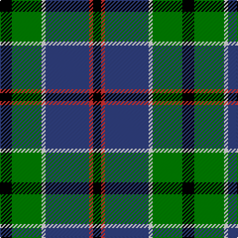

In pattern [KGWBRK](/patterns/kgwbrk/).

This was sourced from weddslist.  It is a [6 stripes tartan](/stripes/stripes6/).

Original link http://www.weddslist.com/cgi-bin/tartans/pg.pl?source=sts

## Thread count
K/12 G30 LN4 B44 R4 K/8

## Palette
Each colour and its ΔE from the base-6 reference it is a variant of.

| Colour | Shade | Base | ΔE (OKLab) |
|---|---|---|---|
| B | <code style="background-color:#304080;">#304080</code> `#304080` | B <code style="background-color:#2C4084;">#2C4084</code> | 0.01 |
| G | <code style="background-color:#008000;">#008000</code> `#008000` | G <code style="background-color:#006400;">#006400</code> | 0.09 |
| K | <code style="background-color:#000000;">#000000</code> `#000000` | K <code style="background-color:#000000;">#000000</code> | 0.00 |
| LN | <code style="background-color:#E0E0E0;">#E0E0E0</code> `#E0E0E0` | W <code style="background-color:#F4F4F0;">#F4F4F0</code> | 0.06 |
| R | <code style="background-color:#D03030;">#D03030</code> `#D03030` | R <code style="background-color:#C80000;">#C80000</code> | 0.05 |

# Sample pattern

## Nearest tartans

The nearest existing variants by ΔTartan distance.

1. [Patterson (blue)](/setts/s6/b44w4k20g22r6g8-b304080-g008000-k000000-rc00000-we0e0e0/) — ΔT 0.33
1. [MacPhail, hunting](/setts/s6/r4b46k28g32k4w4-b304080-g008000-k000000-rc00000-we0e0e0/) — ΔT 0.51
1. [MacLeod of Assynt](/setts/s6/r6k4g30k20b40y4-b304080-g008000-k000000-rc00000-yf0c000/) — ΔT 0.62
1. [MacThomas](/setts/s7/b6r4b44k22g48w4g6-b304080-g008000-k000000-r900030-wc0a0e0/) — ΔT 0.70
1. [Midlothian](/setts/s6/b62ba8b10k38g40y8-b304080-ba8080d0-g008000-k000000-yf0c000/) — ΔT 0.75
1. [MacLeod, Macleod of Harris](/setts/s7/r6k4g30k20b40k4y4-b304080-g008000-k000000-rc00000-yf0c000/) — ΔT 0.77
1. [Inglis (Name)](/setts/s6/y8g48b20r6b24ya8-b1c0070-g006818-rc80000-yb8b8b8-yad09800/) — ΔT 0.85
1. [MacTaggert](/setts/s7/g18b4g2k12ba12r2ba2-b5480b0-ba304080-g008000-k000000-rc00000/) — ΔT 0.88
1. [Afternoon Tea / Darjeeling](/setts/s6/w15g98b72r25b8y15-b14283c-g005448-r800028-wf0e0c8-yffe600/) — ΔT 0.90
1. [Highlander, Highland Laddie Kilts](/setts/s5/k14r6g58b58w6-b304080-g008000-k000000-r802040-we0e0e0/) — ΔT 0.91

## Neighbour map

Every grey dot is one of 15726 variants placed by the first two principal components of the ΔTartan feature space (44% of its variance). Red is this tartan; blue dots are its nearest — click one to open its page.

<svg viewBox="0 0 640 380" role="img" style="max-width:100%;height:auto;border:1px solid #e0e0e0;border-radius:4px;display:block" xmlns="http://www.w3.org/2000/svg"><image href="/nn/cloud.v1.png" width="640" height="380"/><a href="/setts/s6/b44w4k20g22r6g8-b304080-g008000-k000000-rc00000-we0e0e0/"><circle cx="171.5" cy="190.3" r="4" fill="#3465a4"><title>Patterson (blue)</title></circle></a><a href="/setts/s6/r4b46k28g32k4w4-b304080-g008000-k000000-rc00000-we0e0e0/"><circle cx="162.8" cy="185.0" r="4" fill="#3465a4"><title>MacPhail, hunting</title></circle></a><a href="/setts/s6/r6k4g30k20b40y4-b304080-g008000-k000000-rc00000-yf0c000/"><circle cx="150.1" cy="192.0" r="4" fill="#3465a4"><title>MacLeod of Assynt</title></circle></a><a href="/setts/s7/b6r4b44k22g48w4g6-b304080-g008000-k000000-r900030-wc0a0e0/"><circle cx="190.7" cy="174.2" r="4" fill="#3465a4"><title>MacThomas</title></circle></a><a href="/setts/s6/b62ba8b10k38g40y8-b304080-ba8080d0-g008000-k000000-yf0c000/"><circle cx="155.3" cy="207.7" r="4" fill="#3465a4"><title>Midlothian</title></circle></a><a href="/setts/s7/r6k4g30k20b40k4y4-b304080-g008000-k000000-rc00000-yf0c000/"><circle cx="146.9" cy="178.3" r="4" fill="#3465a4"><title>MacLeod, Macleod of Harris</title></circle></a><a href="/setts/s6/y8g48b20r6b24ya8-b1c0070-g006818-rc80000-yb8b8b8-yad09800/"><circle cx="180.1" cy="207.4" r="4" fill="#3465a4"><title>Inglis (Name)</title></circle></a><a href="/setts/s7/g18b4g2k12ba12r2ba2-b5480b0-ba304080-g008000-k000000-rc00000/"><circle cx="140.5" cy="191.0" r="4" fill="#3465a4"><title>MacTaggert</title></circle></a><a href="/setts/s6/w15g98b72r25b8y15-b14283c-g005448-r800028-wf0e0c8-yffe600/"><circle cx="202.4" cy="185.3" r="4" fill="#3465a4"><title>Afternoon Tea / Darjeeling</title></circle></a><a href="/setts/s5/k14r6g58b58w6-b304080-g008000-k000000-r802040-we0e0e0/"><circle cx="194.6" cy="203.1" r="4" fill="#3465a4"><title>Highlander, Highland Laddie Kilts</title></circle></a><circle cx="184.0" cy="183.8" r="5" fill="#c00000"/></svg>

ID: /setts/s6/k12g30w4b44r4k8-b304080-g008000-k000000-rd03030-we0e0e0/
