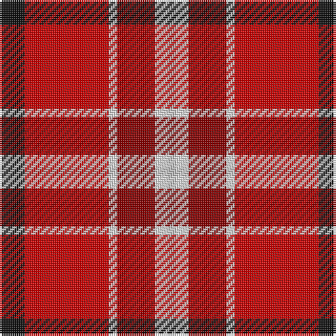

In pattern [KRWRWW](/patterns/krwrww/).

This was sourced from tartans-authority.  It is a [6 stripes tartan](/stripes/stripes6/).

Original link http://www.tartansauthority.com/tartan-ferret/display/8535/

## Thread count
K/12 R40 LN4 DR18 LN6 N/4

## Palette
Each colour and its ΔE from the base-6 reference it is a variant of.

| Colour | Shade | Base | ΔE (OKLab) |
|---|---|---|---|
| DR | <code style="background-color:#880000;">#880000</code> `#880000` | R <code style="background-color:#CC0000;">#CC0000</code> | 0.15 |
| K | <code style="background-color:#101010;">#101010</code> `#101010` | K <code style="background-color:#000000;">#000000</code> | 0.17 |
| LN | <code style="background-color:#E0E0E0;">#E0E0E0</code> `#E0E0E0` | W <code style="background-color:#F7F7F7;">#F7F7F7</code> | 0.07 |
| N | <code style="background-color:#C0C0C0;">#C0C0C0</code> `#C0C0C0` | W <code style="background-color:#F7F7F7;">#F7F7F7</code> | 0.17 |
| R | <code style="background-color:#C80000;">#C80000</code> `#C80000` | R <code style="background-color:#CC0000;">#CC0000</code> | 0.01 |

# Sample pattern

## Nearest tartans

The nearest existing variants by ΔTartan distance.

1. [Afternoon Tea / Apple Tea](/setts/s6/w15b8r25b72ra98y15-b4c3428-rec34c4-rac82828-we0e0e0-yf8e38c/) — ΔT 0.85
1. [Benedict (Personal)](/setts/s5/g16w16k8r60y16-g003820-k101010-rc80000-wc0c0c0-yd8b000/) — ΔT 1.11
1. [Ferguson's Promise (Commemorative)](/setts/s7/r76k24ra30rb8ra30k4w8-k101010-r880000-rae87878-rbc8002c-we0e0e0/) — ΔT 1.16
1. [Royal Stuart/Stewart](/setts/s8/r14b4k4y2k4r4k2w2-b2c4084-k101010-rdc0000-we0e0e0-ye8c000/) — ΔT 1.20
1. [Mangles, Peter and Annette (Personal](/setts/s7/r80k20g20r20w20ra12g12-g285800-k101010-rc80000-ra888888-wfcfcfc/) — ΔT 1.25
1. [Benedict (Personal)](/setts/s5/g16w16k8r60y16-g006438-k101010-rc80000-wc0c0c0-yd8b000/) — ΔT 1.26
1. [McGill University](/setts/s5/w6r48b24g16y6-b23138d-g063928-rff0000-wffffff-ycea12c/) — ΔT 1.26
1. [MIT1951](/setts/s10/r48ra10y14b4y8b28r22b6r6w8-b1c1c1c-rc8002c-ra901c38-we0e0e0-yb0b0b0/) — ΔT 1.27
1. [Mangles, Peter and Annette (Personal)](/setts/s7/r80k20g20r20w20b12g12-b686468-g00643c-k000000-re01c18-we8e8e8/) — ΔT 1.28
1. [Mangles, Peter and Annette Family/Personal Tartan Tartan Number: 10844. Earliest known date: 02/05/2013 The colours were chosen to represent the organisation and the location where Peter and Annette first met in Liverpool. In addition the red is representative of the city of Aberdeen (Scotland) and the black and grey is representative of the granite used extensively throughout Aberdeen See products available Copyright © Blair Urquhart, Comrie, 2015](/setts/s7/r80k20g20r20w20y12g12-g006840-k101010-re01c18-wf8f8f8-ya4a8a8/) — ΔT 1.32

## Neighbour map

Every grey dot is one of 15726 variants placed by the first two principal components of the ΔTartan feature space (44% of its variance). Red is this tartan; blue dots are its nearest — click one to open its page.

<svg viewBox="0 0 640 380" role="img" style="max-width:100%;height:auto;border:1px solid #e0e0e0;border-radius:4px;display:block" xmlns="http://www.w3.org/2000/svg"><image href="/nn/cloud.v1.png" width="640" height="380"/><a href="/setts/s6/w15b8r25b72ra98y15-b4c3428-rec34c4-rac82828-we0e0e0-yf8e38c/"><circle cx="220.5" cy="163.6" r="4" fill="#3465a4"><title>Afternoon Tea / Apple Tea</title></circle></a><a href="/setts/s5/g16w16k8r60y16-g003820-k101010-rc80000-wc0c0c0-yd8b000/"><circle cx="227.4" cy="191.7" r="4" fill="#3465a4"><title>Benedict (Personal)</title></circle></a><a href="/setts/s7/r76k24ra30rb8ra30k4w8-k101010-r880000-rae87878-rbc8002c-we0e0e0/"><circle cx="234.2" cy="140.3" r="4" fill="#3465a4"><title>Ferguson's Promise (Commemorative)</title></circle></a><a href="/setts/s8/r14b4k4y2k4r4k2w2-b2c4084-k101010-rdc0000-we0e0e0-ye8c000/"><circle cx="208.1" cy="171.4" r="4" fill="#3465a4"><title>Royal Stuart/Stewart</title></circle></a><a href="/setts/s7/r80k20g20r20w20ra12g12-g285800-k101010-rc80000-ra888888-wfcfcfc/"><circle cx="231.3" cy="178.0" r="4" fill="#3465a4"><title>Mangles, Peter and Annette (Personal</title></circle></a><a href="/setts/s5/g16w16k8r60y16-g006438-k101010-rc80000-wc0c0c0-yd8b000/"><circle cx="232.8" cy="193.9" r="4" fill="#3465a4"><title>Benedict (Personal)</title></circle></a><a href="/setts/s5/w6r48b24g16y6-b23138d-g063928-rff0000-wffffff-ycea12c/"><circle cx="197.3" cy="185.0" r="4" fill="#3465a4"><title>McGill University</title></circle></a><a href="/setts/s10/r48ra10y14b4y8b28r22b6r6w8-b1c1c1c-rc8002c-ra901c38-we0e0e0-yb0b0b0/"><circle cx="231.3" cy="144.5" r="4" fill="#3465a4"><title>MIT1951</title></circle></a><a href="/setts/s7/r80k20g20r20w20b12g12-b686468-g00643c-k000000-re01c18-we8e8e8/"><circle cx="222.9" cy="173.9" r="4" fill="#3465a4"><title>Mangles, Peter and Annette (Personal)</title></circle></a><a href="/setts/s7/r80k20g20r20w20y12g12-g006840-k101010-re01c18-wf8f8f8-ya4a8a8/"><circle cx="228.3" cy="174.6" r="4" fill="#3465a4"><title>Mangles, Peter and Annette Family/Personal Tartan Tartan Number: 10844. Earliest known date: 02/05/2013 The colours were chosen to represent the organisation and the location where Peter and Annette first met in Liverpool. In addition the red is representative of the city of Aberdeen (Scotland) and the black and grey is representative of the granite used extensively throughout Aberdeen See products available Copyright © Blair Urquhart, Comrie, 2015</title></circle></a><circle cx="226.7" cy="164.5" r="5" fill="#c00000"/></svg>

ID: /setts/s6/k12r40w4ra18w6wa4-k101010-rc80000-ra880000-we0e0e0-wac0c0c0/
