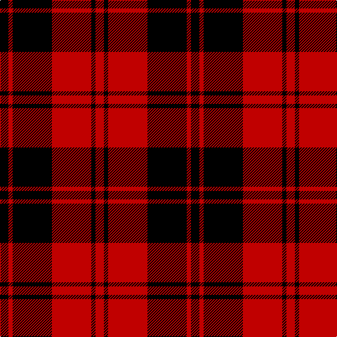

In pattern [KRKRKR](/patterns/krkrkr/).

This was sourced from weddslist.  It is a [6 stripes tartan](/stripes/stripes6/).

Original link http://www.weddslist.com/cgi-bin/tartans/pg.pl?source=sts

## Thread count
K/12 R6 K56 R56 K6 R/12

## Palette
Each colour and its ΔE from the base-6 reference it is a variant of.

| Colour | Shade | Base | ΔE (OKLab) |
|---|---|---|---|
| K | <code style="background-color:#000000;">#000000</code> `#000000` | K <code style="background-color:#000000;">#000000</code> | 0.00 |
| R | <code style="background-color:#C00000;">#C00000</code> `#C00000` | R <code style="background-color:#C80000;">#C80000</code> | 0.02 |

# Sample pattern

## Nearest tartans

The nearest existing variants by ΔTartan distance.

1. [Erskine](/setts/s6/k62r8k94r94k8r62-k000000-rc00000/) — ΔT 0.99
1. [MacLeod, Black & Red](/setts/s5/r16k2r16k24r2-k000000-rc00000/) — ΔT 1.06
1. [MacLeod of Raasay](/setts/s5/k24r4k24r36k4-k000000-rc00000/) — ΔT 1.09
1. [Erskine (MacGregor-Hastie)](/setts/s6/k12r6k56r56k6r12-k101010-rdc0000/) — ΔT 1.11
1. [Campbell of Armaddie](/setts/s5/r8k2r24k24r4-k000000-rc80000/) — ΔT 1.11
1. [Erskine, Black & Red (Clan)](/setts/s6/k12r6k56r56k6r12-k101010-rc80000/) — ΔT 1.15
1. [Brodie](/setts/s6/k6r30k22y4k8r6-k000000-rc00000-yf0c000/) — ΔT 1.17
1. [MacQueen](/setts/s6/k4r12k4r12k24y2-k000000-rc80000-yc8c800/) — ΔT 1.17
1. [MacQueen](/setts/s6/k4r12k4r12k24y2-k000000-rc00000-yf0c000/) — ΔT 1.18
1. [Brodie](/setts/s6/k4r32k16y2k16r4-k000000-rc00000-yf0c000/) — ΔT 1.22

## Neighbour map

Every grey dot is one of 15726 variants placed by the first two principal components of the ΔTartan feature space (44% of its variance). Red is this tartan; blue dots are its nearest — click one to open its page.

<svg viewBox="0 0 640 380" role="img" style="max-width:100%;height:auto;border:1px solid #e0e0e0;border-radius:4px;display:block" xmlns="http://www.w3.org/2000/svg"><image href="/nn/cloud.v1.png" width="640" height="380"/><a href="/setts/s6/k62r8k94r94k8r62-k000000-rc00000/"><circle cx="328.7" cy="244.3" r="4" fill="#3465a4"><title>Erskine</title></circle></a><a href="/setts/s5/r16k2r16k24r2-k000000-rc00000/"><circle cx="366.3" cy="241.0" r="4" fill="#3465a4"><title>MacLeod, Black &amp; Red</title></circle></a><a href="/setts/s5/k24r4k24r36k4-k000000-rc00000/"><circle cx="350.0" cy="261.8" r="4" fill="#3465a4"><title>MacLeod of Raasay</title></circle></a><a href="/setts/s6/k12r6k56r56k6r12-k101010-rdc0000/"><circle cx="354.0" cy="227.5" r="4" fill="#3465a4"><title>Erskine (MacGregor-Hastie)</title></circle></a><a href="/setts/s5/r8k2r24k24r4-k000000-rc80000/"><circle cx="376.1" cy="233.6" r="4" fill="#3465a4"><title>Campbell of Armaddie</title></circle></a><a href="/setts/s6/k12r6k56r56k6r12-k101010-rc80000/"><circle cx="362.9" cy="233.3" r="4" fill="#3465a4"><title>Erskine, Black &amp; Red (Clan)</title></circle></a><a href="/setts/s6/k6r30k22y4k8r6-k000000-rc00000-yf0c000/"><circle cx="272.9" cy="227.7" r="4" fill="#3465a4"><title>Brodie</title></circle></a><a href="/setts/s6/k4r12k4r12k24y2-k000000-rc80000-yc8c800/"><circle cx="325.0" cy="215.2" r="4" fill="#3465a4"><title>MacQueen</title></circle></a><a href="/setts/s6/k4r12k4r12k24y2-k000000-rc00000-yf0c000/"><circle cx="326.3" cy="216.1" r="4" fill="#3465a4"><title>MacQueen</title></circle></a><a href="/setts/s6/k4r32k16y2k16r4-k000000-rc00000-yf0c000/"><circle cx="322.3" cy="196.6" r="4" fill="#3465a4"><title>Brodie</title></circle></a><circle cx="342.1" cy="229.4" r="5" fill="#c00000"/></svg>

ID: /setts/s6/k12r6k56r56k6r12-k000000-rc00000/
