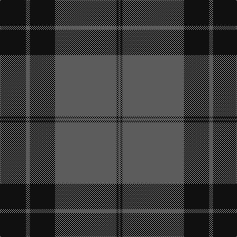

In pattern [BKBKBK](/patterns/bkbkbk/).

This was sourced from tartans-authority.  It is a [6 stripes tartan](/stripes/stripes6/).

Original link http://www.tartansauthority.com/tartan-ferret/display/6927/

## Thread count
K/52 N8 K52 N124 K4 N/4

## Palette
Each colour and its ΔE from the base-6 reference it is a variant of.

| Colour | Shade | Base | ΔE (OKLab) |
|---|---|---|---|
| K | <code style="background-color:#101010;">#101010</code> `#101010` | K <code style="background-color:#000000;">#000000</code> | 0.17 |
| N | <code style="background-color:#5C5C5C;">#5C5C5C</code> `#5C5C5C` | B <code style="background-color:#2A418A;">#2A418A</code> | 0.15 |

# Sample pattern

## Nearest tartans

The nearest existing variants by ΔTartan distance.

1. [Grey Pride of Scotland (Fashion)](/setts/s11/k8b2k2b2k14b2k2b1k14b26k2~b5c5c5c-k101010~x2/) — ΔT 1.31
1. [Korner-MacPherson (Personal)](/setts/s7/b5r3b35k28b4k11b2~b5c5c5c-k101010-rc80000~x2/) — ΔT 1.35
1. [Silver Mist](/setts/s5/b2k13b31k1b1~b5c5c5c-k101010~x4/) — ΔT 1.59
1. [Myles, Lee](/setts/s10/r2b3r1b9k4b13k33b1k4r1~b575757-k101010-rc71585~x2/) — ΔT 1.61
1. [Grey Spirit (Fashion)](/setts/s6/b6k17b6k17b45k4~b5c5c5c-k101010~x2/) — ΔT 1.64
1. [Pride of New Zealand](/setts/s4/b62k30w1k1~b5c5c5c-k101010-wfcfcfc~x2/) — ΔT 1.68
1. [TACC (Corporate)](/setts/s7/b34k7b12k40b3k4ba3~b5c5c5c-ba5c8ca8-k101010~x2/) — ΔT 1.68
1. [Keepers of the Quaich](/setts/s6/y3g33b24g2b2g2~b2c2c80-g604000-yd09800~x2/) — ΔT 1.74
1. [Tartan Army Children's Charity (Corp](/setts/s7/b34k7b12k39b3k4y3~b5c5c5c-k101010-y48a4c0~x2/) — ΔT 1.74
1. [City Building (Glasgow) LLP](/setts/s10/b3k2b36k5b3k8y2k8b6k3~b5c5c5c-k101010-ya0a0a0~x2/) — ΔT 1.79

## Neighbour map

Every grey dot is one of 15726 variants placed by the first two principal components of the ΔTartan feature space (44% of its variance). Red is this tartan; blue dots are its nearest — click one to open its page.

<svg viewBox="0 0 640 380" role="img" style="max-width:100%;height:auto;border:1px solid #e0e0e0;border-radius:4px;display:block" xmlns="http://www.w3.org/2000/svg"><image href="/nn/cloud.v1.png" width="640" height="380"/><a href="/setts/s11/k8b2k2b2k14b2k2b1k14b26k2~b5c5c5c-k101010~x2/"><circle cx="449.6" cy="190.4" r="4" fill="#3465a4"><title>Grey Pride of Scotland (Fashion)</title></circle></a><a href="/setts/s7/b5r3b35k28b4k11b2~b5c5c5c-k101010-rc80000~x2/"><circle cx="387.3" cy="210.4" r="4" fill="#3465a4"><title>Korner-MacPherson (Personal)</title></circle></a><a href="/setts/s5/b2k13b31k1b1~b5c5c5c-k101010~x4/"><circle cx="561.6" cy="216.0" r="4" fill="#3465a4"><title>Silver Mist</title></circle></a><a href="/setts/s10/r2b3r1b9k4b13k33b1k4r1~b575757-k101010-rc71585~x2/"><circle cx="443.6" cy="155.0" r="4" fill="#3465a4"><title>Myles, Lee</title></circle></a><a href="/setts/s6/b6k17b6k17b45k4~b5c5c5c-k101010~x2/"><circle cx="432.0" cy="260.7" r="4" fill="#3465a4"><title>Grey Spirit (Fashion)</title></circle></a><a href="/setts/s4/b62k30w1k1~b5c5c5c-k101010-wfcfcfc~x2/"><circle cx="511.3" cy="194.0" r="4" fill="#3465a4"><title>Pride of New Zealand</title></circle></a><a href="/setts/s7/b34k7b12k40b3k4ba3~b5c5c5c-ba5c8ca8-k101010~x2/"><circle cx="367.7" cy="221.7" r="4" fill="#3465a4"><title>TACC (Corporate)</title></circle></a><a href="/setts/s6/y3g33b24g2b2g2~b2c2c80-g604000-yd09800~x2/"><circle cx="439.7" cy="216.7" r="4" fill="#3465a4"><title>Keepers of the Quaich</title></circle></a><a href="/setts/s7/b34k7b12k39b3k4y3~b5c5c5c-k101010-y48a4c0~x2/"><circle cx="360.8" cy="221.6" r="4" fill="#3465a4"><title>Tartan Army Children's Charity (Corp</title></circle></a><a href="/setts/s10/b3k2b36k5b3k8y2k8b6k3~b5c5c5c-k101010-ya0a0a0~x2/"><circle cx="451.1" cy="178.3" r="4" fill="#3465a4"><title>City Building (Glasgow) LLP</title></circle></a><circle cx="461.3" cy="212.9" r="5" fill="#c00000"/></svg>

ID: /setts/s6/k13b2k13b31k1b1~b5c5c5c-k101010~x4/
