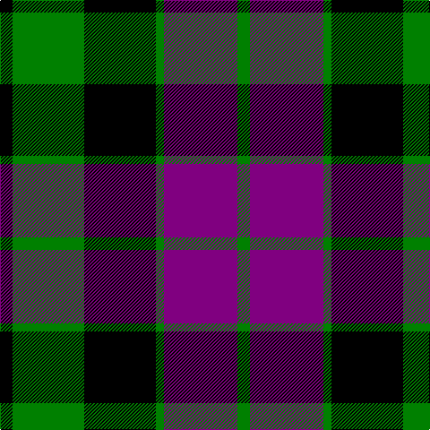

This page is one **sett** — a single exact thread-count. It belongs to the [tartan](/tartans/k14g80k80g9p82g14/)
(the same proportion at any scale), whose colour order is pattern [GBGKGK](/stripes/gbgkgk/).

Sourced from weddslist.  It is a [6 stripe tartan](/stripes/stripes6/).

Original link http://www.weddslist.com/cgi-bin/tartans/pg.pl?source=sts

## Thread count
K/14 G80 K80 G9 P82 G/14

## Palette

Palette: <strong>Ingles Buchan</strong> <small style="color:#888">(1 of 3 colours)</small>
<table><thead><tr><th>Colour</th><th>Threads</th><th>Shade</th><th>Base</th><th>OKLCh</th></tr></thead><tbody><tr><td>K/</td><td style="text-align:right;font-variant-numeric:tabular-nums">14</td><td><code style="background-color:#000000;">#000000</code> <small style="color:#888">#000000</small></td><td>K <code style="background-color:#000000;">#000000</code></td><td><small style="color:#888">oklch(0.0% 0.000 0.0)</small></td></tr><tr><td>G</td><td style="text-align:right;font-variant-numeric:tabular-nums">80</td><td><code style="background-color:#008000;">#008000</code> <small style="color:#888">#008000</small></td><td>G <code style="background-color:#006100;">#006100</code></td><td><small style="color:#888">oklch(52.0% 0.177 142.5)</small></td></tr><tr><td>K</td><td style="text-align:right;font-variant-numeric:tabular-nums">80</td><td><code style="background-color:#000000;">#000000</code> <small style="color:#888">#000000</small></td><td>K <code style="background-color:#000000;">#000000</code></td><td><small style="color:#888">oklch(0.0% 0.000 0.0)</small></td></tr><tr><td>G</td><td style="text-align:right;font-variant-numeric:tabular-nums">9</td><td><code style="background-color:#008000;">#008000</code> <small style="color:#888">#008000</small></td><td>G <code style="background-color:#006100;">#006100</code></td><td><small style="color:#888">oklch(52.0% 0.177 142.5)</small></td></tr><tr><td>P</td><td style="text-align:right;font-variant-numeric:tabular-nums">82</td><td><code style="background-color:#800080;">#800080</code> <small style="color:#888">#800080</small></td><td>B <code style="background-color:#2A418A;">#2A418A</code></td><td><small style="color:#888">oklch(42.1% 0.193 328.4)</small></td></tr><tr><td>G/</td><td style="text-align:right;font-variant-numeric:tabular-nums">14</td><td><code style="background-color:#008000;">#008000</code> <small style="color:#888">#008000</small></td><td>G <code style="background-color:#006100;">#006100</code></td><td><small style="color:#888">oklch(52.0% 0.177 142.5)</small></td></tr></tbody></table>

# Sample pattern

## Nearest tartans

The nearest existing variants by ΔTartan distance, with this tartan at the top so the swatches line up against it.

ΔTartan

Tartan

Sett

—

<a href="/ttd/edit/#slug=k14g80k80g9p82g14">MacKay, Plaid</a> <a class="nn-out" href="/setts/s6/k14g80k80g9p82g14/" title="open its dictionary page">↗</a>

0.89

<a href="/ttd/edit/#slug=k3g17ly2k18p17g3~x2">Wilson's, No 100</a> <a class="nn-out" href="/setts/s6/k3g17ly2k18p17g3~x2/" title="open its dictionary page">↗</a>

0.89

<a href="/ttd/edit/#slug=k3g17w2k18p17g3~x2">Wilson's, No 76</a> <a class="nn-out" href="/setts/s6/k3g17w2k18p17g3~x2/" title="open its dictionary page">↗</a>

1.04

<a href="/ttd/edit/#slug=g18t2g4k14p12k3~x2">Wilson's, No 150 &quot;Coburg&quot;</a> <a class="nn-out" href="/setts/s6/g18t2g4k14p12k3~x2/" title="open its dictionary page">↗</a>

1.04

<a href="/ttd/edit/#slug=g21w2g4k17p14k3~x2">Wilson's No 158</a> <a class="nn-out" href="/setts/s6/g21w2g4k17p14k3~x2/" title="open its dictionary page">↗</a>

1.09

<a href="/ttd/edit/#slug=db9r3db1r3dg9r3db1~x2">Skene</a> <a class="nn-out" href="/setts/s7/db9r3db1r3dg9r3db1~x2/" title="open its dictionary page">↗</a>

1.10

<a href="/ttd/edit/#slug=g21ly2g4k16p14k3~x2">Wilson's, No 160</a> <a class="nn-out" href="/setts/s6/g21ly2g4k16p14k3~x2/" title="open its dictionary page">↗</a>

1.17

<a href="/ttd/edit/#slug=g14db2g2k8p9k2~x2">MacArthur of Milton, hunting</a> <a class="nn-out" href="/setts/s6/g14db2g2k8p9k2~x2/" title="open its dictionary page">↗</a>

1.18

<a href="/setts/s6/o2k14o1ki14o14ly2~x2/">United Distillers (Corporate)</a>

1.19

<a href="/ttd/edit/#slug=dg21lb2dg4k17dp14k3">Graham W</a> <a class="nn-out" href="/setts/s6/dg21lb2dg4k17dp14k3/" title="open its dictionary page">↗</a>

1.19

<a href="/ttd/edit/#slug=k3g14k14g2db14g3~x2">MacKay</a> <a class="nn-out" href="/setts/s6/k3g14k14g2db14g3~x2/" title="open its dictionary page">↗</a>

## Neighbour map

Every grey dot is one of 14359 variants placed by the first two principal components of the ΔTartan feature space (44% of its variance). Red is this tartan; blue dots are its nearest — click one to open its page.

<svg viewBox="0 0 640 380" role="img" style="max-width:100%;height:auto;border:1px solid #e0e0e0;border-radius:4px;display:block" xmlns="http://www.w3.org/2000/svg"><image href="/nn/cloud.v1.png" width="640" height="380"/><a href="/setts/s6/k3g17ly2k18p17g3~x2/"><circle cx="155.6" cy="214.0" r="4" fill="#3465a4"><title>Wilson's, No 100</title></circle></a><a href="/setts/s6/k3g17w2k18p17g3~x2/"><circle cx="154.6" cy="213.7" r="4" fill="#3465a4"><title>Wilson's, No 76</title></circle></a><a href="/setts/s6/g18t2g4k14p12k3~x2/"><circle cx="176.7" cy="221.4" r="4" fill="#3465a4"><title>Wilson's, No 150 &quot;Coburg&quot;</title></circle></a><a href="/setts/s6/g21w2g4k17p14k3~x2/"><circle cx="181.7" cy="209.6" r="4" fill="#3465a4"><title>Wilson's No 158</title></circle></a><a href="/setts/s7/db9r3db1r3dg9r3db1~x2/"><circle cx="218.7" cy="229.7" r="4" fill="#3465a4"><title>Skene</title></circle></a><a href="/setts/s6/g21ly2g4k16p14k3~x2/"><circle cx="184.7" cy="209.9" r="4" fill="#3465a4"><title>Wilson's, No 160</title></circle></a><a href="/setts/s6/g14db2g2k8p9k2~x2/"><circle cx="177.6" cy="225.9" r="4" fill="#3465a4"><title>MacArthur of Milton, hunting</title></circle></a><a href="/setts/s6/o2k14o1ki14o14ly2~x2/"><circle cx="179.5" cy="194.0" r="4" fill="#3465a4"><title>United Distillers (Corporate)</title></circle></a><a href="/setts/s6/dg21lb2dg4k17dp14k3/"><circle cx="200.7" cy="223.5" r="4" fill="#3465a4"><title>Graham W</title></circle></a><a href="/setts/s6/k3g14k14g2db14g3~x2/"><circle cx="179.5" cy="256.1" r="4" fill="#3465a4"><title>MacKay</title></circle></a><circle cx="189.9" cy="231.7" r="5" fill="#c00000"/></svg>

ID: /setts/s6/k14g80k80g9p82g14/
