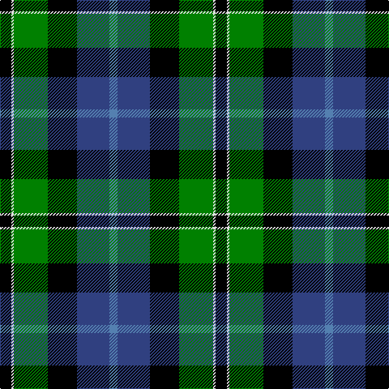

In pattern [BBKGWK](/stripes/bbkgwk/).

This was sourced from weddslist.  It is a [6 stripe tartan](/stripes/stripes6/).

Original link http://www.weddslist.com/cgi-bin/tartans/pg.pl?source=sts

## Also known as

This cloth is also recorded under:

- New York, Firemen's Pipe Band

## Attestations

This cloth appears in 2 source records; the oldest owns this page.

- undated — New York, Firemen's Pipe Band (weddslist, [record](http://www.weddslist.com/cgi-bin/tartans/pg.pl?source=sts))
- undated — New York Firemen's Pipe Band Corporate Tartan Tartan Number: 60. Earliest known date: 1964 Nothing See products available Copyright © Blair Urquhart, Comrie, 2015 (house-of-tartan, [record](http://www.house-of-tartan.scotland.net/house/TartanViewjs.asp?colr=Def&tnam=60))

## Thread count
K/14 LN3 G42 K36 B40 Ba/10

## Palette
Each colour and the base-6 reference it is a variant of.

| Colour | Shade | Base |
|---|---|---|
| B | <code style="background-color:#304080;">#304080</code> `oklch(39.4% 0.109 270.2)` <small>#304080</small> | B <code style="background-color:#2A418A;">#2A418A</code> |
| Ba | <code style="background-color:#5480B0;">#5480B0</code> `oklch(58.8% 0.089 251.5)` <small>#5480B0</small> | B <code style="background-color:#2A418A;">#2A418A</code> |
| G | <code style="background-color:#008000;">#008000</code> `oklch(52.0% 0.177 142.5)` <small>#008000</small> | G <code style="background-color:#006100;">#006100</code> |
| K | <code style="background-color:#000000;">#000000</code> `oklch(0.0% 0.000 0.0)` <small>#000000</small> | K <code style="background-color:#000000;">#000000</code> |
| LN | <code style="background-color:#E0E0E0;">#E0E0E0</code> `oklch(90.7% 0.000 89.9)` <small>#E0E0E0</small> | W <code style="background-color:#F7F7F7;">#F7F7F7</code> |

# Sample pattern

## Nearest tartans

The nearest existing variants by ΔTartan distance, with this tartan at the top so the swatches line up against it.

ΔTartan

Tartan

Sett

—

<a href="/ttd/edit/#slug=k14w3g42k36db40t10">New York, Firemen's Pipe Band</a> <a class="nn-out" href="/setts/s6/k14w3g42k36db40t10/" title="open its dictionary page">↗</a>

0.55

<a href="/ttd/edit/#slug=k2g12k12r1db12w2~x2">Russell, or Mitchell or Hunter or Galbraith</a> <a class="nn-out" href="/setts/s6/k2g12k12r1db12w2~x2/" title="open its dictionary page">↗</a>

0.65

<a href="/ttd/edit/#slug=w1db12k12g12k5ly1~x4">MacNeil 5</a> <a class="nn-out" href="/setts/s6/w1db12k12g12k5ly1~x4/" title="open its dictionary page">↗</a>

0.69

<a href="/ttd/edit/#slug=k2g11ly1k8db9r2~x4">Forsyth</a> <a class="nn-out" href="/setts/s6/k2g11ly1k8db9r2~x4/" title="open its dictionary page">↗</a>

0.76

<a href="/ttd/edit/#slug=k2g11ly1k8b9r2~x4">Forsyth (1795)</a> <a class="nn-out" href="/setts/s6/k2g11ly1k8b9r2~x4/" title="open its dictionary page">↗</a>

0.83

<a href="/ttd/edit/#slug=r1g14k14r2db14t1~x2">Wilson's, No 221</a> <a class="nn-out" href="/setts/s6/r1g14k14r2db14t1~x2/" title="open its dictionary page">↗</a>

0.92

<a href="/ttd/edit/#slug=r2db16r1k10g12o2~x2">MacWilliam</a> <a class="nn-out" href="/setts/s6/r2db16r1k10g12o2~x2/" title="open its dictionary page">↗</a>

0.95

<a href="/ttd/edit/#slug=r2db23k14g16k2w2~x2">MacPhail, hunting</a> <a class="nn-out" href="/setts/s6/r2db23k14g16k2w2~x2/" title="open its dictionary page">↗</a>

0.95

<a href="/ttd/edit/#slug=w1db8k9g9k1ly1~x4">MacNeil 4</a> <a class="nn-out" href="/setts/s6/w1db8k9g9k1ly1~x4/" title="open its dictionary page">↗</a>

0.96

<a href="/ttd/edit/#slug=k4w1g13k11db11lb3~x4">New York Fire Department Pipe Band</a> <a class="nn-out" href="/setts/s6/k4w1g13k11db11lb3~x4/" title="open its dictionary page">↗</a>

0.99

<a href="/ttd/edit/#slug=r3k2g15k10db20ly2~x2">MacLeod of Assynt</a> <a class="nn-out" href="/setts/s6/r3k2g15k10db20ly2~x2/" title="open its dictionary page">↗</a>

## Neighbour map

Every grey dot is one of 14299 variants placed by the first two principal components of the ΔTartan feature space (44% of its variance). Red is this tartan; blue dots are its nearest — click one to open its page.

<svg viewBox="0 0 640 380" role="img" style="max-width:100%;height:auto;border:1px solid #e0e0e0;border-radius:4px;display:block" xmlns="http://www.w3.org/2000/svg"><image href="/nn/cloud.v1.png" width="640" height="380"/><a href="/setts/s6/k2g12k12r1db12w2~x2/"><circle cx="136.7" cy="190.3" r="4" fill="#3465a4"><title>Russell, or Mitchell or Hunter or Galbraith</title></circle></a><a href="/setts/s6/w1db12k12g12k5ly1~x4/"><circle cx="157.8" cy="198.6" r="4" fill="#3465a4"><title>MacNeil 5</title></circle></a><a href="/setts/s6/k2g11ly1k8db9r2~x4/"><circle cx="127.4" cy="197.0" r="4" fill="#3465a4"><title>Forsyth</title></circle></a><a href="/setts/s6/k2g11ly1k8b9r2~x4/"><circle cx="121.2" cy="195.1" r="4" fill="#3465a4"><title>Forsyth (1795)</title></circle></a><a href="/setts/s6/r1g14k14r2db14t1~x2/"><circle cx="141.9" cy="181.7" r="4" fill="#3465a4"><title>Wilson's, No 221</title></circle></a><a href="/setts/s6/r2db16r1k10g12o2~x2/"><circle cx="170.5" cy="179.4" r="4" fill="#3465a4"><title>MacWilliam</title></circle></a><a href="/setts/s6/r2db23k14g16k2w2~x2/"><circle cx="167.2" cy="186.2" r="4" fill="#3465a4"><title>MacPhail, hunting</title></circle></a><a href="/setts/s6/w1db8k9g9k1ly1~x4/"><circle cx="129.1" cy="196.5" r="4" fill="#3465a4"><title>MacNeil 4</title></circle></a><a href="/setts/s6/k4w1g13k11db11lb3~x4/"><circle cx="153.7" cy="209.1" r="4" fill="#3465a4"><title>New York Fire Department Pipe Band</title></circle></a><a href="/setts/s6/r3k2g15k10db20ly2~x2/"><circle cx="154.2" cy="193.1" r="4" fill="#3465a4"><title>MacLeod of Assynt</title></circle></a><circle cx="132.8" cy="198.6" r="5" fill="#c00000"/></svg>

ID: /setts/s6/k14w3g42k36db40t10/
