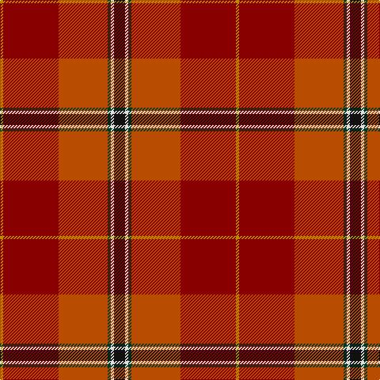

In pattern [KWGRRY](/patterns/kwgrry/).

This was sourced from tartans-authority.  It is a [6 stripes tartan](/stripes/stripes6/).

Original link http://www.tartansauthority.com/tartan-ferret/display/10720/

## Thread count
DY/4 DR70 DO62 DG4 LN4 K/14

## Palette
Each colour and its ΔE from the base-6 reference it is a variant of.

| Colour | Shade | Base | ΔE (OKLab) |
|---|---|---|---|
| DG | <code style="background-color:#003820;">#003820</code> `#003820` | G <code style="background-color:#006400;">#006400</code> | 0.16 |
| DO | <code style="background-color:#B84C00;">#B84C00</code> `#B84C00` | R <code style="background-color:#C80000;">#C80000</code> | 0.08 |
| DR | <code style="background-color:#880000;">#880000</code> `#880000` | R <code style="background-color:#C80000;">#C80000</code> | 0.14 |
| DY | <code style="background-color:#BC8C00;">#BC8C00</code> `#BC8C00` | Y <code style="background-color:#E8C000;">#E8C000</code> | 0.16 |
| K | <code style="background-color:#101010;">#101010</code> `#101010` | K <code style="background-color:#000000;">#000000</code> | 0.17 |
| LN | <code style="background-color:#E0E0E0;">#E0E0E0</code> `#E0E0E0` | W <code style="background-color:#F4F4F0;">#F4F4F0</code> | 0.06 |

# Sample pattern

## Nearest tartans

The nearest existing variants by ΔTartan distance.

1. [Snelgrove (Name)](/setts/s7/k8g24b16ba4r72b20y4-b642000-ba2888c4-g006818-k101010-rc80000-ybc8c00/) — ΔT 0.79
1. [Mason, David Elsworth (Personal)](/setts/s6/k14w4g4r62ra70y4-g0b3d2e-k010512-rda412d-ra89051b-wddd5af-yebaa57/) — ΔT 1.12
1. [Passchendaele (Commemorative)](/setts/s6/g6k6y4r56ra56rb2-g006818-k101010-r880000-ra9c6800-rbc80000-ybc8c00/) — ΔT 1.31
1. [Barbour - Cardinal Red](/setts/s7/r6y4r36b16w2ra36r4-b2c2c80-rc80000-rab03000-wfcfcfc-yfccc00/) — ΔT 1.39
1. [Flowers of the Forest, The](/setts/s9/r4ra8ra4b10y6g26ra40ba4ra4-b2c2c80-ba441800-g5c6428-ra03400-rac80000-y48a4c0/) — ΔT 1.50
1. [Tartan Army Whisky](/setts/s8/r52g10ga14ra4b18y2ya2ga8-b441800-g006818-ga003820-rc80000-raa00000-yfcb464-yaec8048/) — ΔT 1.61
1. [Spragg, Andrew](/setts/s7/r4g32ra2r4ra24y2ga2-g165041-ga547c73-ra62a2a-racc1100-yffe600/) — ΔT 1.64
1. [Dundhuin](/setts/s6/y12r10k4g36ra56w4-g6a8a67-k1c1714-r905966-ra9d2123-wf9f5ef-y99a3ba/) — ΔT 1.66
1. [MacQueen of Dalmagarry (Clan?)](/setts/s8/g6r8k2r52ga28r8b32w4-b440044-g289c18-ga5c6428-k101010-rc80000-wfcfcfc/) — ΔT 1.69
1. [Gordon of Abergeldie (Portrait)](/setts/s6/r126w8k8b36y8g100-b780078-g005830-k101010-rc80000-wfcfcfc-yd8b000/) — ΔT 1.70

## Neighbour map

Every grey dot is one of 15726 variants placed by the first two principal components of the ΔTartan feature space (44% of its variance). Red is this tartan; blue dots are its nearest — click one to open its page.

<svg viewBox="0 0 640 380" role="img" style="max-width:100%;height:auto;border:1px solid #e0e0e0;border-radius:4px;display:block" xmlns="http://www.w3.org/2000/svg"><image href="/nn/cloud.v1.png" width="640" height="380"/><a href="/setts/s7/k8g24b16ba4r72b20y4-b642000-ba2888c4-g006818-k101010-rc80000-ybc8c00/"><circle cx="286.7" cy="136.6" r="4" fill="#3465a4"><title>Snelgrove (Name)</title></circle></a><a href="/setts/s6/k14w4g4r62ra70y4-g0b3d2e-k010512-rda412d-ra89051b-wddd5af-yebaa57/"><circle cx="280.7" cy="132.2" r="4" fill="#3465a4"><title>Mason, David Elsworth (Personal)</title></circle></a><a href="/setts/s6/g6k6y4r56ra56rb2-g006818-k101010-r880000-ra9c6800-rbc80000-ybc8c00/"><circle cx="343.9" cy="141.0" r="4" fill="#3465a4"><title>Passchendaele (Commemorative)</title></circle></a><a href="/setts/s7/r6y4r36b16w2ra36r4-b2c2c80-rc80000-rab03000-wfcfcfc-yfccc00/"><circle cx="304.2" cy="159.8" r="4" fill="#3465a4"><title>Barbour - Cardinal Red</title></circle></a><a href="/setts/s9/r4ra8ra4b10y6g26ra40ba4ra4-b2c2c80-ba441800-g5c6428-ra03400-rac80000-y48a4c0/"><circle cx="289.7" cy="151.3" r="4" fill="#3465a4"><title>Flowers of the Forest, The</title></circle></a><a href="/setts/s8/r52g10ga14ra4b18y2ya2ga8-b441800-g006818-ga003820-rc80000-raa00000-yfcb464-yaec8048/"><circle cx="259.3" cy="94.0" r="4" fill="#3465a4"><title>Tartan Army Whisky</title></circle></a><a href="/setts/s7/r4g32ra2r4ra24y2ga2-g165041-ga547c73-ra62a2a-racc1100-yffe600/"><circle cx="300.3" cy="151.7" r="4" fill="#3465a4"><title>Spragg, Andrew</title></circle></a><a href="/setts/s6/y12r10k4g36ra56w4-g6a8a67-k1c1714-r905966-ra9d2123-wf9f5ef-y99a3ba/"><circle cx="255.8" cy="160.2" r="4" fill="#3465a4"><title>Dundhuin</title></circle></a><a href="/setts/s8/g6r8k2r52ga28r8b32w4-b440044-g289c18-ga5c6428-k101010-rc80000-wfcfcfc/"><circle cx="270.1" cy="112.4" r="4" fill="#3465a4"><title>MacQueen of Dalmagarry (Clan?)</title></circle></a><a href="/setts/s6/r126w8k8b36y8g100-b780078-g005830-k101010-rc80000-wfcfcfc-yd8b000/"><circle cx="240.4" cy="140.5" r="4" fill="#3465a4"><title>Gordon of Abergeldie (Portrait)</title></circle></a><circle cx="303.4" cy="147.3" r="5" fill="#c00000"/></svg>

ID: /setts/s6/k14w4g4r62ra70y4-g003820-k101010-rb84c00-ra880000-we0e0e0-ybc8c00/
