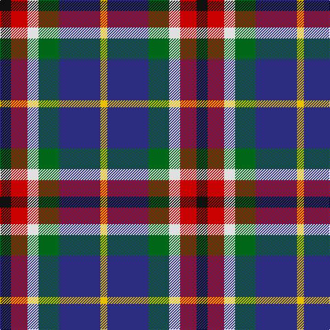

In pattern [KRWGBY](/patterns/krwgby/).

This was sourced from tartans-authority.  It is a [6 stripes tartan](/stripes/stripes6/).

Original link http://www.tartansauthority.com/tartan-ferret/display/10279/

## Thread count
K/16 R24 LN16 G30 DB60 Y/10

## Palette
Each colour and its ΔE from the base-6 reference it is a variant of.

| Colour | Shade | Base | ΔE (OKLab) |
|---|---|---|---|
| DB | <code style="background-color:#2C2C80;">#2C2C80</code> `#2C2C80` | B <code style="background-color:#2C4084;">#2C4084</code> | 0.05 |
| G | <code style="background-color:#006818;">#006818</code> `#006818` | G <code style="background-color:#006400;">#006400</code> | 0.02 |
| K | <code style="background-color:#101010;">#101010</code> `#101010` | K <code style="background-color:#000000;">#000000</code> | 0.17 |
| LN | <code style="background-color:#E0E0E0;">#E0E0E0</code> `#E0E0E0` | W <code style="background-color:#F4F4F0;">#F4F4F0</code> | 0.06 |
| R | <code style="background-color:#C80000;">#C80000</code> `#C80000` | R <code style="background-color:#C80000;">#C80000</code> | 0.00 |
| Y | <code style="background-color:#E8C000;">#E8C000</code> `#E8C000` | Y <code style="background-color:#E8C000;">#E8C000</code> | 0.00 |

# Sample pattern

## Nearest tartans

The nearest existing variants by ΔTartan distance.

1. [Reekie (Edmonton)](/setts/s6/k16r24w16g30b60y10-b5f7490-g23321b-k1c1714-rb62531-wf9f5ef-yf8e380/) — ΔT 0.66
1. [Cherokee](/setts/s8/g8b4g18k8g4r12ba24w4-b5c8ca8-ba1c0070-g408060-k101010-rc80000-wf8f8f8/) — ΔT 0.79
1. [Thompson's Fancy (Fashion)](/setts/s6/r6g36b12w24k24w6-b1c0070-g604000-k101010-r880000-w98c8e8/) — ΔT 0.99
1. [MacBlain (2016)](/setts/s6/b50ba30w20g30k10y10-b2c2c80-ba6c0070-g004c00-k000000-wf8f8f8-yf8e38c/) — ΔT 0.99
1. [Galvez-Brown (Personal)](/setts/s7/b72y10r24ra18ba10w24y14-b003c64-ba440044-r880000-rac80000-wfcfcfc-ybc8c00/) — ΔT 1.06
1. [Jamestown Parish Church (Corporate)](/setts/s6/r6y4g24k24b28w6-b2c2c80-g006818-k101010-rc80000-we0e0e0-ye8c000/) — ΔT 1.06
1. [Hawkes, Norman (Personal)](/setts/s6/g14w8k42b32ba32r10-b666666-ba0000cd-g008b00-k101010-rff0000-wffffff/) — ΔT 1.12
1. [Hoban (Name)](/setts/s9/y12w36k12w16k36g60k36b44wa8-b2c2c80-g408060-k101010-wc49cd8-wafcfcfc-ye8c000/) — ΔT 1.13
1. [Thom(p)son's, Fancy](/setts/s6/r12ra48b12ba24k24ba6-b304080-ba5480b0-k000000-rc00000-ra806050/) — ΔT 1.14
1. [Caledonian Labrador Retrievers](/setts/s8/r42b8ba10b8r10k42g42y10-b000048-ba501400-g006818-k101010-r9c68a4-yfccc00/) — ΔT 1.16

## Neighbour map

Every grey dot is one of 15726 variants placed by the first two principal components of the ΔTartan feature space (44% of its variance). Red is this tartan; blue dots are its nearest — click one to open its page.

<svg viewBox="0 0 640 380" role="img" style="max-width:100%;height:auto;border:1px solid #e0e0e0;border-radius:4px;display:block" xmlns="http://www.w3.org/2000/svg"><image href="/nn/cloud.v1.png" width="640" height="380"/><a href="/setts/s6/k16r24w16g30b60y10-b5f7490-g23321b-k1c1714-rb62531-wf9f5ef-yf8e380/"><circle cx="84.4" cy="197.5" r="4" fill="#3465a4"><title>Reekie (Edmonton)</title></circle></a><a href="/setts/s8/g8b4g18k8g4r12ba24w4-b5c8ca8-ba1c0070-g408060-k101010-rc80000-wf8f8f8/"><circle cx="86.6" cy="189.8" r="4" fill="#3465a4"><title>Cherokee</title></circle></a><a href="/setts/s6/r6g36b12w24k24w6-b1c0070-g604000-k101010-r880000-w98c8e8/"><circle cx="85.0" cy="219.1" r="4" fill="#3465a4"><title>Thompson's Fancy (Fashion)</title></circle></a><a href="/setts/s6/b50ba30w20g30k10y10-b2c2c80-ba6c0070-g004c00-k000000-wf8f8f8-yf8e38c/"><circle cx="32.0" cy="211.1" r="4" fill="#3465a4"><title>MacBlain (2016)</title></circle></a><a href="/setts/s7/b72y10r24ra18ba10w24y14-b003c64-ba440044-r880000-rac80000-wfcfcfc-ybc8c00/"><circle cx="117.3" cy="164.2" r="4" fill="#3465a4"><title>Galvez-Brown (Personal)</title></circle></a><a href="/setts/s6/r6y4g24k24b28w6-b2c2c80-g006818-k101010-rc80000-we0e0e0-ye8c000/"><circle cx="70.8" cy="201.2" r="4" fill="#3465a4"><title>Jamestown Parish Church (Corporate)</title></circle></a><a href="/setts/s6/g14w8k42b32ba32r10-b666666-ba0000cd-g008b00-k101010-rff0000-wffffff/"><circle cx="31.6" cy="215.6" r="4" fill="#3465a4"><title>Hawkes, Norman (Personal)</title></circle></a><a href="/setts/s9/y12w36k12w16k36g60k36b44wa8-b2c2c80-g408060-k101010-wc49cd8-wafcfcfc-ye8c000/"><circle cx="46.8" cy="181.0" r="4" fill="#3465a4"><title>Hoban (Name)</title></circle></a><a href="/setts/s6/r12ra48b12ba24k24ba6-b304080-ba5480b0-k000000-rc00000-ra806050/"><circle cx="132.6" cy="210.0" r="4" fill="#3465a4"><title>Thom(p)son's, Fancy</title></circle></a><a href="/setts/s8/r42b8ba10b8r10k42g42y10-b000048-ba501400-g006818-k101010-r9c68a4-yfccc00/"><circle cx="58.6" cy="188.5" r="4" fill="#3465a4"><title>Caledonian Labrador Retrievers</title></circle></a><circle cx="81.3" cy="199.7" r="5" fill="#c00000"/></svg>

ID: /setts/s6/k16r24w16g30b60y10-b2c2c80-g006818-k101010-rc80000-we0e0e0-ye8c000/
