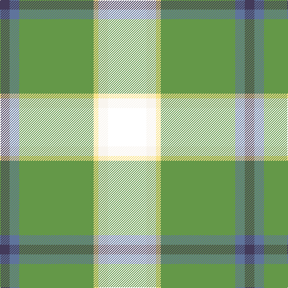

In pattern [BBGYWK](/patterns/bbgywk/).

This was sourced from register-of-tartans.  It is a [6 stripes tartan](/stripes/stripes6/).

Original link https://www.tartanregister.gov.uk/tartanDetails.aspx?ref=10813

## Register references

External register numbers recorded for this tartan.

- Scottish Register of Tartans: [10813](https://www.tartanregister.gov.uk/tartanDetails.aspx?ref=10813)

## Thread count
N/16 B16 LG124 LY8 W16 T/64

## Palette
Each colour and its ΔE from the base-6 reference it is a variant of.

| Colour | Shade | Base | ΔE (OKLab) |
|---|---|---|---|
| B | <code style="background-color:#5F749C;">#5F749C</code> `#5F749C` | B <code style="background-color:#2A418A;">#2A418A</code> | 0.17 |
| LG | <code style="background-color:#649848;">#649848</code> `#649848` | G <code style="background-color:#006100;">#006100</code> | 0.20 |
| LY | <code style="background-color:#F8E38C;">#F8E38C</code> `#F8E38C` | Y <code style="background-color:#F2BF00;">#F2BF00</code> | 0.11 |
| N | <code style="background-color:#433A5A;">#433A5A</code> `#433A5A` | B <code style="background-color:#2A418A;">#2A418A</code> | 0.09 |
| W | <code style="background-color:#F9F5EF;">#F9F5EF</code> `#F9F5EF` | W <code style="background-color:#F7F7F7;">#F7F7F7</code> | 0.01 |

# Sample pattern

## Nearest tartans

The nearest existing variants by ΔTartan distance.

1. [Driver (Name)](/setts/s6/g11w11k3y3ga36ya7~g006818-ga003820-k101010-we0e0e0-ye8c000-yad87c00~x2/) — ΔT 0.78
1. [Shawlands International (Commem.)](/setts/s6/k3g44b27y6r10w3~b1c0070-g006818-k101010-rc80000-we0e0e0-yfccc00~x2/) — ΔT 1.10
1. [Official Glasgow 2014, The](/setts/s6/k3g44b27y6r10w3~b0000cd-g2a8a0f-k101010-rff0000-wffffff-yffe600~x2/) — ΔT 1.11
1. [Driver, RC](/setts/s6/g11w11k3y3ga36r7~g008000-ga004f00-k101010-rcd3700-wffffff-yeeee00~x2/) — ΔT 1.12
1. [Louth County Crest (Fashion)](/setts/s9/y16ya5k8ya8k68g46w8k8r8~g006818-k101010-re87878-we0e0e0-ye8c000-yabc8c00/) — ΔT 1.26
1. [Mellor (Name)](/setts/s6/w8k16g32b3y5w5~b003c64-g006818-k101010-we0e0e0-ybc8c00~x2/) — ΔT 1.30
1. [Tooth](/setts/s8/g5y1r2g25k14b19w4g2~b304080-g008000-k000000-rc00000-we0e0e0-yf0c000~x2/) — ΔT 1.36
1. [East Lothian](/setts/s7/b6ba17bb4ba2k11g33y4~b5480b0-ba304080-bb800080-g008000-k000000-yf0c000~x2/) — ΔT 1.37
1. [Carleton College Rugby](/setts/s6/r5b30w3g15y8ra4~b003c64-g004c00-rb07430-rac80000-wf8f8f8-yfccc00~x2/) — ΔT 1.43
1. [Brooke](/setts/s9/b2w1b2k16g20k14r2wa2y2~b3850c8-g289c18-k101010-ra00000-wa8ace8-wafcfcfc-ye8c000~x2/) — ΔT 1.43

## Neighbour map

Every grey dot is one of 15726 variants placed by the first two principal components of the ΔTartan feature space (44% of its variance). Red is this tartan; blue dots are its nearest — click one to open its page.

<svg viewBox="0 0 640 380" role="img" style="max-width:100%;height:auto;border:1px solid #e0e0e0;border-radius:4px;display:block" xmlns="http://www.w3.org/2000/svg"><image href="/nn/cloud.v1.png" width="640" height="380"/><a href="/setts/s6/g11w11k3y3ga36ya7~g006818-ga003820-k101010-we0e0e0-ye8c000-yad87c00~x2/"><circle cx="199.2" cy="155.3" r="4" fill="#3465a4"><title>Driver (Name)</title></circle></a><a href="/setts/s6/k3g44b27y6r10w3~b1c0070-g006818-k101010-rc80000-we0e0e0-yfccc00~x2/"><circle cx="208.2" cy="150.0" r="4" fill="#3465a4"><title>Shawlands International (Commem.)</title></circle></a><a href="/setts/s6/k3g44b27y6r10w3~b0000cd-g2a8a0f-k101010-rff0000-wffffff-yffe600~x2/"><circle cx="188.4" cy="141.5" r="4" fill="#3465a4"><title>Official Glasgow 2014, The</title></circle></a><a href="/setts/s6/g11w11k3y3ga36r7~g008000-ga004f00-k101010-rcd3700-wffffff-yeeee00~x2/"><circle cx="191.7" cy="151.4" r="4" fill="#3465a4"><title>Driver, RC</title></circle></a><a href="/setts/s9/y16ya5k8ya8k68g46w8k8r8~g006818-k101010-re87878-we0e0e0-ye8c000-yabc8c00/"><circle cx="195.2" cy="124.8" r="4" fill="#3465a4"><title>Louth County Crest (Fashion)</title></circle></a><a href="/setts/s6/w8k16g32b3y5w5~b003c64-g006818-k101010-we0e0e0-ybc8c00~x2/"><circle cx="184.1" cy="179.6" r="4" fill="#3465a4"><title>Mellor (Name)</title></circle></a><a href="/setts/s8/g5y1r2g25k14b19w4g2~b304080-g008000-k000000-rc00000-we0e0e0-yf0c000~x2/"><circle cx="190.7" cy="120.0" r="4" fill="#3465a4"><title>Tooth</title></circle></a><a href="/setts/s7/b6ba17bb4ba2k11g33y4~b5480b0-ba304080-bb800080-g008000-k000000-yf0c000~x2/"><circle cx="167.0" cy="142.8" r="4" fill="#3465a4"><title>East Lothian</title></circle></a><a href="/setts/s6/r5b30w3g15y8ra4~b003c64-g004c00-rb07430-rac80000-wf8f8f8-yfccc00~x2/"><circle cx="169.0" cy="167.5" r="4" fill="#3465a4"><title>Carleton College Rugby</title></circle></a><a href="/setts/s9/b2w1b2k16g20k14r2wa2y2~b3850c8-g289c18-k101010-ra00000-wa8ace8-wafcfcfc-ye8c000~x2/"><circle cx="204.0" cy="100.0" r="4" fill="#3465a4"><title>Brooke</title></circle></a><circle cx="204.9" cy="135.9" r="5" fill="#c00000"/></svg>

ID: /setts/s6/k16w4y2g31b4ba4~b5f749c-ba433a5a-g649848-k000000-wf9f5ef-yf8e38c~x4/
