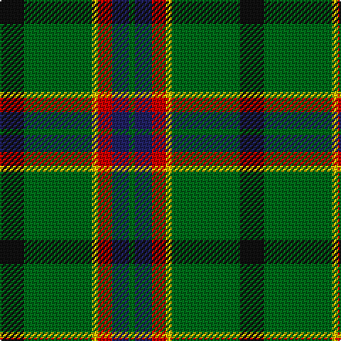

In pattern [GBRYGK](/stripes/gbrygk/).

This was sourced from tartans-authority.  It is a [6 stripe tartan](/stripes/stripes6/).

Original link http://www.tartansauthority.com/tartan-ferret/display/10866/

## Thread count
K/17 G48 Y4 R10 DB12 G/4

## Palette
Each colour and its ΔE from the base-6 reference it is a variant of.

| Colour | Shade | Base | ΔE (OKLab) |
|---|---|---|---|
| DB | <code style="background-color:#202060;">#202060</code> `#202060` | B <code style="background-color:#2A418A;">#2A418A</code> | 0.11 |
| G | <code style="background-color:#006818;">#006818</code> `#006818` | G <code style="background-color:#006100;">#006100</code> | 0.02 |
| K | <code style="background-color:#101010;">#101010</code> `#101010` | K <code style="background-color:#000000;">#000000</code> | 0.17 |
| R | <code style="background-color:#C80000;">#C80000</code> `#C80000` | R <code style="background-color:#CC0000;">#CC0000</code> | 0.01 |
| Y | <code style="background-color:#E8C000;">#E8C000</code> `#E8C000` | Y <code style="background-color:#F2BF00;">#F2BF00</code> | 0.02 |

# Sample pattern

## Nearest tartans

The nearest existing variants by ΔTartan distance.

1. [Carrick Hunting District Tartan Tartan Number: 721. Earliest known date: 1930 This sample comes from the MacGregor-Hastie collection which forms the basis of the cloth archive of the Scottish Tartans Society. Some of the samples, including this one, were unmarked. One can assume that the sample dates between 1930 and 1950. See products available Copyright © Blair Urquhart, Comrie, 2015](/setts/s8/g13dp1g1dp1g3db5k4ly2~x2/) — ΔT 0.82
1. [Gorman, George (Personal)](/setts/s6/g9g1p2g1db4r1~x12/) — ΔT 1.01
1. [Asheville Firefighters, The](/setts/s6/k17dg48ly4r10lb12dg4/) — ΔT 1.03
1. [Merwe](/setts/s6/g15ly2k30g32r3w2~x2/) — ΔT 1.05
1. [Wardrope (Personal)](/setts/s9/r3g32k4g4k11db3k7r4lb3/) — ΔT 1.06
1. [St Johns County Sheriff Office (Cor)](/setts/s5/r17db7lo8g58k6~x2/) — ΔT 1.07
1. [Lossiemouth/Hersbruck](/setts/s6/g26db3g12k10dp15w2~x2/) — ΔT 1.12
1. [Dundhuin Hunting (Personal)](/setts/s5/dg62g17ly12t8o8~x2/) — ΔT 1.15
1. [Arkansas](/setts/s7/dg3w1dg12r6dg3k3g2~x4/) — ΔT 1.15
1. [Chiti, Cristiano (Personal)](/setts/s6/dg20dg11lb6r2dp3lb1~x2/) — ΔT 1.15

## Neighbour map

Every grey dot is one of 14299 variants placed by the first two principal components of the ΔTartan feature space (44% of its variance). Red is this tartan; blue dots are its nearest — click one to open its page.

<svg viewBox="0 0 640 380" role="img" style="max-width:100%;height:auto;border:1px solid #e0e0e0;border-radius:4px;display:block" xmlns="http://www.w3.org/2000/svg"><image href="/nn/cloud.v1.png" width="640" height="380"/><a href="/setts/s8/g13dp1g1dp1g3db5k4ly2~x2/"><circle cx="289.3" cy="173.1" r="4" fill="#3465a4"><title>Carrick Hunting District Tartan Tartan Number: 721. Earliest known date: 1930 This sample comes from the MacGregor-Hastie collection which forms the basis of the cloth archive of the Scottish Tartans Society. Some of the samples, including this one, were unmarked. One can assume that the sample dates between 1930 and 1950. See products available Copyright © Blair Urquhart, Comrie, 2015</title></circle></a><a href="/setts/s6/g9g1p2g1db4r1~x12/"><circle cx="247.1" cy="202.7" r="4" fill="#3465a4"><title>Gorman, George (Personal)</title></circle></a><a href="/setts/s6/k17dg48ly4r10lb12dg4/"><circle cx="262.0" cy="178.0" r="4" fill="#3465a4"><title>Asheville Firefighters, The</title></circle></a><a href="/setts/s6/g15ly2k30g32r3w2~x2/"><circle cx="313.2" cy="184.5" r="4" fill="#3465a4"><title>Merwe</title></circle></a><a href="/setts/s9/r3g32k4g4k11db3k7r4lb3/"><circle cx="268.7" cy="167.9" r="4" fill="#3465a4"><title>Wardrope (Personal)</title></circle></a><a href="/setts/s5/r17db7lo8g58k6~x2/"><circle cx="325.7" cy="200.2" r="4" fill="#3465a4"><title>St Johns County Sheriff Office (Cor)</title></circle></a><a href="/setts/s6/g26db3g12k10dp15w2~x2/"><circle cx="275.6" cy="207.4" r="4" fill="#3465a4"><title>Lossiemouth/Hersbruck</title></circle></a><a href="/setts/s5/dg62g17ly12t8o8~x2/"><circle cx="269.4" cy="199.6" r="4" fill="#3465a4"><title>Dundhuin Hunting (Personal)</title></circle></a><a href="/setts/s7/dg3w1dg12r6dg3k3g2~x4/"><circle cx="295.0" cy="190.5" r="4" fill="#3465a4"><title>Arkansas</title></circle></a><a href="/setts/s6/dg20dg11lb6r2dp3lb1~x2/"><circle cx="245.1" cy="169.8" r="4" fill="#3465a4"><title>Chiti, Cristiano (Personal)</title></circle></a><circle cx="278.8" cy="189.6" r="5" fill="#c00000"/></svg>

ID: /setts/s6/k17g48ly4r10db12g4/
