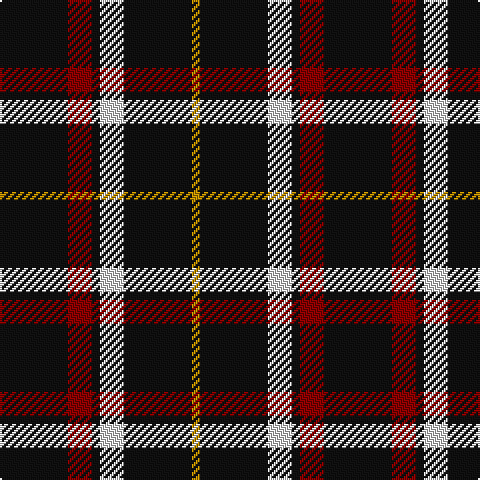

In pattern [KRKWKY](/stripes/krkwky/).

This was sourced from tartans-authority.  It is a [6 stripe tartan](/stripes/stripes6/).

Original link http://www.tartansauthority.com/tartan-ferret/display/7630/

## Also known as

This cloth is also recorded under:

- Black 1990

## Attestations

This cloth appears in 2 source records; the oldest owns this page.

- pre 1945 — Black 1990 (Name) (tartans-authority, [record](http://www.tartansauthority.com/tartan-ferret/display/7630/))
- 01/01/1990 — Black (asymmetric) (register-of-tartans, [record](https://www.tartanregister.gov.uk/tartanDetails.aspx?ref=5648))

## Register references

External register numbers recorded for this tartan.

- Scottish Register of Tartans: [5648](https://www.tartanregister.gov.uk/tartanDetails.aspx?ref=5648)
- Scottish Tartans Authority (ITI): 7630

## Thread count
K/34 DR12 K4 LN12 K34 DY/4

## Palette
Each colour and the base-6 reference it is a variant of.

| Colour | Shade | Base |
|---|---|---|
| DR | <code style="background-color:#880000;">#880000</code> `oklch(39.4% 0.162 29.2)` <small>#880000</small> | R <code style="background-color:#CC0000;">#CC0000</code> |
| DY | <code style="background-color:#BC8C00;">#BC8C00</code> `oklch(66.8% 0.137 84.1)` <small>#BC8C00</small> | Y <code style="background-color:#F2BF00;">#F2BF00</code> |
| K | <code style="background-color:#101010;">#101010</code> `oklch(17.3% 0.000 89.9)` <small>#101010</small> | K <code style="background-color:#000000;">#000000</code> |
| LN | <code style="background-color:#E0E0E0;">#E0E0E0</code> `oklch(90.7% 0.000 89.9)` <small>#E0E0E0</small> | W <code style="background-color:#F7F7F7;">#F7F7F7</code> |

# Sample pattern

## Nearest tartans

The nearest existing variants by ΔTartan distance.

1. [Black (symmetrical)](/setts/s6/k17r6k2lb6k17lo2~x2/) — ΔT 0.33
1. [Benson (New England)](/setts/s7/k16b2k8r3lr3r3k8~x2/) — ΔT 0.79
1. [St. Eloi](/setts/s6/r3lo2k10w1~x6/) — ΔT 1.15
1. [Anzac (Fashion)](/setts/s8/k21lb2k4lb4do2lb4k13g2~x4/) — ΔT 1.15
1. [Punky Princess (Fashion)](/setts/s7/k14r2k4lb3k12r8k1~x2/) — ΔT 1.23
1. [New Zealand District Tartan Tartan Number: 3250. Earliest known date: 2000 Designed as a District sett by Timely Marketing Promotions, Christchurch, New Zealand See products available Copyright © Blair Urquhart, Comrie, 2015](/setts/s6/k21w2k5w9k13g2~x4/) — ΔT 1.29
1. [Callaway (Corporate)](/setts/s6/r1k10n2lb5k5r1~x4/) — ΔT 1.29
1. [Cowe (Personal)](/setts/s7/k8t3k32b14w3k25t3~x2/) — ΔT 1.30
1. [London Fog Black 2 (fashion)](/setts/s10/k18t9k18lb2k2lb2k18lr9k18lb2/) — ΔT 1.32
1. [Justus Family Tartan Tartan Number: 2100. Earliest known date: 1990 Submitted as the Justus family sett but awaits the approval of the proposed Justus Family Society of North America. Sample supplied in 9 tpi. See products available Copyright © Blair Urquhart, Comrie, 2015](/setts/s7/db1k4r1k1ly1k4db1~x6/) — ΔT 1.46

## Neighbour map

Every grey dot is one of 14299 variants placed by the first two principal components of the ΔTartan feature space (44% of its variance). Red is this tartan; blue dots are its nearest — click one to open its page.

<svg viewBox="0 0 640 380" role="img" style="max-width:100%;height:auto;border:1px solid #e0e0e0;border-radius:4px;display:block" xmlns="http://www.w3.org/2000/svg"><image href="/nn/cloud.v1.png" width="640" height="380"/><a href="/setts/s6/k17r6k2lb6k17lo2~x2/"><circle cx="381.5" cy="227.4" r="4" fill="#3465a4"><title>Black (symmetrical)</title></circle></a><a href="/setts/s7/k16b2k8r3lr3r3k8~x2/"><circle cx="403.6" cy="228.2" r="4" fill="#3465a4"><title>Benson (New England)</title></circle></a><a href="/setts/s6/r3lo2k10w1~x6/"><circle cx="376.7" cy="215.7" r="4" fill="#3465a4"><title>St. Eloi</title></circle></a><a href="/setts/s8/k21lb2k4lb4do2lb4k13g2~x4/"><circle cx="402.9" cy="188.6" r="4" fill="#3465a4"><title>Anzac (Fashion)</title></circle></a><a href="/setts/s7/k14r2k4lb3k12r8k1~x2/"><circle cx="399.0" cy="210.5" r="4" fill="#3465a4"><title>Punky Princess (Fashion)</title></circle></a><a href="/setts/s6/k21w2k5w9k13g2~x4/"><circle cx="415.8" cy="227.2" r="4" fill="#3465a4"><title>New Zealand District Tartan Tartan Number: 3250. Earliest known date: 2000 Designed as a District sett by Timely Marketing Promotions, Christchurch, New Zealand See products available Copyright © Blair Urquhart, Comrie, 2015</title></circle></a><a href="/setts/s6/r1k10n2lb5k5r1~x4/"><circle cx="309.4" cy="208.8" r="4" fill="#3465a4"><title>Callaway (Corporate)</title></circle></a><a href="/setts/s7/k8t3k32b14w3k25t3~x2/"><circle cx="412.6" cy="212.7" r="4" fill="#3465a4"><title>Cowe (Personal)</title></circle></a><a href="/setts/s10/k18t9k18lb2k2lb2k18lr9k18lb2/"><circle cx="383.8" cy="206.3" r="4" fill="#3465a4"><title>London Fog Black 2 (fashion)</title></circle></a><a href="/setts/s7/db1k4r1k1ly1k4db1~x6/"><circle cx="336.0" cy="255.8" r="4" fill="#3465a4"><title>Justus Family Tartan Tartan Number: 2100. Earliest known date: 1990 Submitted as the Justus family sett but awaits the approval of the proposed Justus Family Society of North America. Sample supplied in 9 tpi. See products available Copyright © Blair Urquhart, Comrie, 2015</title></circle></a><circle cx="372.1" cy="222.4" r="5" fill="#c00000"/></svg>

ID: /setts/s6/k17r6k2w6k17lo2~x2/
