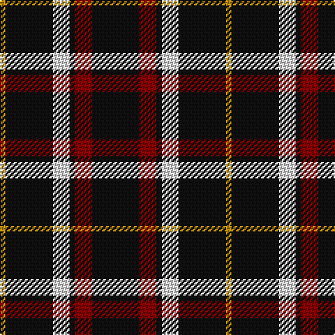

In pattern [KRKWKY](/patterns/krkwky/).

This was sourced from tartans-authority.  It is a [6 stripes tartan](/stripes/stripes6/).

Original link http://www.tartansauthority.com/tartan-ferret/display/7630/

## Attestations

This cloth appears in 2 source records; the oldest owns this page.

- pre 1945 — Black 1990 (Name) (tartans-authority, [record](http://www.tartansauthority.com/tartan-ferret/display/7630/))
- 01/01/1990 — Black (asymmetric) (register-of-tartans, [record](https://www.tartanregister.gov.uk/tartanDetails.aspx?ref=5648))

## Thread count
DY/4 K34 LN12 K4 DR12 K/34

## Palette
Each colour and its ΔE from the base-6 reference it is a variant of.

| Colour | Shade | Base | ΔE (OKLab) |
|---|---|---|---|
| DR | <code style="background-color:#880000;">#880000</code> `#880000` | R <code style="background-color:#CC0000;">#CC0000</code> | 0.15 |
| DY | <code style="background-color:#BC8C00;">#BC8C00</code> `#BC8C00` | Y <code style="background-color:#F2BF00;">#F2BF00</code> | 0.16 |
| K | <code style="background-color:#101010;">#101010</code> `#101010` | K <code style="background-color:#000000;">#000000</code> | 0.17 |
| LN | <code style="background-color:#E0E0E0;">#E0E0E0</code> `#E0E0E0` | W <code style="background-color:#F7F7F7;">#F7F7F7</code> | 0.07 |

# Sample pattern

## Nearest tartans

The nearest existing variants by ΔTartan distance.

1. [Black Clan/Family Tartan Tartan Number: 2761. Earliest known date: pre 1945 In 1990, taken to a TECA stand at one of the US Highland Games by a Timothy Wood, who explained that his faher had 'found' it in a shop in northern England during World War II. See products available Copyright © Blair Urquhart, Comrie, 2015](/setts/s6/k17r6k2w6k17y2x2~k101010-r880000-wc0c0c0-yd09800/) — ΔT 0.28
1. [Black (symmetrical)](/setts/s6/k17r6k2w6k17y2x2~k101010-r880000-wc0c0c0-ybc8c00/) — ΔT 0.33
1. [Benson (New England)](/setts/s7/k16b2k8r3y3r3k8x2~b1474b4-k101010-rc80000-yb8b8b8/) — ΔT 0.79
1. [Anzac (Fashion)](/setts/s8/k21w2k4w4b2w4k13g2x4~b4c3428-g006818-k101010-wc0c0c0/) — ΔT 1.15
1. [St. Eloi](/setts/s6/r3y2k10w1k10y2x6~k00002c-r880000-we0e0e0-yd09800/) — ΔT 1.15
1. [Punky Princess (Fashion)](/setts/s7/k14r2k4w3k12r8k1x2~k101010-re87878-wc0c0c0/) — ΔT 1.23
1. [New Zealand District Tartan Tartan Number: 3250. Earliest known date: 2000 Designed as a District sett by Timely Marketing Promotions, Christchurch, New Zealand See products available Copyright © Blair Urquhart, Comrie, 2015](/setts/s6/k21w2k5w9k13g2x4~g006818-k101010-we0e0e0/) — ΔT 1.29
1. [Cowe (Personal)](/setts/s7/k8b3k32ba14w3k25b3x2~b5c8ca8-ba1474b4-k101010-wfcfcfc/) — ΔT 1.29
1. [Callaway (Corporate)](/setts/s6/r1k10b2w5k5r1x4~b5c5c5c-k101010-r880000-wc0c0c0/) — ΔT 1.30
1. [London Fog Black 2 (fashion)](/setts/s10/k18b9k18w2k2w2k18y9k18w2~b2888c4-k101010-wd4d4c4-yccc0a4/) — ΔT 1.32

## Neighbour map

Every grey dot is one of 15726 variants placed by the first two principal components of the ΔTartan feature space (44% of its variance). Red is this tartan; blue dots are its nearest — click one to open its page.

<svg viewBox="0 0 640 380" role="img" style="max-width:100%;height:auto;border:1px solid #e0e0e0;border-radius:4px;display:block" xmlns="http://www.w3.org/2000/svg"><image href="/nn/cloud.v1.png" width="640" height="380"/><a href="/setts/s6/k17r6k2w6k17y2x2~k101010-r880000-wc0c0c0-yd09800/"><circle cx="378.5" cy="232.1" r="4" fill="#3465a4"><title>Black Clan/Family Tartan Tartan Number: 2761. Earliest known date: pre 1945 In 1990, taken to a TECA stand at one of the US Highland Games by a Timothy Wood, who explained that his faher had 'found' it in a shop in northern England during World War II. See products available Copyright © Blair Urquhart, Comrie, 2015</title></circle></a><a href="/setts/s6/k17r6k2w6k17y2x2~k101010-r880000-wc0c0c0-ybc8c00/"><circle cx="379.8" cy="232.7" r="4" fill="#3465a4"><title>Black (symmetrical)</title></circle></a><a href="/setts/s7/k16b2k8r3y3r3k8x2~b1474b4-k101010-rc80000-yb8b8b8/"><circle cx="402.0" cy="233.1" r="4" fill="#3465a4"><title>Benson (New England)</title></circle></a><a href="/setts/s8/k21w2k4w4b2w4k13g2x4~b4c3428-g006818-k101010-wc0c0c0/"><circle cx="400.6" cy="194.1" r="4" fill="#3465a4"><title>Anzac (Fashion)</title></circle></a><a href="/setts/s6/r3y2k10w1k10y2x6~k00002c-r880000-we0e0e0-yd09800/"><circle cx="374.1" cy="221.2" r="4" fill="#3465a4"><title>St. Eloi</title></circle></a><a href="/setts/s7/k14r2k4w3k12r8k1x2~k101010-re87878-wc0c0c0/"><circle cx="397.4" cy="217.7" r="4" fill="#3465a4"><title>Punky Princess (Fashion)</title></circle></a><a href="/setts/s6/k21w2k5w9k13g2x4~g006818-k101010-we0e0e0/"><circle cx="413.7" cy="235.4" r="4" fill="#3465a4"><title>New Zealand District Tartan Tartan Number: 3250. Earliest known date: 2000 Designed as a District sett by Timely Marketing Promotions, Christchurch, New Zealand See products available Copyright © Blair Urquhart, Comrie, 2015</title></circle></a><a href="/setts/s7/k8b3k32ba14w3k25b3x2~b5c8ca8-ba1474b4-k101010-wfcfcfc/"><circle cx="410.1" cy="216.7" r="4" fill="#3465a4"><title>Cowe (Personal)</title></circle></a><a href="/setts/s6/r1k10b2w5k5r1x4~b5c5c5c-k101010-r880000-wc0c0c0/"><circle cx="307.2" cy="213.5" r="4" fill="#3465a4"><title>Callaway (Corporate)</title></circle></a><a href="/setts/s10/k18b9k18w2k2w2k18y9k18w2~b2888c4-k101010-wd4d4c4-yccc0a4/"><circle cx="381.6" cy="211.9" r="4" fill="#3465a4"><title>London Fog Black 2 (fashion)</title></circle></a><circle cx="370.3" cy="228.7" r="5" fill="#c00000"/></svg>

ID: /setts/s6/k17r6k2w6k17y2x2~k101010-r880000-we0e0e0-ybc8c00/
