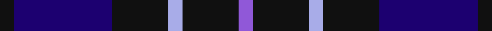

**Bands:** [KBKWKB](/stripes/kbkwkb/) · **Stripes:** [K DB K LB K P](/stripes/stripes6/) K DB K LB K P

This was sourced from register-of-tartans.  It is a [6 band tartan](/bands/bands6/).

Original link https://www.tartanregister.gov.uk/tartanDetails.aspx?ref=3715

## Also known as

This cloth is also recorded under:

- Scottish Express International (Corp

## Attestations

This cloth appears in 2 source records; the oldest owns this page.

- 01/06/1996 — Scottish Express International (register-of-tartans, [record](https://www.tartanregister.gov.uk/tartanDetails.aspx?ref=3715))
- pre 1997 — Scottish Express International (Corp (tartans-authority, [record](http://www.tartansauthority.com/tartan-ferret/display/2309/))

## Register references

External register numbers recorded for this tartan.

- Scottish Register of Tartans: [3715](https://www.tartanregister.gov.uk/tartanDetails.aspx?ref=3715)
- Scottish Tartans Authority (ITI): 2309
- Scottish Tartans World Register: 2309

## Thread count
K/4 DB28 K16 LP4 K16 P/4

## Palette
Each colour and its ΔE from the base-6 reference it is a variant of.

| Colour | Shade | Base | ΔE (OKLab) |
|---|---|---|---|
| DB | <code style="background-color:#1C0070;">#1C0070</code> `#1C0070` | B <code style="background-color:#2A418A;">#2A418A</code> | 0.14 |
| K | <code style="background-color:#101010;">#101010</code> `#101010` | K <code style="background-color:#000000;">#000000</code> | 0.17 |
| LP | <code style="background-color:#A8ACE8;">#A8ACE8</code> `#A8ACE8` | W <code style="background-color:#F7F7F7;">#F7F7F7</code> | 0.23 |
| P | <code style="background-color:#9058D8;">#9058D8</code> `#9058D8` | B <code style="background-color:#2A418A;">#2A418A</code> | 0.21 |

# Sample pattern

## Nearest tartans

The nearest existing variants by ΔTartan distance.

1. [Britannia](/setts/s5/k14r4k25db30w4~x2/) — ΔT 0.96
1. [Daks, Muted blue](/setts/s8/o5db12db4o4db22db3db4o5/) — ΔT 1.12
1. [Allianz Deutschland 2012 (Corporate)](/setts/s7/db6db3db6db20k20db8w4~x2/) — ΔT 1.14
1. [College of Radiographers](/setts/s5/k15lo2k10db18lb3~x2/) — ΔT 1.19
1. [Royal Scotsman Train (Corporate)](/setts/s6/db5k2db14k14db2lr2~x2/) — ΔT 1.21
1. [Gifford (Personal)](/setts/s7/k15r8ly2db25k5db13k5~x2/) — ΔT 1.22
1. [Heritage of Scotland](/setts/s7/db6w3db21k16dp6k3dp6~x2/) — ΔT 1.24
1. [The Harbour Town, Hilton Head](/setts/s6/k3dg11k3dr11k18o3~x2/) — ΔT 1.35
1. [Komissarov, Dmitry (Personal)](/setts/s7/dp30db30y4db4y4db5r6~x2/) — ΔT 1.36
1. [St. Georges, Edgbaston](/setts/s7/r4k21w2k20db21k2db2~x2/) — ΔT 1.36

## Neighbour map

Every grey dot is one of 14299 variants placed by the first two principal components of the ΔTartan feature space (44% of its variance). Red is this tartan; blue dots are its nearest — click one to open its page.

<svg viewBox="0 0 640 380" role="img" style="max-width:100%;height:auto;border:1px solid #e0e0e0;border-radius:4px;display:block" xmlns="http://www.w3.org/2000/svg"><image href="/nn/cloud.v1.png" width="640" height="380"/><a href="/setts/s5/k14r4k25db30w4~x2/"><circle cx="285.5" cy="262.5" r="4" fill="#3465a4"><title>Britannia</title></circle></a><a href="/setts/s8/o5db12db4o4db22db3db4o5/"><circle cx="281.0" cy="238.9" r="4" fill="#3465a4"><title>Daks, Muted blue</title></circle></a><a href="/setts/s7/db6db3db6db20k20db8w4~x2/"><circle cx="235.2" cy="253.3" r="4" fill="#3465a4"><title>Allianz Deutschland 2012 (Corporate)</title></circle></a><a href="/setts/s5/k15lo2k10db18lb3~x2/"><circle cx="273.8" cy="252.7" r="4" fill="#3465a4"><title>College of Radiographers</title></circle></a><a href="/setts/s6/db5k2db14k14db2lr2~x2/"><circle cx="353.1" cy="270.6" r="4" fill="#3465a4"><title>Royal Scotsman Train (Corporate)</title></circle></a><a href="/setts/s7/k15r8ly2db25k5db13k5~x2/"><circle cx="299.8" cy="225.0" r="4" fill="#3465a4"><title>Gifford (Personal)</title></circle></a><a href="/setts/s7/db6w3db21k16dp6k3dp6~x2/"><circle cx="226.2" cy="236.4" r="4" fill="#3465a4"><title>Heritage of Scotland</title></circle></a><a href="/setts/s6/k3dg11k3dr11k18o3~x2/"><circle cx="268.1" cy="274.6" r="4" fill="#3465a4"><title>The Harbour Town, Hilton Head</title></circle></a><a href="/setts/s7/dp30db30y4db4y4db5r6~x2/"><circle cx="292.3" cy="225.9" r="4" fill="#3465a4"><title>Komissarov, Dmitry (Personal)</title></circle></a><a href="/setts/s7/r4k21w2k20db21k2db2~x2/"><circle cx="347.8" cy="222.1" r="4" fill="#3465a4"><title>St. Georges, Edgbaston</title></circle></a><circle cx="285.7" cy="256.9" r="5" fill="#c00000"/></svg>

ID: /setts/s6/k1db7k4lb1k4p1~x4/
