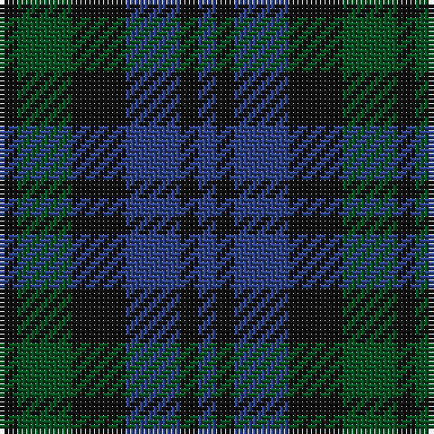

This page is one **sett** — a single exact thread-count. It belongs to the [tartan](/tartans/k1dg3k3db3k1db1/)
(the same proportion at any scale), whose colour order is pattern [BKBKGK](/stripes/bkbkgk/).

Sourced from register-of-tartans.  It is a [6 stripe tartan](/stripes/stripes6/).

Original link https://www.tartanregister.gov.uk/tartanDetails.aspx?ref=4044

## Also known as

This cloth is also recorded under:

- Sutherland, 42nd

## Register references

External register numbers recorded for this tartan.

- Scottish Register of Tartans: [4044](https://www.tartanregister.gov.uk/tartanDetails.aspx?ref=4044)
- Scottish Tartans World Register: 255

## Thread count
K/4 G12 K12 B12 K4 B/4

## Palette

Palette: <strong>Tartan Register</strong>
<table><thead><tr><th>Colour</th><th>Threads</th><th>Shade</th><th>Base</th><th>OKLCh</th></tr></thead><tbody><tr><td>K/</td><td style="text-align:right;font-variant-numeric:tabular-nums">4</td><td><code style="background-color:#101010;">#101010</code> <small style="color:#888">#101010</small></td><td>K <code style="background-color:#000000;">#000000</code></td><td><small style="color:#888">oklch(17.3% 0.000 89.9)</small></td></tr><tr><td>G</td><td style="text-align:right;font-variant-numeric:tabular-nums">12</td><td><code style="background-color:#005020;">#005020</code> <small style="color:#888">#005020</small></td><td>G <code style="background-color:#006100;">#006100</code></td><td><small style="color:#888">oklch(37.7% 0.105 149.6)</small></td></tr><tr><td>K</td><td style="text-align:right;font-variant-numeric:tabular-nums">12</td><td><code style="background-color:#101010;">#101010</code> <small style="color:#888">#101010</small></td><td>K <code style="background-color:#000000;">#000000</code></td><td><small style="color:#888">oklch(17.3% 0.000 89.9)</small></td></tr><tr><td>B</td><td style="text-align:right;font-variant-numeric:tabular-nums">12</td><td><code style="background-color:#2C4084;">#2C4084</code> <small style="color:#888">#2C4084</small></td><td>B <code style="background-color:#2A418A;">#2A418A</code></td><td><small style="color:#888">oklch(39.4% 0.117 268.3)</small></td></tr><tr><td>K</td><td style="text-align:right;font-variant-numeric:tabular-nums">4</td><td><code style="background-color:#101010;">#101010</code> <small style="color:#888">#101010</small></td><td>K <code style="background-color:#000000;">#000000</code></td><td><small style="color:#888">oklch(17.3% 0.000 89.9)</small></td></tr><tr><td>B/</td><td style="text-align:right;font-variant-numeric:tabular-nums">4</td><td><code style="background-color:#2C4084;">#2C4084</code> <small style="color:#888">#2C4084</small></td><td>B <code style="background-color:#2A418A;">#2A418A</code></td><td><small style="color:#888">oklch(39.4% 0.117 268.3)</small></td></tr></tbody></table>

# Sample pattern

## Nearest tartans

The nearest existing variants by ΔTartan distance, with this tartan at the top so the swatches line up against it.

ΔTartan

Tartan

Sett

—

<a href="/ttd/edit/#slug=k1dg3k3db3k1db1~x4">Sutherland 42nd</a> <a class="nn-out" href="/setts/s6/k1dg3k3db3k1db1~x4/" title="open its dictionary page">↗</a>

0.88

<a href="/ttd/edit/#slug=k3dg4k1dg4k3db4k1~x2">Unidentified No 63</a> <a class="nn-out" href="/setts/s7/k3dg4k1dg4k3db4k1~x2/" title="open its dictionary page">↗</a>

1.13

<a href="/ttd/edit/#slug=k5dg14k16db12dg4~x2">Unidentified #29</a> <a class="nn-out" href="/setts/s5/k5dg14k16db12dg4~x2/" title="open its dictionary page">↗</a>

1.44

<a href="/ttd/edit/#slug=db4k4db4g9k2~x2">Austin Clan</a> <a class="nn-out" href="/setts/s5/db4k4db4g9k2~x2/" title="open its dictionary page">↗</a>

1.48

<a href="/ttd/edit/#slug=k2dg8db2k9dp7k2~x2">Campbell, Sir Walter Scott</a> <a class="nn-out" href="/setts/s6/k2dg8db2k9dp7k2~x2/" title="open its dictionary page">↗</a>

1.52

<a href="/ttd/edit/#slug=k12dg12k2dg12k12db12t3~x2">MacIntyre</a> <a class="nn-out" href="/setts/s7/k12dg12k2dg12k12db12t3~x2/" title="open its dictionary page">↗</a>

1.55

<a href="/ttd/edit/#slug=k6dg6r1dg6k6db6k1~x2">MacCallum #2</a> <a class="nn-out" href="/setts/s7/k6dg6r1dg6k6db6k1~x2/" title="open its dictionary page">↗</a>

1.67

<a href="/ttd/edit/#slug=db2k2g2db1k1~x20">Wandering Shepherd (Personal)</a> <a class="nn-out" href="/setts/s5/db2k2g2db1k1~x20/" title="open its dictionary page">↗</a>

1.70

<a href="/ttd/edit/#slug=k3dg12k12r2db12k3~x2">Ferguson of Balquhidder #3</a> <a class="nn-out" href="/setts/s6/k3dg12k12r2db12k3~x2/" title="open its dictionary page">↗</a>

1.72

<a href="/ttd/edit/#slug=dt12g8t4g8dt12t5">Sheffield High School</a> <a class="nn-out" href="/setts/s6/dt12g8t4g8dt12t5/" title="open its dictionary page">↗</a>

1.74

<a href="/ttd/edit/#slug=db2dg6db6dp5db1dp2~x2">Unidentified no. 54</a> <a class="nn-out" href="/setts/s6/db2dg6db6dp5db1dp2~x2/" title="open its dictionary page">↗</a>

## Neighbour map

Every grey dot is one of 14299 variants placed by the first two principal components of the ΔTartan feature space (44% of its variance). Red is this tartan; blue dots are its nearest — click one to open its page.

<svg viewBox="0 0 640 380" role="img" style="max-width:100%;height:auto;border:1px solid #e0e0e0;border-radius:4px;display:block" xmlns="http://www.w3.org/2000/svg"><image href="/nn/cloud.v1.png" width="640" height="380"/><a href="/setts/s7/k3dg4k1dg4k3db4k1~x2/"><circle cx="235.4" cy="344.1" r="4" fill="#3465a4"><title>Unidentified No 63</title></circle></a><a href="/setts/s5/k5dg14k16db12dg4~x2/"><circle cx="264.5" cy="364.3" r="4" fill="#3465a4"><title>Unidentified #29</title></circle></a><a href="/setts/s5/db4k4db4g9k2~x2/"><circle cx="209.1" cy="323.4" r="4" fill="#3465a4"><title>Austin Clan</title></circle></a><a href="/setts/s6/k2dg8db2k9dp7k2~x2/"><circle cx="223.9" cy="293.2" r="4" fill="#3465a4"><title>Campbell, Sir Walter Scott</title></circle></a><a href="/setts/s7/k12dg12k2dg12k12db12t3~x2/"><circle cx="212.5" cy="302.5" r="4" fill="#3465a4"><title>MacIntyre</title></circle></a><a href="/setts/s7/k6dg6r1dg6k6db6k1~x2/"><circle cx="220.8" cy="296.4" r="4" fill="#3465a4"><title>MacCallum #2</title></circle></a><a href="/setts/s5/db2k2g2db1k1~x20/"><circle cx="154.9" cy="366.0" r="4" fill="#3465a4"><title>Wandering Shepherd (Personal)</title></circle></a><a href="/setts/s6/k3dg12k12r2db12k3~x2/"><circle cx="225.1" cy="280.0" r="4" fill="#3465a4"><title>Ferguson of Balquhidder #3</title></circle></a><a href="/setts/s6/dt12g8t4g8dt12t5/"><circle cx="242.3" cy="364.1" r="4" fill="#3465a4"><title>Sheffield High School</title></circle></a><a href="/setts/s6/db2dg6db6dp5db1dp2~x2/"><circle cx="289.7" cy="332.8" r="4" fill="#3465a4"><title>Unidentified no. 54</title></circle></a><circle cx="233.7" cy="348.8" r="5" fill="#c00000"/></svg>

ID: /setts/s6/k1dg3k3db3k1db1~x4/
